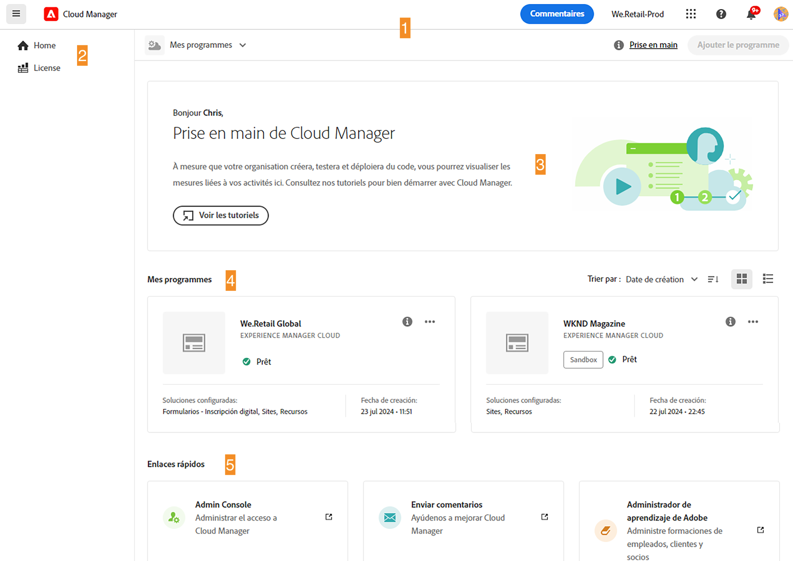
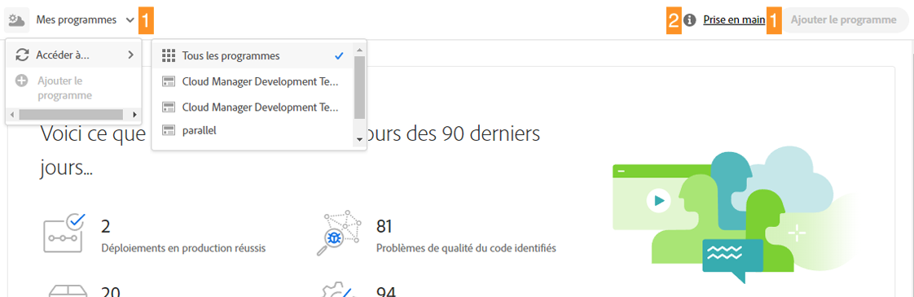
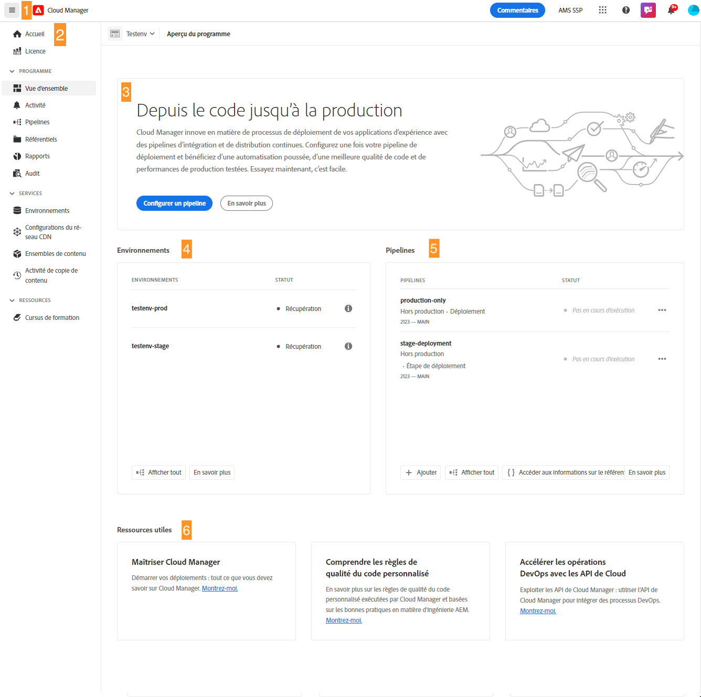

# Navigation dans l’interface d’utilisation de Cloud Manager {#navigation}

Découvrez l’organisation de l’interface d’utilisation de Cloud Manager et comment gérer vos programmes et vos environnements.

L’interface d’utilisation de Cloud Manager est composée principalement de deux interfaces graphiques :

* [La console Mes programmes](#my-programs-console) où vous pouvez afficher et gérer tous vos programmes.
* [La fenêtre Vue d’ensemble du programme](#program-overview) où vous pouvez consulter les détails d’un programme individuel et le gérer.

## Console Mes programmes {#my-programs-console}

Lorsque vous vous connectez à Cloud Manager sur la page [my.cloudmanager.adobe.com](https://my.cloudmanager.adobe.com/) et que vous sélectionnez l’organisation appropriée, vous accédez à la console **Mes programmes**.

La console Mes programmes fournit une vue d’ensemble de tous les programmes auxquels vous avez accès dans l’organisation sélectionnée. Elle est constituée de plusieurs éléments.

1. Des [Barres d’outils](#toolbars-my-programs-toolbars) pour la sélection de l’organisation, les alertes et les paramètres de compte.
1. Des onglets qui permettent de changer l’affichage actuel de vos programmes.
   * Vue **Accueil** (par défaut) qui sélectionne la vue **Mes programmes** avec une vue d’ensemble de tous les programmes.
   * **Licence** qui accède au tableau de bord des licences. Le tableau de bord des licences s’applique uniquement aux programmes AEM as a Cloud Service, et non aux programmes AMS.
      * Pour déterminer le type de service de votre programme (AMS ou AEMaaCS), reportez-vous à la [section Program Cards](#program-cards) de ce document.
   * Notez que les onglets sont fermés par défaut et peuvent être affichés à l’aide du menu hamburger dans l’[en-tête Cloud Manager](#cloud-manager-header).
1. Des [Statistiques et des appels à l’action](#cta-statistics) pour une vue d’ensemble de votre activité récente.
1. [**Section Mes programmes**](#my-programs-section) avec une vue d’ensemble de tous vos programmes.
1. Des [Liens rapides](#quick-links) pour accéder facilement aux ressources connexes.

>[!TIP]
>
>Pour plus d’informations sur les programmes, voir [Programmes et types de programme](/help/getting-started/program-setup.md) .

### Barres d’outils {#my-programs-toolbars}

Il y a deux barres d’outils superposées.

#### En-tête de Cloud Manager {#cloud-manager-header}

La première est l’en-tête de Cloud Manager, qui est présent en permanence lorsque vous naviguez dans Cloud Manager. Il s’agit d’un élément ancré qui permet d’accéder aux paramètres et aux informations relatifs à l’ensemble des programmes Cloud Manager.

1. Le menu Hamburger donne accès à des onglets qui peuvent vous diriger vers des parties spécifiques d’un programme individuel ou basculer entre le tableau de bord des licences et la console **[Mes programmes](#my-programs-console)** en fonction du contexte.
   * Le tableau de bord des licences s’applique uniquement aux programmes AEM as a Cloud Service, et non aux programmes AMS.
   * Pour déterminer le type de service de votre programme (AMS ou AEMaaCS), reportez-vous à la [section Program Cards](#program-cards) de ce document.
1. Le bouton Cloud Manager vous ramène à la console Mes programmes de Cloud Manager, où que vous soyez dans Cloud Manager.
1. Cliquez sur le bouton Commentaires pour fournir des commentaires à Adobe sur Cloud Manager.
1. Le sélecteur d’organisation affiche l’organisation que vous utilisez actuellement pour vous connecter (dans cet exemple, Fonudation Internal). Cliquez sur pour passer à une autre organisation si votre Adobe ID est associé à plusieurs.
1. Cliquez sur le sélecteur de solutions pour accéder rapidement à d’autres solutions Experience Cloud.
1. L’icône d’aide permet d’accéder rapidement aux ressources d’apprentissage et d’assistance.
1. L’icône de notification comporte un badge indiquant le nombre de [notifications](/help/using/notifications.md) incomplètes actuellement attribuées.
1. Appuyez ou cliquez sur l’icône qui représente votre utilisateur ou votre utilisatrice pour accéder à vos paramètres d’utilisateur ou d’utilisatrice. Si vous n’avez configuré aucune image d’utilisateur ou d’utilisatrice, une icône est attribuée de manière aléatoire.

#### Barre d’outils des programmes {#program-toolbar}

La barre d’outils des programmes fournit des liens pour basculer entre les programmes Cloud Manager et des actions contextuelles.

1. Le sélecteur de programme s’ouvre dans une liste déroulante dans laquelle vous pouvez sélectionner rapidement d’autres programmes ou effectuer des actions contextuelles, telles que la création d’un programme.
1. Le lien de prise en main vous permet d’accéder au [parcours d’intégration et de documentation](https://experienceleague.adobe.com/fr/docs/experience-manager-cloud-service/content/onboarding/journey/overview) pour vous familiariser avec Cloud Manager.
   * Notez que le parcours d’intégration est conçu pour AEM as a Cloud Service et non pour Cloud Service pour AMS, mais de nombreux concepts sont identiques.
1. Le bouton d’action propose des actions contextuelles, telles que la création d’un programme.

### Appels à l’action et statistiques {#cta-statistics}

La section Appels à l’action et statistiques fournit des données agrégées pour votre organisation. Par exemple, si vous avez terminé de configurer vos programmes, les statistiques de vos activités des 90 derniers jours peuvent s’afficher, incluant ce qui suit :

* Le nombre de [déploiements](/help/using/code-deployment.md)
* Le nombre de [problèmes relatifs à la qualité du code](/help/using/code-quality-testing.md) identifiés
* Le nombre de versions

Si vous êtes au commencement de la configuration de votre organisation, vous pouvez obtenir des conseils sur les étapes suivantes ou des ressources de documentation.

### Section Mes programmes {#my-programs-section}

Le contenu principal de la console Mes programmes est la section **Mes programmes** qui répertorie vos programmes sous la forme de cartes individuelles. Cliquez sur une carte pour accéder à la page **Aperçu du programme** pour plus d’informations sur le programme.

>[!NOTE]
>
>Selon vos privilèges, il se peut que vous ne puissiez pas sélectionner certains programmes.

Utilisez les options de tri pour trouver plus rapidement le programme dont vous avez besoin.

* Trier par
   * Date de création (par défaut)
   * Nom du programme
   * Statut
* Croissant (par défaut) / Décroissant
* Vue Grille (par défaut)
* Vue Liste

#### Cartes de programme {#program-cards}

Chaque programme est représenté par une vignette (ou une ligne dans un tableau), qui donne une vue d’ensemble du programme et des liens rapides pour effectuer des actions.

* Image du programme (si configurée)
* Nom du programme
* Type de service :
   * **Experience Manager** pour les programmes AMS
   * **Cloud Experience Manager** pour les [programmes AEM as a Cloud Service](https://experienceleague.adobe.com/fr/docs/experience-manager-cloud-service/content/implementing/home)
* Statut
* Solutions configurées
* Date de création

L’icône d’informations permet un accès rapide à des informations supplémentaires sur le programme (utile dans la vue Liste).

L’icône représentant des points de suspension vous permet d’accéder à des actions supplémentaires que vous pouvez effectuer sur le programme.

* Accéder à un [environnement](/help/using/managing-environments.md) particulier du programme
* Ouvrir la [vue d’ensemble du programme](#program-overview)
* [Modifier le programme](/help/getting-started/program-setup.md)
* Afficher la surveillance

### Liens rapides {#quick-links}

La section Liens rapides vous donne accès aux ressources connexes couramment utilisées.

## Fenêtre Vue d’ensemble du programme {#program-overview}

Une fois que vous avez sélectionné un programme dans la [**console Mes programmes**](#my-programs-console), vous accédez à l’ Aperçu du programme.

La vue d’ensemble du programme vous donne accès à toutes les informations d’un programme Cloud Manager. Comme la console Mes programmes, elle est composée de plusieurs éléments.

1. [Barres d’outils](#program-overview-toolbar) pour revenir rapidement à la console Mes programmes et parcourir le programme
1. Des [onglets](#program-tabs) pour basculer entre les différents éléments du programme.
1. Un [appel à l’action](#cta) basé sur les dernières actions du programme.
1. Une [vue d’ensemble des environnements](#environments) du programme.
1. Une [vue d’ensemble des pipelines](#pipelines) du programme.
1. Des liens vers des [ressources utiles](#useful-resources).

### Barres d’outils {#program-overview-toolbar}

Les barres d’outils pour la présentation du programme sont très similaires à celles de la [console Mes programmes](#my-programs-toolbars). Seules les différences sont illustrées ici.

#### En-tête de Cloud Manager {#cloud-manager-header-2}

L’en-tête de Cloud Manager comporte un menu Hamburger qui s’ouvre automatiquement et affiche les onglets navigables de la vue d’ensemble du programme.

Cliquez sur l’icône du menu hamburger pour masquer les onglets.

#### Barre d’outils des programmes {#program-toolbar-2}

La barre d’outils du programme vous permet de basculer rapidement vers d’autres programmes, mais vous permet également d’accéder à des actions contextuelles telles que l’ajout et la modification du programme.

De plus, la barre d’outils indique toujours l’onglet sur lequel vous vous trouvez si vous avez choisi de masquer les onglets à l’aide du menu Hamburger.

### Onglets des programmes {#program-tabs}

Chaque programme comporte de nombreuses options et données. Ces données sont regroupées dans des onglets afin de faciliter la navigation dans le programme. Les onglets permettent d’accéder aux éléments suivants :

* Vue d’ensemble : vue d’ensemble du programme, telle que décrite dans le présent document.
* [Activité](/help/using/managing-pipelines.md#activity) : historique des exécutions de pipeline du programme.
* [Pipelines](/help/using/managing-pipelines.md#pipelines) : tous les pipelines configurés pour le programme.
* [Référentiels](/help/managing-code/managing-repositories.md) : tous les référentiels configurés pour le programme.
* [Rapports](/help/using/monitoring-environments.md#system-monitoring-overview) : mesures, telles que les données SLA.
* [Environnements](/help/using/managing-environments.md) : tous les environnements configurés pour le programme.
* [Jeux de contenu](/help/using/content-copy.md) : jeux de contenu créé à des fins de copie.
* [Activité Copie de contenu](/help/using/content-copy.md) : activités de copie de contenu.
* Parcours de formation : ressources de formation supplémentaires pour Cloud Manager.

Par défaut, lorsque vous ouvrez un programme, vous accédez à l’onglet **Vue d’ensemble**. L’onglet actif est mis en surbrillance. Sélectionnez un autre onglet pour afficher ses détails.

Utilisez le menu Hamburger dans l’[en-tête de Cloud Manager](#cloud-manager-header-2) pour masquer les onglets.

### Appel à l’action {#cta}

La section Appel à l’action vous fournit des informations utiles en fonction du statut de votre programme. Pour un nouveau programme, vous pouvez voir les prochaines étapes proposées et un rappel d’une date de mise en service, [définie lors de la création du programme](/help/getting-started/program-setup.md).

Pour un programme actif, vous pouvez voir le statut de votre dernier déploiement accompagné de liens pour obtenir plus de détails pour démarrer un nouveau déploiement.

### Vignette Environnements {#environments}

La carte **Environnements** vous donne un aperçu de vos environnements et liens pour les actions rapides.

La carte **Environnements** répertorie seulement trois environnements. Cliquez sur **Tout afficher** pour voir tous les environnements du programme.

Voir [Gestion des environnements](/help/using/managing-environments.md) pour plus d’informations sur la gestion de vos environnements.

### Vignette Pipelines {#pipelines}

La carte **Pipelines** donne un aperçu de vos pipelines et des liens pour les actions rapides.

La vignette **Pipelines** répertorie seulement trois pipelines. Cliquez sur **Tout afficher** pour voir tous les pipelines du programme.

Voir [Gestion des pipelines](/help/using/managing-pipelines.md) pour plus d’informations sur la gestion des pipelines.

### Ressources utiles {#useful-resources}

La section **Ressources utiles** fournit des liens vers des ressources de formation supplémentaires pour Cloud Manager.
