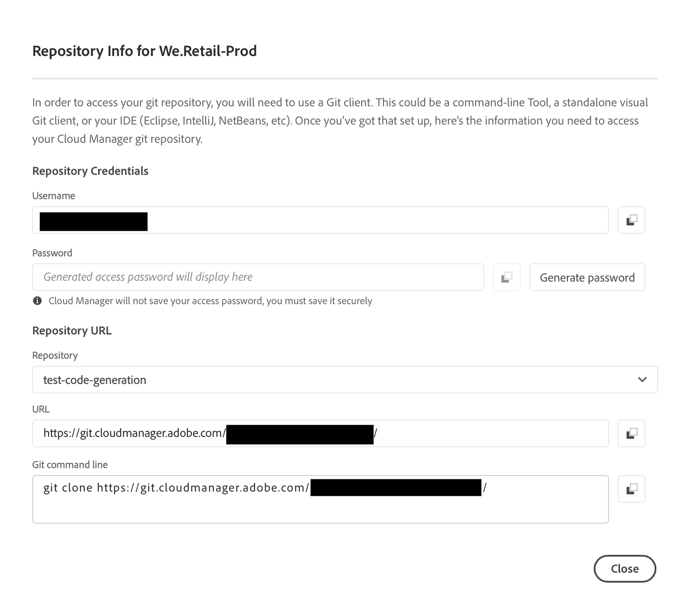
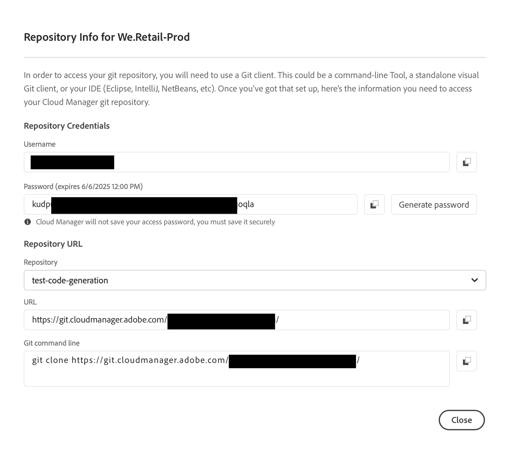

# Informations d’accès au référentiel {#accessing-repos}

Découvrez comment accéder à vos référentiels Git gérés par l’Adobe et les gérer à l’aide de la gestion de compte Git en libre-service dans Cloud Manager.

## Accès aux informations du référentiel à partir de la page Aperçu {#overview-page}

1. Connectez-vous à Cloud Manager à l’adresse [my.cloudmanager.adobe.com](https://my.cloudmanager.adobe.com/) et sélectionnez l’organisation et le programme appropriés.

1. Accédez à la carte **Pipelines** à partir de votre page **Aperçu du programme**.

   

1. Cliquez sur **Accéder à Repo Info**. Dans la boîte de dialogue **Repository Info for..**, vous pouvez afficher les éléments suivants :

   * Nom d’utilisateur Git.
   * Mot de passe Git.
   * URL vers le référentiel Git de Cloud Manager.
   * Commandes git préconfigurées pour ajouter rapidement une télécommande à votre référentiel Git et un code push.

   

1. Pour accéder au mot de passe, un nouveau mot de passe doit être généré. Cliquez sur **`Generate password`**.

1. Dans la boîte de dialogue **Êtes-vous sûr...**, confirmez la génération du mot de passe en cliquant sur **Générer le mot de passe**.

   

1. Dans le champ **Mot de passe**, le mot de passe est généré. Cliquez sur l’icône Copier pour la copier dans le Presse-papiers.

   * La génération d’un mot de passe invalide le mot de passe précédent.
   * Cloud Manager n’enregistre pas votre mot de passe d’accès. Veillez à enregistrer ce mot de passe en toute sécurité.
   * Si vous perdez le mot de passe, vous devez en générer un nouveau.

   

À l’aide de ces informations d’identification, vous pouvez cloner une copie locale du référentiel et apporter des modifications à ce référentiel local. Lorsque vous avez terminé, vous pouvez ensuite valider toutes les modifications du code vers le référentiel de code distant dans Cloud Manager.

>[!NOTE]
>
>* L’option **Accéder aux informations sur le référentiel** est visible pour les utilisateurs disposant du rôle **Développeur**, ou du rôle **Gestionnaire de déploiement**, ou les deux.
>* Le bouton **Accéder aux informations sur le référentiel** n’affiche que les informations d’accès au référentiel pour les référentiels gérés par Adobe. Les informations d’accès relatives aux [référentiels privés](private-repositories.md) ne sont pas disponibles dans Cloud Manager.

## Accès aux informations du référentiel à partir de la fenêtre Référentiels {#repositories-window}

Le bouton **Accéder aux informations sur les référents** est également disponible dans la barre d’outils de la fenêtre [**Référentiels**](managing-repositories.md). Il affiche les mêmes informations sur l’accès aux référentiels gérés par Adobe.

## Révocation d’un mot de passe d’accès {#revoke-password}

Vous pouvez révoquer un mot de passe d’accès à tout moment. [Créez un ticket d’assistance pour une telle requête](https://experienceleague.adobe.com/?support-solution=Experience+Manager&amp;support-tab=home#support).

Le ticket est traité avec une priorité élevée et est généralement révoqué dans la journée.
