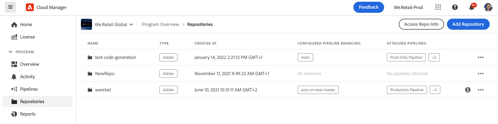

# Ajout de référentiels Adobe dans Cloud Manager {#adobe-repositories}

Découvrez comment créer des référentiels gérés par Adobe dans Cloud Manager.

## Ajout d’un référentiel géré par Adobe {#add-adobe-repository}

La fenêtre **Référentiels** facilite l’ajout de référentiels gérés par Adobe supplémentaires pour votre programme.

1. Connectez-vous à Cloud Manager à l’adresse [my.cloudmanager.adobe.com](https://my.cloudmanager.adobe.com/) et sélectionnez l’organisation et le programme appropriés.

1. Sur la page **Vue d’ensemble du programme**, cliquez sur l’onglet **Référentiels** pour accéder à la page **Référentiels**.

1. Cliquez sur **Ajouter un référentiel** dans la barre d’outils.

   

1. Saisissez le nom et la description demandés, puis cliquez sur **Enregistrer**.

   

Lorsque l’assistant se ferme, votre nouveau référentiel s’affiche dans le tableau dans la fenêtre **Référentiels**. Vous pouvez désormais associer un [Pipeline CI/CD](/help/overview/ci-cd-pipelines.md) à celui-ci, ou le gérer dans la fenêtre [**Référentiels**.](managing-repositories.md)

>[!TIP]
>
>Vous pouvez également ajouter des référentiels GitHub que vous gérez vous-même, en tant que [référentiels privés.](private-repositories.md)
