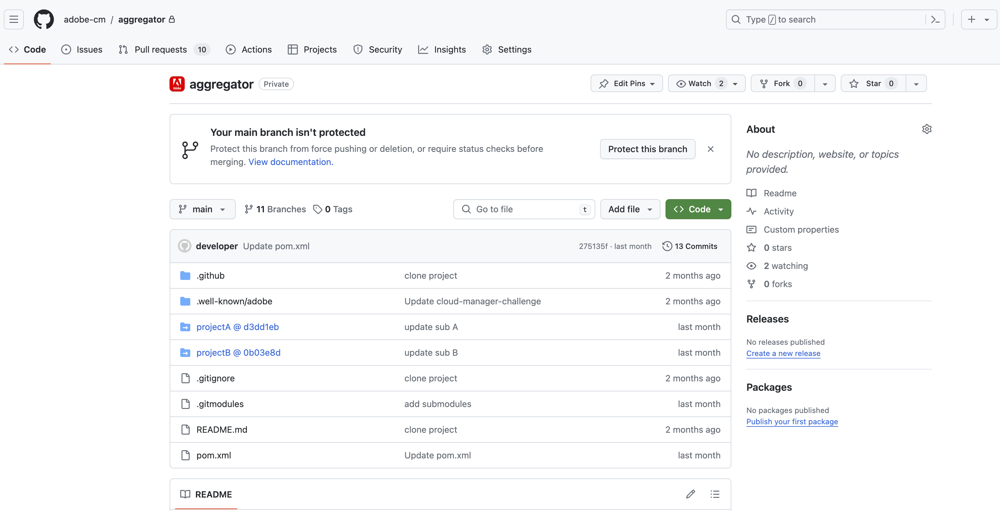

# Prise en charge des sous-modules Git pour les référentiels d’Adobe {#git-submodule-support}

Les sous-modules Git peuvent être utilisés pour fusionner le contenu de plusieurs branches dans des référentiels Git au moment de la création.

Lorsque le processus de création de Cloud Manager s’exécute, une fois le référentiel configuré pour le pipeline cloné et la branche configurée extraite, si la branche contient un fichier `.gitmodules` dans le répertoire racine, la commande est exécutée.

```
$ git submodule update --init
```

Cette procédure extrait chaque sous-module dans le répertoire approprié. Cette technique constitue une alternative potentielle à l’[utilisation de plusieurs référentiels Git sources](/help/managing-code/multiple-git-repos.md) pour les organisations qui maîtrisent l’utilisation des sous-modules Git et qui ne souhaitent pas gérer de processus de fusion externe.

Par exemple, supposons qu’il existe trois référentiels, chacun contenant une seule branche nommée `main`. Dans le référentiel « principal », c’est-à-dire celui qui est configuré dans les pipelines, la branche `main` contient un fichier `pom.xml` qui déclare les projets contenus dans les deux autres référentiels :

```xml
<?xml version="1.0" encoding="UTF-8"?>
<project xmlns="http://maven.apache.org/POM/4.0.0" xmlns:xsi="http://www.w3.org/2001/XMLSchema-instance"
    xsi:schemaLocation="http://maven.apache.org/POM/4.0.0 http://maven.apache.org/maven-v4_0_0.xsd">
    <modelVersion>4.0.0</modelVersion>
   
    <groupId>customer.group.id</groupId>
    <artifactId>customer-reactor</artifactId>
    <version>0.0.1-SNAPSHOT</version>
    <packaging>pom</packaging>
   
    <modules>
        <module>project-a</module>
        <module>project-b</module>
    </modules>
   
</project>
```

Vous pouvez ensuite ajouter des sous-modules pour les deux autres référentiels :

```shell
$ git submodule add -b main https://git.cloudmanager.adobe.com/ProgramName/projectA/ project-a
$ git submodule add -b main https://git.cloudmanager.adobe.com/ProgramName/projectB/ project-b
```

Vous obtenez un fichier `.gitmodules` qui ressemble à ceci :

```text
[submodule "project-a"]
    path = project-a
    url = https://git.cloudmanager.adobe.com/ProgramName/projectA/
    branch = main
[submodule "project-b"]
    path = project-b
    url = https://git.cloudmanager.adobe.com/ProgramName/projectB/
    branch = main
```

Vous trouverez plus d’informations sur les sous-modules Git dans le [Manuel de référence Git](https://git-scm.com/book/fr/v2/Git-Tools-Submodules).

## Limites {#limitations}

Lors de l’utilisation de sous-modules Git, veuillez tenir compte des points suivants :

* L’URL Git doit se trouver exactement dans la syntaxe décrite ci-dessus.
* Pour des raisons de sécurité, n’incorporez pas les informations d’identification dans ces URL.
* Seuls les sous-modules situés à la racine de la branche sont pris en charge.
* Les références des sous-modules Git sont stockées vers des validations Git spécifiques.
   * Par conséquent, lorsque des modifications sont apportées au référentiel de sous-module, la validation référencée doit être mise à jour, par exemple à l’aide de `git submodule update --remote`.
* Sauf indication contraire, il est vivement recommandé d’utiliser des sous-modules « superficiels ».
   * Pour ce faire, exécutez `git config -f .gitmodules submodule.<submodule path>.shallow true` pour chaque sous-module.


## Prise en charge du sous-module Git pour les référentiels privés {#private-repositories}

Prise en charge des sous-modules git lors de l’utilisation de [référentiels privés](private-repositories.md) est largement identique à l’utilisation de référentiels Adobe.

Cependant, après avoir configuré votre `pom.xml` et d’exécuter la variable `git submodule` Commandes, vous devez ajouter une `.gitmodules` dans le répertoire racine du référentiel de l’agrégateur pour que Cloud Manager détecte la configuration du sous-module.




### Restrictions et recommandations {#limitations-recommendations-private-repos}

Lors de l’utilisation de sous-modules git avec des référentiels privés, tenez compte des limites suivantes.

* Les URL git des sous-modules peuvent être au format HTTPS ou SSH, mais elles doivent être liées à un référentiel github.com
   * L’ajout d’un sous-module de référentiel d’Adobe à un référentiel d’agrégation GitHub ou vice versa ne fonctionnera pas.
* Les sous-modules GitHub doivent être accessibles pour l’application GitHub Adobe.
* [Limites de l’utilisation de sous-modules Git avec des référentiels gérés par Adobe](#limitations-recommendations) s’appliquent également.