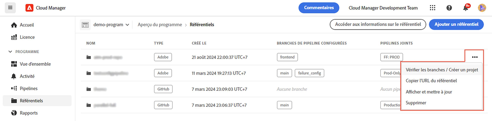
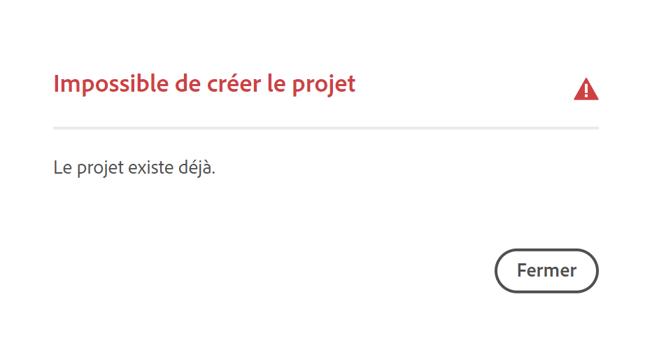

# Référentiels Cloud Manager {#cloud-manager-repos}

Découvrez comment créer, afficher et modifier vos référentiels Git dans Cloud Manager.

## Vue d’ensemble {#overview}

Les référentiels servent à stocker et gérer le code de votre projet à l’aide de Git. Chaque programme que vous créez dans Cloud Manager dispose d’un référentiel géré par Adobe créé pour lui.

Vous pouvez choisir de créer d’autres référentiels gérés par Adobe et d’ajouter vos propres référentiels privés. Tous les référentiels associés à votre programme peuvent être consultés dans la fenêtre **Référentiels**.

Vous pouvez également sélectionner les référentiels créés dans Cloud Manager lors de l’ajout ou de la modification de pipelines. Consultez [Pipelines CI-CD](/help/overview/ci-cd-pipelines.md) pour en savoir plus.

Il existe un référentiel principal unique ou une branche pour chaque pipeline donné. Avec la [prise en charge du sous-module Git](git-submodules.md), de nombreuses branches secondaires peuvent être incluses au moment de la création.

## Fenêtre Référentiels {#repositories-window}

1. Connectez-vous à Cloud Manager à l’adresse [my.cloudmanager.adobe.com](https://my.cloudmanager.adobe.com/) et sélectionnez l’organisation et le programme appropriés.

1. Sur la page **Vue d’ensemble du programme**, cliquez sur l’onglet **Référentiels** pour accéder à la page **Référentiels**.

1. La fenêtre **Référentiels** affiche tous les référentiels associés à votre programme.

   

La fenêtre **Référentiels** fournit des détails sur les référentiels :

* Type de référentiel.
   * **Adobe** indique les référentiels gérés par Adobe.
   * **GitHub** indique les référentiels GitHub privés que vous gérez.
* La date de création
* Les pipelines associés au référentiel

Vous pouvez sélectionner le référentiel dans la fenêtre et cliquer sur le bouton représentant des points de suspension pour agir sur le référentiel sélectionné.

* **[Vérifier les branches/Créer un projet](#check-branches)** (disponible uniquement pour les référentiels Adobe)
* **[Copier l’URL du référentiel](#copy-url)**
* **[Afficher et mettre à jour](#view-update)**
* **[Supprimer](#delete)**

## Ajout de référentiels {#adding-repositories}

Cliquez sur le bouton **Ajouter un référentiel** dans la fenêtre **Référentiels** pour lancer l’assistant **Ajouter un référentiel**.

Cloud Manager prend en charge les référentiels gérés par Adobe (**Référentiel Adobe**) ainsi que vos propres référentiels auto-gérés (**Référentiel privé**). Les champs requis varient en fonction du type de référentiel que vous choisissez d’ajouter.

Voir [Ajout de référentiels d’Adobe dans Cloud Manager](adobe-repositories.md).
Voir [Ajout de référentiels privés dans Cloud Manager](private-repositories.md).

>[!NOTE]
>
>Un utilisateur ou une utilisatrice doit disposer du rôle **Responsable de déploiement** ou **Propriétaire de l’entreprise** pour pouvoir ajouter un référentiel.
>
>Les référentiels sont limités à 300 pour tous les programmes d’une société ou d’une organisation IMS donnée.

## Accès aux informations du référentiel {#repo-info}

Lorsque vous consultez vos référentiels dans la fenêtre **Référentiels**, vous pouvez consulter des informations sur la façon d’accéder aux référentiels gérés par Adobe par programmation, en cliquant sur le bouton **Accéder aux informations sur le référentiel** dans la barre d’outils.

La fenêtre **Informations sur le référentiel** s’ouvre et affiche les détails. Pour plus d’informations sur l’accès aux informations du référentiel, voir la section [Accéder aux informations du référentiel](accessing-repositories.md).

## Vérifier les branches {#check-branches}

L’action **Vérifier les branches / Créer un projet** exécute deux fonctions selon l’état du référentiel.

Si le référentiel est nouvellement créé, l’action crée un exemple de projet basé sur [l’archétype de projet AEM](https://experienceleague.adobe.com/fr/docs/experience-manager-core-components/using/developing/archetype/overview).

Si le référentiel a déjà créé l’exemple de projet, il vérifie l’état du référentiel et de ses branches et signale si l’exemple de projet existe déjà.

## Copie de l’URL du référentiel {#copy-url}

L’action **Copier l’URL du référentiel** copie l’URL du référentiel sélectionné dans la fenêtre **Référentiels** vers le Presse-papiers afin d’utiliser cette URL ailleurs.

## Affichage et mise à jour {#view-update}

L’action **Afficher et mettre à jour** ouvre la boîte de dialogue **Mettre à jour le référentiel**. À l’aide de celle-ci, vous pouvez afficher le **Nom** et l’**Aperçu de l’URL du référentiel** et mettre à jour la **Description** du référentiel.

## Supprimer {#delete}

L’action **Supprimer** supprime le référentiel de votre projet. Un référentiel ne peut pas être supprimé s’il est associé à un pipeline.

Lorsqu’un référentiel est supprimé dans Cloud Manager, il est marqué comme supprimé ; il n’est plus accessible à l’utilisateur. Toutefois, il est conservé dans le système à des fins de récupération.

Si vous essayez de créer un référentiel après avoir supprimé un référentiel portant le même nom, vous recevez le message d’erreur `An error has occurred while trying to create repository. Contact your CSE or Adobe Support.`

Si vous recevez ce message d’erreur, contactez l’assistance Adobe pour obtenir de l’aide afin de renommer le référentiel supprimé ou de choisir un autre nom pour votre nouveau référentiel.
