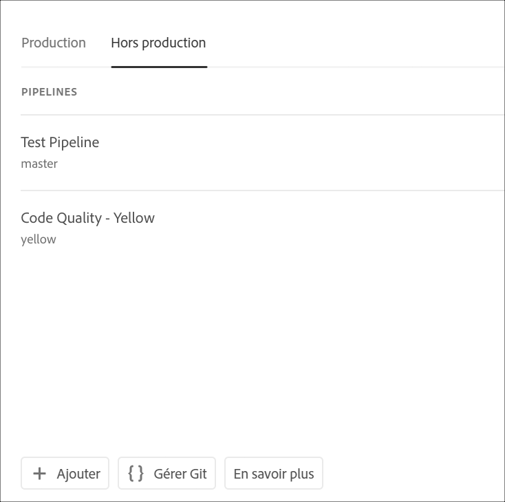

# Accès à Git {#accessing-git}

Vous pouvez accéder à votre référentiel Git et le gérer à l’aide de la gestion de compte Git en libre-service à partir de l’interface utilisateur de Cloud Manager.

## Utilisation De La Gestion De Compte Git En Libre-Service {#self-service-git}

Utilisez le bouton **Gérer l’extraction** disponible dans l’interface utilisateur de Cloud Manager, principalement sur la carte du pipeline.

1. Accédez à la page Aperçu *du* programme et à la carte Pipelines.

1. Vous verrez l’option **Gérer Git** pour accéder à votre référentiel Git et le gérer.

   

   De plus, si vous sélectionnez l’onglet **Conduite hors production** , vous verrez également l’option **Gérer Git** .

   

>[!NOTE]
>L’option **Gérer Git** est visible par les utilisateurs dans le rôle Développeur ou Gestionnaire de déploiement. Cliquez sur ce bouton pour ouvrir une boîte de dialogue qui permet à l’utilisateur de trouver l’URL de son référentiel Git Cloud Manager, ainsi que son nom d’utilisateur et son mot de passe.

