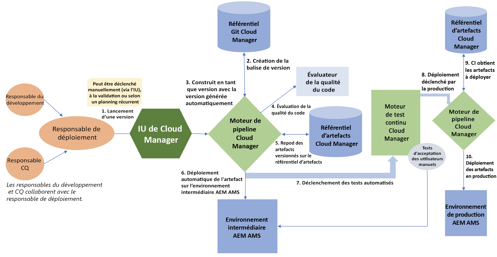
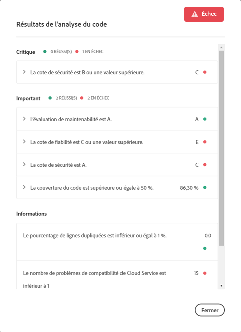

# Pipeline CI/CD {#ci-cd-pipeline}

## Présentation du pipeline {#pipeline-overview}

[!UICONTROL Cloud Manager] comprend une structure d’intégration continue (CI) et de diffusion continue (CD) qui permet aux équipes d’implémentation de tester et de diffuser rapidement du code nouveau ou mis à jour. Par exemple, les équipes d’implémentation peuvent configurer et démarrer un pipeline CI/CD automatisé qui utilise les bonnes pratiques en matière de codage Adobe afin d’analyser précisément le code et d’en garantir la qualité.

Le pipeline CI/CD automatise également les processus de test d’unités et de performances pour accroître l’efficacité du déploiement et identifier de manière proactive les problèmes critiques dont la correction coûte chère après le déploiement. Les équipes d’implémentation peuvent avoir accès à un rapport complet sur les performances du code afin d’avoir une vue d’ensemble des impacts potentiels sur les indicateurs de performance clés et les validations de sécurité critiques en cas de déploiement du code en production.

## Processus du pipeline {#pipeline-process}

Le diagramme ci-après illustre ce qui se produit lorsqu’une version est déclenchée dans [!UICONTROL Cloud Manager]. Le tableau associé ci-dessous explique chaque étape dans le workflow.

Le tableau suivant détaille ce qui se passe à chaque étape du processus :

| Étape du processus de pipeline | Que se passe-t-il ? |
|---|---|
| 1. Démarrage d’une version | Un responsable de déploiement déclenche une version manuellement, avec une validation Git ou selon une planification récurrente. |
| 2. Création d’une balise de version | [!UICONTROL Cloud Manager] crée une balise Git pour marquer la version à l’aide d’un numéro de version généré automatiquement. Par exemple : 2018.531.245527.0000001222 |
| 3. Génération de l’application avec la version générée automatiquement | [!UICONTROL Cloud Manager] crée l’application avec le numéro de version nouvellement attribué. |
| 4. Évaluation de la qualité du code | [!UICONTROL Cloud Manager] analyse le code source et fournit un résumé avant que le code puisse être déployé dans l’environnement intermédiaire. |
| 5. Artefact(s) avec version(s) stocké(s) | Les artefacts de version sont stockés pour une utilisation ultérieure dans les étapes de déploiement. |
| 6. Déploiement automatique du ou des artefacts à l’étape AMS AEM | L’artefact de version est déployé dans l’environnement intermédiaire. |
| 7. Déclenchement des tests automatisés | [!UICONTROL Cloud Manager] exécute les tests de performances et de sécurité sur l’artefact. |
| 8. Déploiement en production | Une fois les tests automatisés terminés, [!UICONTROL Cloud Manager] démarre le déploiement en production. |
| 9. [!UICONTROL Cloud Manager] gets Artifacts(s) to Deploy | [!UICONTROL Cloud Manager] extrait les artefacts de version stockés. |
| 10. Déploiement du ou des artefacts en production | Les artefacts de version sont déployés dans l’environnement de production. |

### Configuration d’un pipeline CI/CD {#how-to-setup-a-ci-cd-pipeline}

Pour en savoir plus sur la configuration du pipeline, consultez [Configuration du pipeline](configuring-pipeline.md).

## Points de contrôle de qualité {#quality-gates}

Le pipeline CI/CD fournit des points de contrôle de qualité, ou critères d’acceptation, qui doivent être satisfaits avant que le code puisse passer de l’environnement intermédiaire à l’environnement de déploiement. Le pipeline comprend trois points de contrôle :

* Qualité du code
* Test de performance
* Test de sécurité

Pour chacun de ces points de contrôle, trois niveaux de problèmes sont identifiés :

* **Critique** : problèmes identifiés par le point de contrôle qui entraînent un échec immédiat du pipeline.
* **Important** : problèmes identifiés par le point de contrôle qui entraînent la suspension du pipeline. Un responsable de déploiement, un responsable de projet ou un propriétaire d’entreprise peuvent soit contourner les problèmes, auquel cas le pipeline continue, soit accepter les problèmes, auquel cas le pipeline s’arrête avec un échec.
* **Informations** : problèmes identifiés par le point de contrôle, indiqués à titre informatif et sans incidence sur l’exécution du pipeline.

Voici un exemple d’analyse de code avec des problèmes identifiés au niveau du code :

### Configuration des points de contrôle {#how-to-setup-gates}

Voir **[Configuration de points de contrôle](configuring-pipeline.md)**pour obtenir plus d’informations sur la configuration de votre code et sur les points de contrôle de performance et de qualité.
