# Configuration de votre pipeline CI/CD {#configure-your-ci-cd-pipeline}

La page suivante explique comment configurer le **pipeline**. Pour consulter d’autres informations conceptuelles sur le fonctionnement du pipeline, voir la section [Présentation du pipeline CI/CD](ci-cd-pipeline.md).

## Tutoriel vidéo {#video-tutorial-one}

### Configuration du pipeline dans Cloud Manager {#config-pipeline-video}

La configuration du pipeline de production CI/CD définit le déclencheur qui lancera le pipeline, les paramètres contrôlant le déploiement en production et les paramètres de test de performances.

>[!VIDEO](https://video.tv.adobe.com/v/26314/)

## Présentation du flux {#understanding-the-flow}

Vous pouvez configurer votre pipeline à partir de la vignette **Paramètres du pipeline** dans l’interface utilisateur de [!UICONTROL Cloud Manager].

Le responsable de déploiement est chargé de la configuration du pipeline. Pour ce faire, vous devez d’abord sélectionner une branche dans le **référentiel git**. La configuration du pipeline comprend :

* la définition du déclencheur qui le démarrera ;
* la définition des paramètres qui contrôlent le déploiement en production ;
* la configuration des paramètres de test de performance.

## Configuration du pipeline {#setting-up-the-pipeline}

>[!CAUTION]
>
>Le pipeline ne peut être configuré que si le référentiel Git dispose d’au moins une branche et que la [configuration du programme](setting-up-program.md) est terminée.

Avant de commencer le déploiement du code, vous devez configurer les paramètres de votre pipeline à partir de [!UICONTROL Cloud Manager].

>[!NOTE]
>
>Vous pouvez modifier les paramètres du pipeline après la configuration initiale.

### Configuration des paramètres du pipeline à partir de [!UICONTROL Cloud Manager] {#configuring-the-pipeline-settings-from-cloud-manager}

Une fois que vous avez configuré votre programme à l’aide de l’interface utilisateur de [!UICONTROL Cloud Manager], vous êtes prêt à configurer votre pipeline.

Pour configurer le comportement et les préférences de votre pipeline, procédez comme suit :

1. Cliquez sur **Configurer le pipeline** pour configurer votre pipeline.

   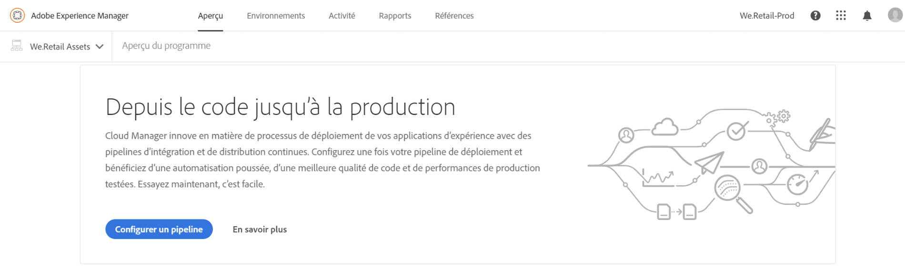

1. L’écran **Configurer un pipeline** s’affiche.

   L’assistant en trois étapes permet de configurer votre **branche**, vos **environnements** et votre environnement de **test**.
Sélectionnez votre branche Git et cliquez **Suivant**.

   >[!NOTE]
   >
   >Les branches trouvées dans le référentiel Git sont associées au programme.

   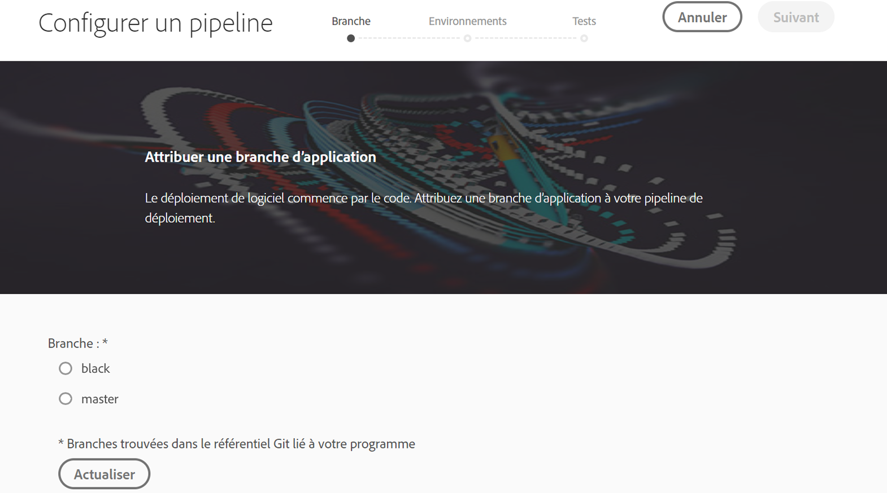

1. Accédez à l’onglet **Environnements** pour sélectionner les options **Intermédiaire** et **Production**.

   Vous pouvez définir le déclencheur pour démarrer le pipeline :

   * **Lors des modifications Git** : démarre le pipeline CI/CD chaque fois que des validations sont ajoutées à la branche git configurée. Même si vous sélectionnez cette option, vous pouvez toujours démarrer le pipeline manuellement.
   * **Manuel** : l’utilisation de l’interface lance le pipeline manuellement.

   Lors de la configuration ou de la modification du pipeline, le responsable de déploiement peut définir le comportement du pipeline en cas d’échec important dans l’un des points de contrôle qualité tels que Qualité du code, Test de sécurité et Test de performance.

   Cela s’avère utile pour les clients qui souhaitent davantage de processus automatisés. Les options disponibles sont les suivantes :

* **Demander à chaque fois** : il s’agit du paramètre par défaut, qui nécessite une intervention manuelle lors de n’importe quel échec important.
* **Annuler immédiatement en cas d’échec** : si cette option est sélectionnée, le pipeline sera annulé chaque fois qu’un échec important se produira. Cette option émule essentiellement un utilisateur rejetant manuellement chaque échec.
* **Continuer immédiatement** : si cette option est sélectionnée, le pipeline se poursuit automatiquement chaque fois qu’un échec important se produit. Cette option émule essentiellement la validation manuelle de l’utilisateur à chaque échec.

   Définissez maintenant les paramètres contrôlant le déploiement en production. Les trois options disponibles sont les suivantes :

* **Utiliser l’approbation GoLive** : un déploiement doit être approuvé manuellement par un propriétaire d’entreprise, un responsable de projet ou un responsable de déploiement via l’interface utilisateur [!UICONTROL Cloud Manager].
* **Utiliser la supervision par l’ingénieur du service client** : un ingénieur du service client participe au démarrage du déploiement. Lors de la configuration ou de la modification du pipeline lorsque la supervision par l’ingénieur du service client est activée, le responsable de déploiement peut sélectionner l’une des options suivantes :

   * **Tout ingénieur du service client** : fait référence à tout ingénieur du service client disponible.
   * **Mon ingénieur du service client** : fait référence à un ingénieur du service client spécifique affecté au client ou un remplaçant, si l’ingénieur du service client est absent du bureau.

* **Planifié** : cette option permet à l’utilisateur d’activer le déploiement en production planifié.

>[!NOTE]
>
>Si l’option **Planifié** est sélectionnée, vous pouvez planifier le déploiement en production sur le pipeline **après** le déploiement en environnement intermédiaire (et **Utiliser l’approbation GoLive**, si cette option a été activée) pour attendre la définition d’une planification. L’utilisateur peut également choisir d’exécuter le déploiement en production immédiatement.
>
>Consultez [**Déploiement de votre code **](deploying-code.md)pour définir la planification du déploiement ou exécuter la production immédiatement.

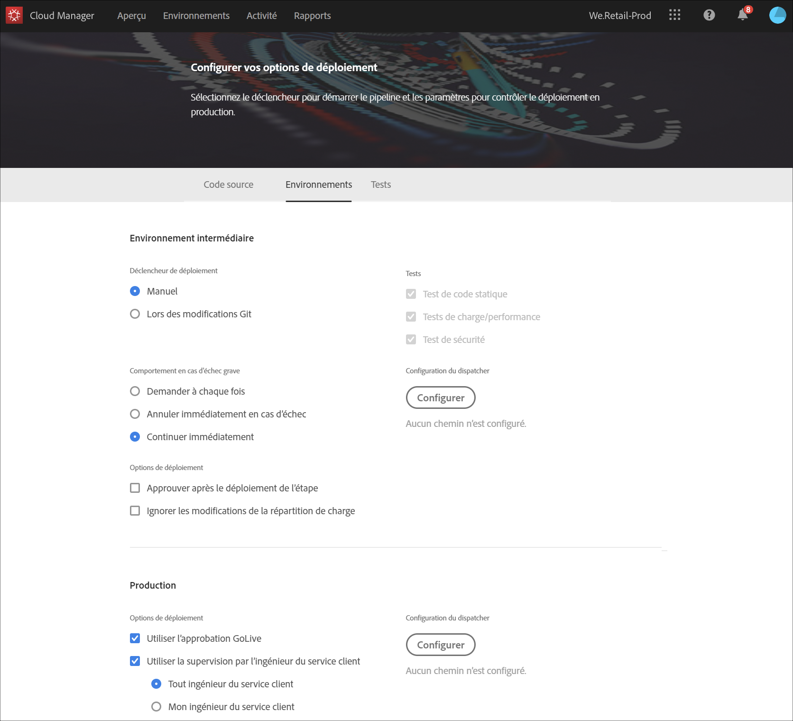

>[!NOTE]
>
>L’option **Utiliser la supervision par l’ingénieur du service client** n’est pas disponible pour tous les clients.

**Approuver après le déploiement de l’étape**

Il existe une étape facultative **Approbation après déploiement dans l’environnement intermédiaire** qui peut être configurée dans le pipeline de production.
Elle est activée dans une nouvelle option de l’écran **Modifier un pipeline** :

Elle s’affiche ensuite sous la forme d’une étape distincte lors de l’exécution du pipeline :

>[!NOTE]
>
>Les fonctions **Approbation après le déploiement dans l’environnement intermédiaire** fonctionnent de la même manière que l’approbation avant le déploiement en production, mais ce processus se produit immédiatement après l’étape de déploiement dans l’environnement intermédiaire, c’est-à-dire avant que les tests ne soient effectués, contrairement à l’approbation avant le déploiement en production, qui est effectuée une fois tous les tests terminés.

**Invalidation du Dispatcher**

En tant que responsable de déploiement, vous avez la possibilité de configurer un ensemble de chemins de contenu qui seront **invalidés** ou **purgés** du cache du Dispatcher AEM, lors de la configuration ou de la modification du pipeline.

Vous pouvez configurer un ensemble distinct de chemins pour le déploiement Intermédiaire et Production. Si elles sont configurées, ces actions de cache sont exécutées dans le cadre de l’étape du pipeline de déploiement, juste après le déploiement des packages de contenu. Ces paramètres utilisent le comportement du Dispatcher AEM standard : invalider effectue une invalidation du cache, comme lorsque le contenu est activé de Author vers Publish ; purger effectue une suppression de cache.

En règle générale, l’utilisation de l’action invalider est préférable mais il se peut que la purge soit requise, notamment lors de l’utilisation des bibliothèques clients HTML AEM.

>[!NOTE]
>
>Pour plus d’informations sur la mise en cache du Dispatcher, consultez [Présentation du Dispatcher](dispatcher-configurations.md).

Pour configurer les invalidations du Dispatcher, procédez comme suit :

1. Cliquez sur **Configurer** sous l’en-tête Configuration du dispatcher.

   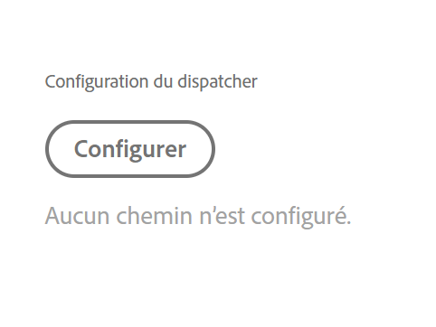

1. Saisissez le chemin d’accès, sélectionnez l’action dans **Type**, puis cliquez sur **Ajouter**. Vous pouvez spécifier jusqu’à 100 chemins par environnement. Une fois les chemins ajoutés, cliquez sur **Appliquer**.

   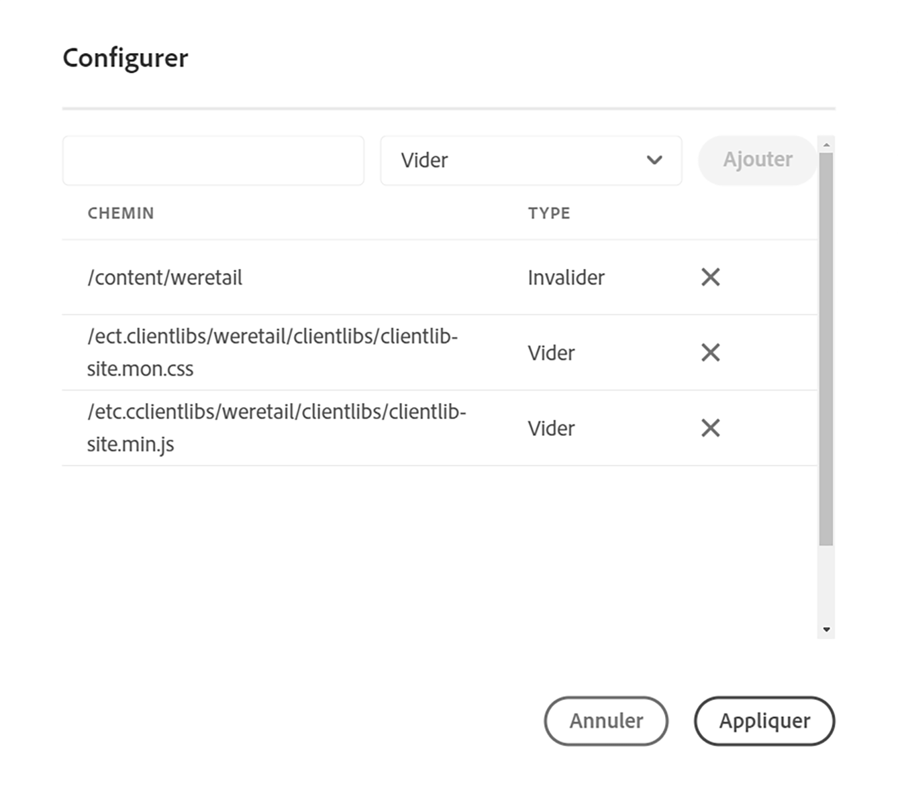

1. Une fois que vous êtes revenu sur la page **Paramètres du pipeline**, un résumé mis à jour des sélections s’affiche.

   Cliquez sur **Enregistrer** pour conserver cette configuration.

   

1. Accédez à l’onglet **Tests** pour définir les critères de test du programme.

   Vous pouvez maintenant configurer les paramètres de test de performance.

   Vous pouvez configurer des tests de performance *AEM Sites* et *AEM Assets*, selon les produits sous licence que vous possédez.

   **AEM Sites :**

   Cloud Manager exécute des tests de performances pour les programmes AEM Sites en demandant des pages (en tant qu’utilisateur non authentifié par défaut) sur le serveur de publication d’étape pendant une période de test de 30 minutes et en mesurant le temps de réponse pour chaque page ainsi que diverses mesures au niveau du système.

   Avant le début de cette période de test de 30 minutes, Cloud Manager explore l’environnement d’évaluation à l’aide d’une ou de plusieurs URL *sources* configurées par l’ingénieur du service client. À partir de ces URL, le code HTML de chaque page est examiné et les liens sont parcourus en largeur d’abord. Ce processus d’exploration est limité à un maximum de 5 000 pages. Les requêtes du robot d’exploration ont un délai d’expiration fixe de 10 secondes.

   Les pages sont sélectionnées par trois **ensembles** ; vous pouvez choisir entre un jeu et trois ensembles. La répartition du trafic dépend du nombre d’ensembles sélectionnés. Si les trois ensembles sont sélectionnés, 33 % du nombre total des pages vues sont placées dans chaque ensemble, si deux ensembles sont sélectionnés, 50 % sont dirigées vers chaque ensemble, si un seul est sélectionné, 100 % du trafic va vers cet ensemble.

   Supposons, par exemple, qu’il y ait une répartition 50 %/50 % entre les pages actives populaires et les nouvelles pages (dans cet exemple, les autres pages actives se sont pas utilisées) et que les nouvelles pages contiennent 3 000 pages. L’indicateur de performance clé des pages vues par minute est défini sur 200. Pendant la période test de 30 minutes :

   * Chacune des 25 pages des pages actives populaires est demandée 240 fois – ((200 x 0,5) : 25) x 30 = 120

   * Chacune des 3 000 pages des nouvelles pages sera demandée une fois - ((200 x 0,5) : 3 000) x 30 = 1

   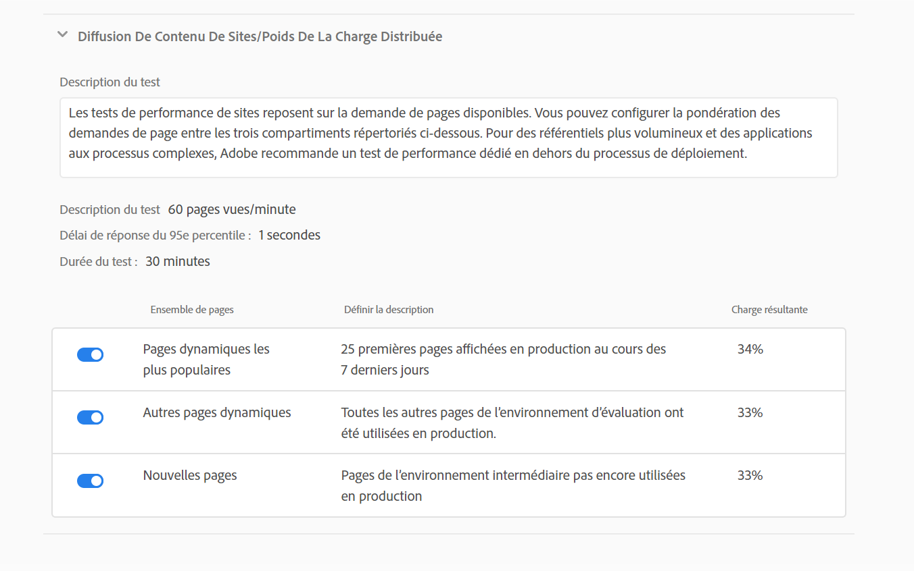

   Reportez-vous au Test [de performances des sites](configuring-pipeline.md#authenticated-sites-performance) authentifiés pour savoir comment authentifier les tests de performances AEM Sites.

   **AEM Assets :**

   Cloud Manager exécute des tests de performance pour les programmes AEM Assets en chargeant des ressources à plusieurs reprises pendant une période de test de 30 minutes et en mesurant le délai de traitement de chaque ressource, ainsi que diverses mesures au niveau du système. Cette fonctionnalité peut télécharger des images et des documents PDF. La répartition du nombre de ressources de chaque type qui sont téléchargées par minute est définie dans l’écran Configuration du pipeline ou Modifier.

   Par exemple, si une répartition 70/30 est utilisée, comme illustré dans le schéma ci-dessous. Dix ressources sont téléchargées par minute, 7 images et 3 documents.

   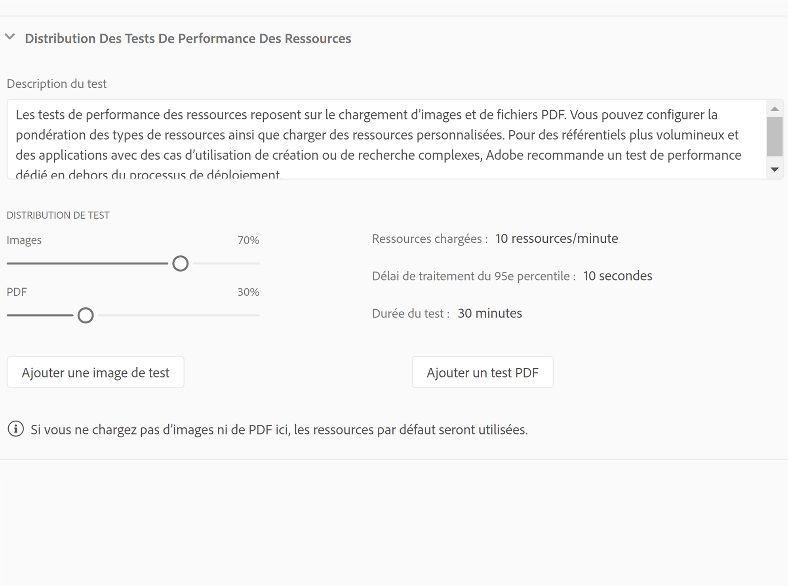

   >[!NOTE]
   >
   >Il existe une image et un document PDF par défaut, mais dans la plupart des cas, les clients souhaitent télécharger leurs propres ressources. Vous pouvez le faire à partir de l’écran Configuration du pipeline ou Modifier. Les formats d’image courants tels que JPEG, PNG, GIF et BMP sont pris en charge, ainsi que les fichiers Photoshop, Illustrator et Postscript.

1. Cliquez sur **Enregistrer** pour terminer la configuration du processus de pipeline.

   >[!NOTE]
   >
   >Une fois que vous avez configuré le pipeline, vous pouvez toujours modifier les paramètres à l’aide de la vignette **Paramètres du pipeline de production** depuis l’interface utilisateur de [!UICONTROL Cloud Manager].

   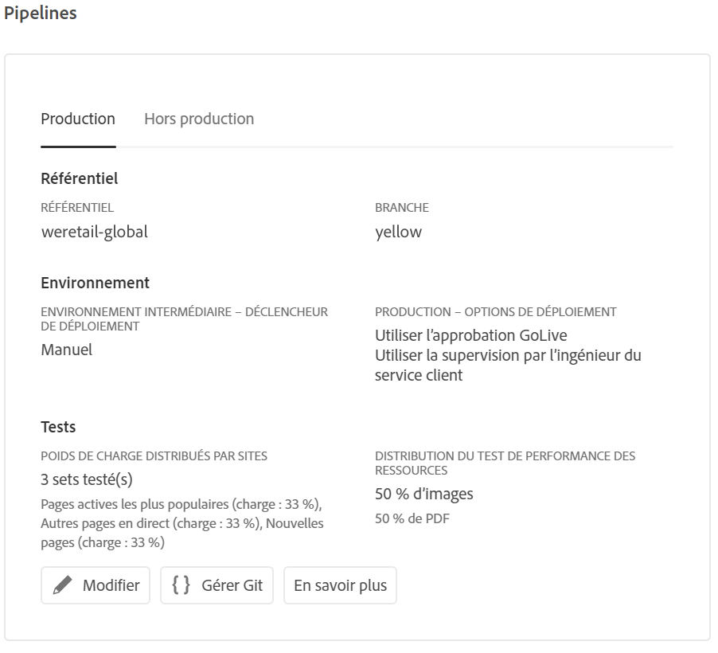

### Test des performances des sites authentifiés {#authenticated-sites-performance}

Les clients Adobe Managed Services (AMS) disposant de sites authentifiés peuvent spécifier un nom d’utilisateur et un mot de passe que Cloud Manager utilisera pour accéder au site Web lors des tests de performances des sites.

Le nom d&#39;utilisateur et le mot de passe sont spécifiés sous la forme de variables de pipeline avec les noms `CM_PERF_TEST_BASIC_USERNAME` et `CM_PERF_TEST_BASIC_PASSWORD` .

>[!NOTE]
> Bien que cela ne soit pas strictement requis, il est recommandé d’utiliser le type de variable de chaîne pour le nom d’utilisateur et le type de variable secretString pour le mot de passe. Si ces deux éléments sont spécifiés, chaque requête du moteur de recherche de tests de performances et des utilisateurs virtuels de test contiendra ces informations d’identification sous forme d’authentification HTTP Basic.

Pour définir ces variables à l’aide de l’interface de ligne de commande de Cloud Manager, exécutez :

`$ aio cloudmanager:set-pipeline-variables <pipeline id> --variable CM_PERF_TEST_BASIC_USERNAME <username> --secret CM_PERF_TEST_BASIC_PASSWORD <password>`

## Pipelines de qualité de code et hors production uniquement

En plus du pipeline principal qui se déploie vers les environnements intermédiaire et de production, les clients peuvent configurer des pipelines supplémentaires, appelés **Pipelines hors production**. Ces pipelines exécutent toujours les étapes de génération et de qualité de code. Si besoin est, elles peuvent aussi déployer vers l’environnement Adobe Managed Services.

## Tutoriel vidéo {#video-tutorial-two}

### Pipelines hors production et de la qualité du code uniquement de Cloud Manager{#non-prod-video}

Les pipelines CI/CD hors production sont divisés en deux catégories : les pipelines de qualité du code et les pipelines de déploiement. Les pipelines de qualité du code canalisent tout le code d’une branche Git pour génération et évaluation par rapport à l’analyse de la qualité du code de Cloud Manager.

>[!VIDEO](https://video.tv.adobe.com/v/26316/)

Sur l’écran d’accueil, ces pipelines sont répertoriés dans une nouvelle carte :

1. Accédez à la vignette **Pipelines hors production** depuis l’écran d’accueil de Cloud Manager.

   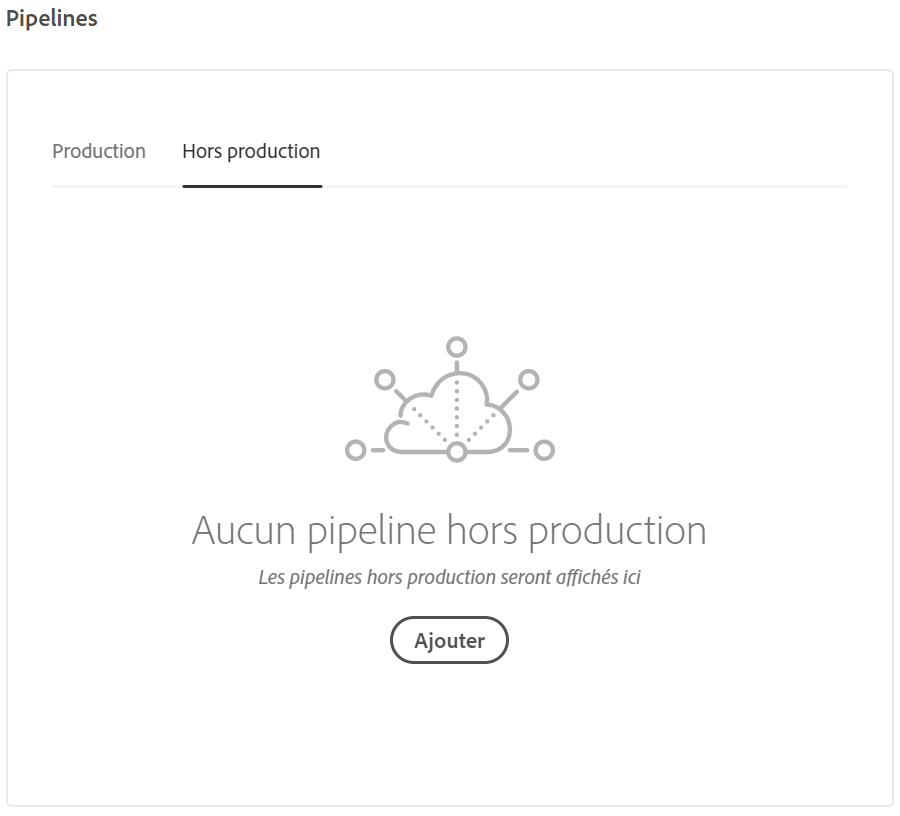

1. Cliquez sur le bouton Ajouter pour spécifier le nom du pipeline, le type de pipeline et la branche Git.

   Vous pouvez également configurer le déclencheur de déploiement et le comportement en cas d’échec important dans les options du pipeline.

   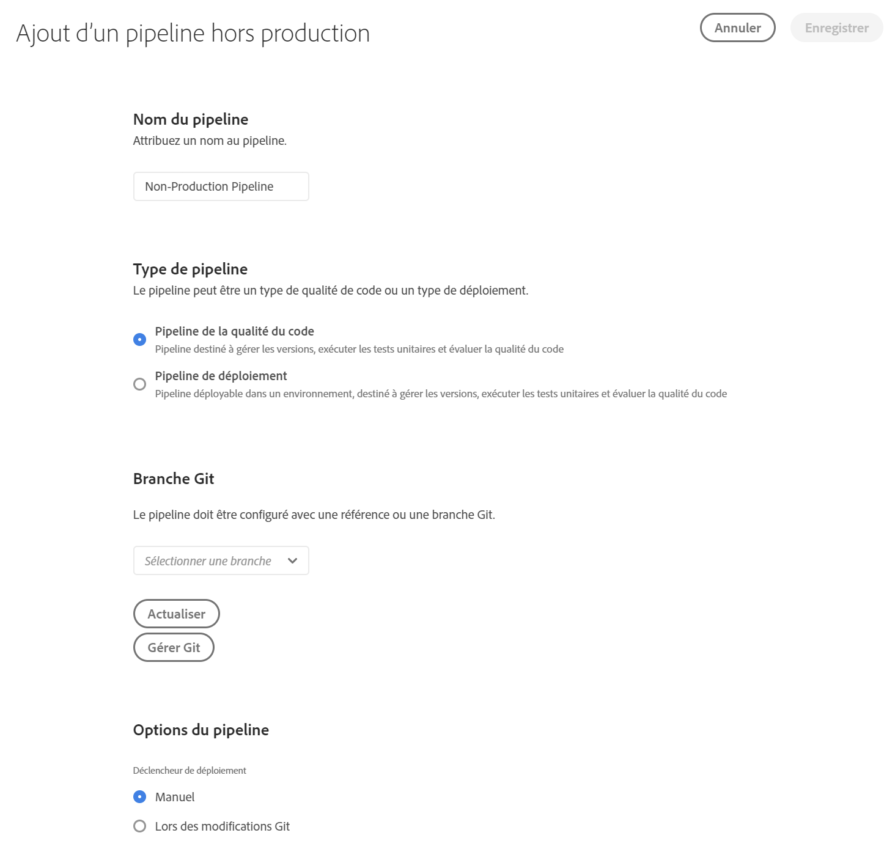

1. Cliquez sur **Enregistrer** pour afficher le pipeline sur la carte de l’écran d’accueil avec trois actions :

   * **Modifier** : permet de modifier les paramètres du pipeline.
   * **Détail** : affiche la dernière exécution du pipeline (si existante).
   * **Génération** : permet d’accéder à la page d’exécution, à partir de laquelle le pipeline peut être exécuté.

   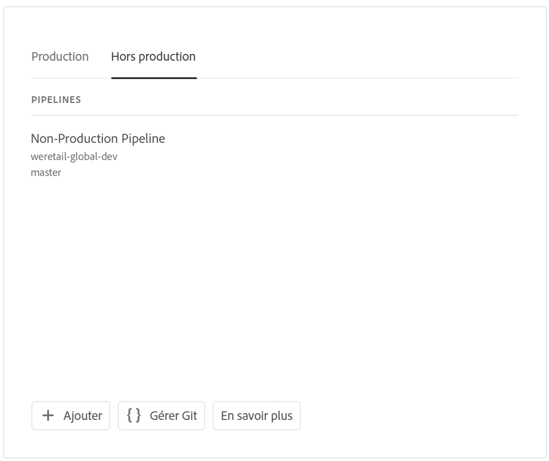

   >[!NOTE]
   >
   >Quand le pipeline est en cours d’exécution, l’étape actuelle est affichée et seule l’action **Détails** est disponible.

## Étapes suivantes {#the-next-steps}

Une fois que vous avez configuré le pipeline, vous devez déployer votre code.

Pour plus d’informations, consultez [Déploiement de votre code](deploying-code.md).
