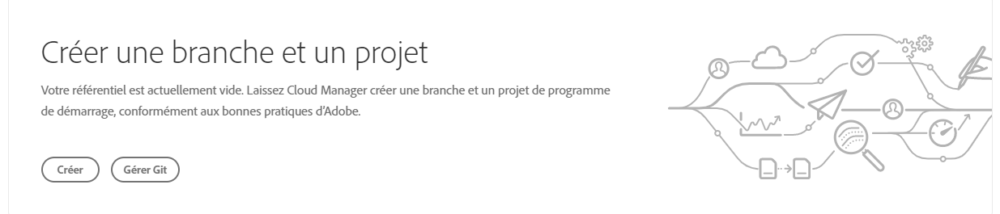
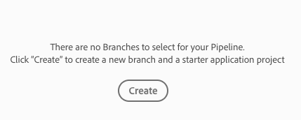
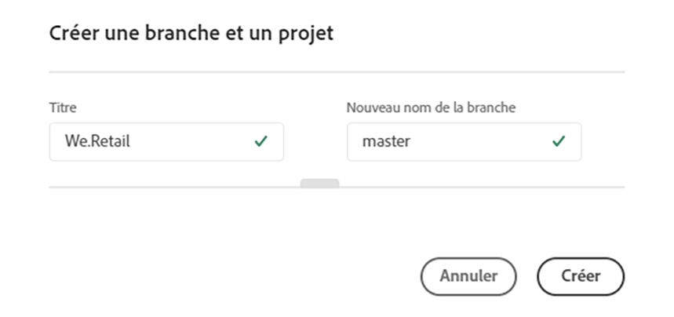
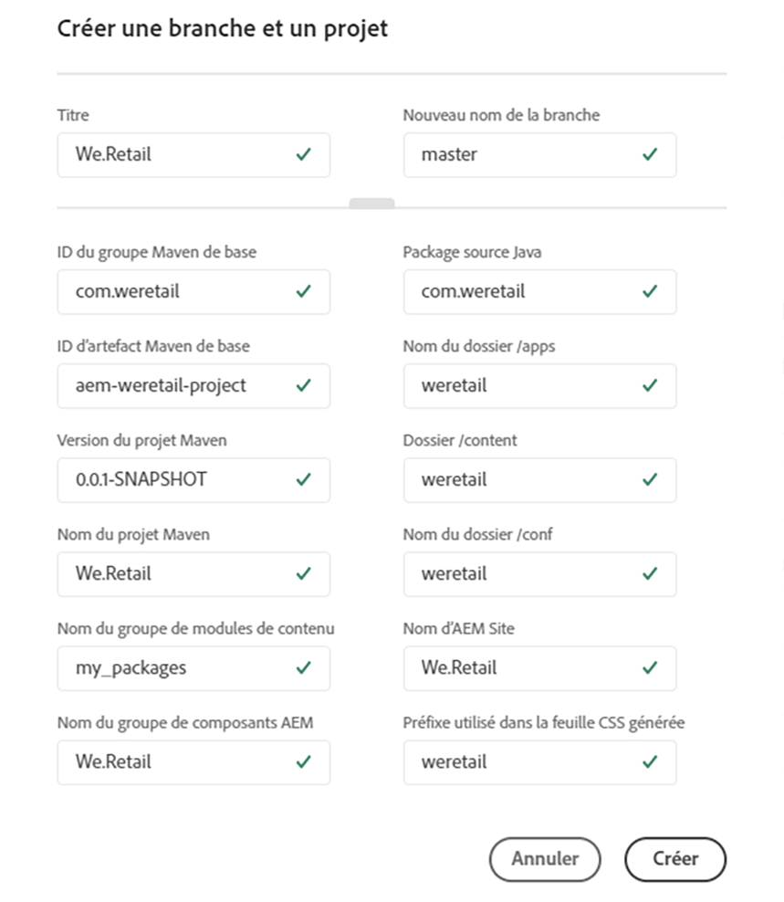

# Création d’un projet d’application AEM {#create-an-aem-application-project}

## Utilisation de l’assistant pour créer un projet d’application AEM {#using-wizard-to-create-an-aem-application-project}

Lorsque les clients se connectent à Cloud Manager, ils reçoivent un référentiel git vide. Les clients Adobe Managed Services (AMS) actuels (ou clients AEM sur site qui migrent vers AMS) auront généralement déjà leur code de projet dans git (ou un autre système de contrôle de version) et importeront leur projet dans le référentiel git Cloud Manager. Toutefois, les nouveaux clients n’ont pas de projets existants.

Pour faciliter la prise en main des nouveaux clients, Cloud Manager peut désormais créer un projet AEM minimal comme point de départ. Ce processus est basé sur l’[**AEM Project Archetype **](https://github.com/Adobe-Marketing-Cloud/aem-project-archetype).

<!-- 

Comment Type: annotation
Last Modified By: jsyal
Last Modified Date: 2018-10-08T12:52:50.071-0400

2018.8.0: Added this new section

 -->

Suivez les étapes ci-dessous pour créer un projet d’application AEM dans Cloud Manager :

1. Une fois que vous vous êtes connecté à Cloud Manager et que la configuration du programme de base est terminée, une vignette d’appel à action spéciale s’affiche sur l’écran **Vue d’ensemble**, si le référentiel est vide.

   

[Shankari] , la deuxième étape décrite ci-dessous est incorrecte. supprimez-le, je vous prie.
1. Cliquez sur **Créer** pour accéder à l’écran **Configuration du pipeline**.

   

1. Cliquez sur **Créer** pour ouvrir une boîte de dialogue qui permet à l’utilisateur de fournir les paramètres requis par AEM Project Archetype. Dans le formulaire par défaut, la boîte de dialogue demande deux valeurs :

   * **Titre** : par défaut, cette valeur est définie sur le *nom du programme*.

   * **Nouveau nom de branche** : par défaut, il s’agit d’un *gabarit*.
   

   La boîte de dialogue comporte un tiroir qui peut être ouvert en cliquant sur la poignée vers le bas de la boîte de dialogue. Dans le formulaire développé, la boîte de dialogue affiche tous les paramètres de configuration d’Archetype. La plupart de ces paramètres comportent des valeurs par défaut générées en fonction du **titre**.

   

   >[!NOTE]
   >
   >Par exemple, si le **titre** est ***We.Finance***, le paramètre d’identifiant de base de Maven Artifact est généré sous la forme de ***com.wefinance***. Si vous le souhaitez, vous pouvez modifier ces valeurs.
   >
   >
   >Par exemple, vous pouvez passer de la valeur générée ***com.wefinance*** à ***net.wefinance***.

1. Cliquez sur **Créer** à l’étape précédente pour créer le projet de démarrage en utilisant l’archétype et en validant la branche git nommée. Vous pouvez ensuite configurer le pipeline.

## Configuration du projet {#setting-up-your-project}

### Modification des détails de configuration du projet {#modifying-project-setup-details}

Pour créer et déployer dans Cloud Manager, les projets AEM existants doivent se conformer à certaines règles de base :

* Les projets doivent être créés à l’aide d’Apache Maven.
* Un fichier *pom.xml* doit se trouver à la racine du référentiel Git. Ce fichier *pom.xml* peut faire référence à autant de sous-modules (qui, à leur tour, peuvent comporter d’autres sous-modules, etc.) que nécessaire.

* Vous pouvez ajouter des références à d’autres référentiels d’artefact Maven dans vos fichiers *pom.xml*. Cependant, l’accès aux référentiels d’artefacts protégés par mot de passe ou par réseau n’est pas pris en charge.
* Les packages de contenu déployables sont découverts en analysant les fichiers *zip* de package de contenu contenus dans un répertoire appelé *target*. Un nombre illimité de sous-modules peuvent produire des packages de contenu.

* Les artefacts déployables de Dispatcher sont découverts en analysant les fichiers *zip* (contenus dans un répertoire appelé *target*) dont les répertoires sont appelés *conf* et *conf.d*.

* S’il existe plusieurs packages de contenu, l’ordre des déploiements des packages n’est pas garanti. Si un ordre spécifique est nécessaire, il est possible d’utiliser les dépendances de package pour le définir. Les packages peuvent être [ignorés](#skipping-content-packages) du déploiement.

<!-- 

Comment Type: annotation
Last Modified By: jsyal
Last Modified Date: 2018-10-08T09:20:10.106-0400

2018.8.0: added existing in the opening sentence

 -->

## Détails de l’environnement de génération {#build-environment-details}

Cloud Manager crée et teste votre code à l&#39;aide d&#39;un environnement de création spécialisé. Cet environnement comporte les attributs suivants :

* L&#39;environnement de création est basé sur Linux, dérivé de Ubuntu 18.04.
* Apache Maven 3.6.0 est installé.
* La version Java installée est Oracle JDK 8u202.
* D’autres packages système nécessaires sont installés :

   * bzip2
   * unzip
   * libpng
   * imagemagick
   * graphicsmagick

* D&#39;autres packages peuvent être installés au moment de la création, comme décrit [ci-dessous](#installing-additional-system-packages).
* Chaque génération a lieu dans un environnement vierge ; le conteneur de génération ne conserve aucun état entre les exécutions.
* Maven est toujours exécuté avec la commande : *mvn --batch-mode clean org.jacoco:jacoco-maven-plugin:prepare-agent package*.
* Maven est configuré au niveau du système avec un fichier settings.xml qui inclut automatiquement le référentiel public Adobe **Artifact**. (Pour plus d’informations, consultez le [référentiel Maven public d’Adobe](https://repo.adobe.com/)).


## Variables d’environnement {#environment-variables}

### Variables d’environnement standard {#standard-environ-variables}

Dans certains cas, les clients jugent nécessaire de modifier le processus de génération en fonction des informations sur le programme ou le pipeline.

Par exemple, si la minification JavaScript au moment de la génération est effectuée par le biais d’un outil comme gulp, il peut être nécessaire d’utiliser un niveau de minification différent lors de la génération pour un environnement de développement et pour des environnements intermédiaire et de production.

Pour la prise en charge, Cloud Manager ajoute ces variables d’environnement standard au conteneur de build pour chaque exécution.

| **Nom de variable** | **Définition** |
|---|---|
| CM_BUILD | Toujours définie sur &quot;true&quot; |
| BRANCHE | Branche configurée pour l’exécution |
| CM_PIPELINE_ID | Identifiant numérique de pipeline |
| CM_PIPELINE_NAME | Nom du pipeline |
| CM_PROGRAM_ID | Identifiant numérique de programme |
| CM_PROGRAM_NAME | Nom du programme |
| ARTIFACTS_VERSION | Pour un pipeline intermédiaire ou de production, version synthétique générée par Cloud Manager |

### Variables d’environnement personnalisées {#custom-environ-variables}

Dans certains cas, le processus de génération d’un client peut dépendre de variables de configuration spécifiques qu’il serait inadéquat de placer dans le référentiel git. Cloud Manager permet que ces variables soient configurées par un ingénieur du service client pour chaque client. Ces variables sont stockées à un emplacement de stockage sécurisé et ne sont visibles que dans le conteneur de génération pour le client spécifique. Les clients qui souhaitent utiliser cette fonctionnalité doivent contacter l’ingénieur du service client pour configurer leurs variables.

Une fois configurées, ces variables seront disponibles en tant que variables d’environnement. Pour les utiliser comme propriétés Maven, vous pouvez les référencer dans votre fichier pom.xml, éventuellement dans un profil, comme décrit ci-dessus :

```xml
        <profile>
            <id>cmBuild</id>
            <activation>
                  <property>
                        <name>env.CM_BUILD</name>
                  </property>
            </activation>
            <properties>
                  <my.custom.property>${env.MY_CUSTOM_PROPERTY}</my.custom.property>  
            </properties>
        </profile>
```

>[!NOTE]
>
>Les noms des variables d’environnement ne peuvent contenir que des caractères alphanumériques et des caractères de soulignement (_). Par convention, les noms doivent être entièrement en majuscules.

## Activation des profils Maven dans Cloud Manager {#activating-maven-profiles-in-cloud-manager}

Dans certains cas, vous devrez peut-être légèrement modifier le processus de génération lors de l’exécution dans Cloud Manager, contrairement à celui qui s’exécute sur les postes de travail des développeurs. Dans ce cas, les [profils Maven](https://maven.apache.org/guides/introduction/introduction-to-profiles.html) peuvent être utilisés pour définir la manière dont la génération doit être différente dans différents environnements, notamment Cloud Manager.

L’activation d’un profil Maven dans l’environnement de génération Cloud Manager doit se faire en recherchant la présence de la variable d’environnement appelée CM_BUILD, décrite plus haut. Par contre, un profil destiné à être utilisé uniquement en dehors de l’environnement de génération Cloud Manager doit être créé en recherchant l’absence de cette variable.

Par exemple, si vous souhaitez générer un message de sortie simple uniquement lorsque la génération est exécutée dans Cloud Manager, procédez comme suit :

```xml
        <profile>
            <id>cmBuild</id>
            <activation>
                  <property>
                        <name>env.CM_BUILD</name>
                  </property>
            </activation>
            <build>
                <plugins>
                    <plugin>
                        <artifactId>maven-antrun-plugin</artifactId>
                        <version>1.8</version>
                        <executions>
                            <execution>
                                <phase>initialize</phase>
                                <configuration>
                                    <target>
                                        <echo>I'm running inside Cloud Manager!</echo>
                                    </target>
                                </configuration>
                                <goals>
                                    <goal>run</goal>
                                </goals>
                            </execution>
                        </executions>
                    </plugin>
                </plugins>
            </build>
        </profile>
```

>[!NOTE]
>
>Pour tester ce profil sur un poste de travail de développeur, vous pouvez l’activer sur la ligne de commande (avec `-PcmBuild`) ou dans l’environnement de développement intégré (IDE).

Si vous souhaitez générer un message de sortie simple uniquement lorsque la génération est exécutée en dehors de Cloud Manager, procédez comme suit :

```xml
        <profile>
            <id>notCMBuild</id>
            <activation>
                  <property>
                        <name>!env.CM_BUILD</name>
                  </property>
            </activation>
            <build>
                <plugins>
                    <plugin>
                        <artifactId>maven-antrun-plugin</artifactId>
                        <version>1.8</version>
                        <executions>
                            <execution>
                                <phase>initialize</phase>
                                <configuration>
                                    <target>
                                        <echo>I'm running outside Cloud Manager!</echo>
                                    </target>
                                </configuration>
                                <goals>
                                    <goal>run</goal>
                                </goals>
                            </execution>
                        </executions>
                    </plugin>
                </plugins>
            </build>
        </profile>
```


## Installation de packages système supplémentaires {#installing-additional-system-packages}

Certaines versions nécessitent d&#39;autres packages système pour fonctionner entièrement. Par exemple, une version peut appeler un script Python ou ruby et, par conséquent, doit se voir installer un interprète de langue approprié. Pour ce faire, appelez le plug-in [exec-maven-plugin](https://www.mojohaus.org/exec-maven-plugin/) pour invoquer APT. Cette exécution doit généralement être encapsulée dans un profil Maven spécifique à Cloud Manager. Par exemple, pour installer Python :

```xml
        <profile>
            <id>install-python</id>
            <activation>
                <property>
                        <name>env.CM_BUILD</name>
                </property>
            </activation>
            <build>
                <plugins>
                    <plugin>
                        <groupId>org.codehaus.mojo</groupId>
                        <artifactId>exec-maven-plugin</artifactId>
                        <version>1.6.0</version>
                        <executions>
                            <execution>
                                <id>apt-get-update</id>
                                <phase>validate</phase>
                                <goals>
                                    <goal>exec</goal>
                                </goals>
                                <configuration>
                                    <executable>apt-get</executable>
                                    <arguments>
                                        <argument>update</argument>
                                    </arguments>
                                </configuration>
                            </execution>
                            <execution>
                                <id>install-python</id>
                                <phase>validate</phase>
                                <goals>
                                    <goal>exec</goal>
                                </goals>
                                <configuration>
                                    <executable>apt-get</executable>
                                    <arguments>
                                        <argument>install</argument>
                                        <argument>-y</argument>
                                        <argument>--no-install-recommends</argument>
                                        <argument>python</argument>
                                    </arguments>
                                </configuration>
                            </execution>
                        </executions>
                    </plugin>
                </plugins>
            </build>
        </profile>
```

Cette même technique peut être utilisée pour installer des packages spécifiques à la langue, c’est-à-dire utilisée `gem` pour les packages RubyGems ou `pip` pour les packages Python.

>[!NOTE]
>
>Installer un package système de cette manière ne l&#39;installe **pas** dans l&#39;environnement d&#39;exécution utilisé pour exécuter Adobe Experience Manager. Si vous avez besoin d&#39;installer un package système dans l&#39;environnement AEM, contactez vos ingénieurs de la réussite client (CSE).

## Omission des modules de contenu{#skipping-content-packages}

Dans Cloud Manager, chaque compilation peut produire un certain nombre de modules de contenu.
Pour diverses raisons, il peut être préférable de produire un module de contenu, mais de ne pas le déployer. Cela peut s’avérer utile, par exemple, lors de la création de modules de contenu utilisés uniquement à des fins de test ou qui seront recompilés lors d’une autre étape du processus de compilation, c’est-à-dire sous la forme d’un sous-module d’un autre module.

Pour tenir compte de ces scénarios, Cloud Manager recherche une propriété nommée ***cloudManagerTarget*** dans les propriétés des modules de contenu créés. Si cette propriété est définie sur « none (aucun) », le module sera ignoré et non déployé. Le mécanisme permettant de définir cette propriété dépend de la manière dont la compilation produit le module de contenu. Par exemple, avec filevault-maven-plugin, vous devez configurer le module externe comme suit :

```xml
        <plugin>
            <groupId>org.apache.jackrabbit</groupId>
            <artifactId>filevault-package-maven-plugin</artifactId>
            <extensions>true</extensions>
            <configuration>
                <properties>
                    <cloudManagerTarget>none</cloudManagerTarget>
                </properties>
        <!-- other configuration -->
            </configuration>
        </plugin>
```

Avec content-package-maven-plugin, il est similaire :

```xml
        <plugin>
            <groupId>com.day.jcr.vault</groupId>
            <artifactId>content-package-maven-plugin</artifactId>
            <extensions>true</extensions>
            <configuration>
                <properties>
                    <cloudManagerTarget>none</cloudManagerTarget>
                </properties>
        <!-- other configuration -->
            </configuration>
        </plugin>
```

## Développement du code en fonction des bonnes pratiques {#develop-your-code-based-on-best-practices}

Les équipes d’ingénierie et de conseil Adobe ont développé [un ensemble complet de bonnes pratiques pour les développeurs AEM](https://helpx.adobe.com/experience-manager/6-4/sites/developing/using/best-practices.html).
