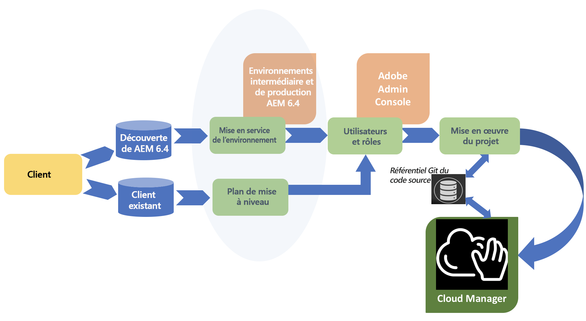

# Parcours client {#customer-journey}

En tant que client, vous commencez peut-être à utiliser Adobe Experience Manager (AEM) avec la version AEM 6.4, ou vous devez effectuer une mise à niveau vers la version 6.4 d’AEM pour utiliser [!UICONTROL Cloud Manager]. Les scénarios suivants expliquent votre parcours en tant que nouveau client ou client actuel pour bien débuter avec [!UICONTROL Cloud Manager].

>[!NOTE]
>
>[!UICONTROL Cloud Manager] est disponible seulement auprès des clients d’Adobe Managed Services qui utilisent AEM 6.4 ou une version ultérieure.

## Intégration à [!UICONTROL Cloud Manager]{#on-boarding-to-cloud-manager}

1. **Nouveau client AEM dans Adobe Managed Services**

   En tant que nouveau client, vous intégrerez [!UICONTROL Cloud Manager] dans le cadre du processus d’intégration à Adobe Managed Services.

   L’URL d’accès à [!UICONTROL Cloud Manager] figure dans l’e-mail de bienvenue. Celui-ci comprend aussi des instructions pour se connecter à [!UICONTROL Experience Cloud] et utiliser Adobe Admin Console afin de gérer vos utilisateurs et leurs autorisations respectives, pour ceux qui doivent avoir accès à [!UICONTROL Cloud Manager].

1. **Client AEM actuel dans Adobe Managed Services**

   En tant que client actuel, vous devrez d’abord mettre à niveau vos environnements de production et vos autres environnements existants pour la version AEM 6.4. Lors de la mise à niveau, vous serez intégré et recevrez l’URL pour avoir accès à [!UICONTROL Cloud Manager]. De plus, vous devrez commencer à utiliser Adobe Admin Console pour gérer vos utilisateurs et leurs autorisations respectives, pour ceux qui doivent avoir accès à [!UICONTROL Cloud Manager].

   Votre projet AEM existant devra également se conformer aux bonnes pratiques recommandées, car vous commencerez à utiliser [!UICONTROL Cloud Manager] pour déployer de nouveaux changements de code dans vos environnements AEM.

   Pour obtenir des informations supplémentaires sur les avantages de la mise à niveau vers AEM 6.4, voir [Mise à niveau vers AEM 6.4](https://helpx.adobe.com/fr/experience-manager/6-4/sites/deploying/using/upgrade.html).

## Accès à [!UICONTROL Cloud Manager] {#accessing-cloud-manager}

Vous avez accès à [!UICONTROL Cloud Manager] et à vos environnements AEM en vous connectant simplement sur la page d’entrée [!UICONTROL Experience Cloud], à l’aide de vos informations d’identification fournies par la gestion des identités Adobe, et en sélectionnant AEM dans l’interface de commutation de solution.

Après la première connexion à [!UICONTROL Cloud Manager], vous avez accès à vos environnements AEM directement depuis l’interface utilisateur de [!UICONTROL Cloud Manager]. À ce stade, vous êtes prêt à explorer toutes les possibilités de [!UICONTROL Cloud Manager], une fois que votre première branche de code est prête à être déployée dans vos environnements intermédiaire et de production.

Pour découvrir [!UICONTROL Cloud Manager] et commencer à utiliser la solution, consultez la section [Première connexion](first-time-login.md). Pour plus d’informations sur AEM, voir [Prise en main d’AEM 6.4](https://helpx.adobe.com/fr/experience-manager/6-4/sites/deploying/using/deploy.html). En outre, reportez-vous aux [ressources AEM](https://www.adobe.com/fr/marketing-cloud/experience-manager/resources.html?promoid=759X6WV8&amp;mv=other) pour plus d’informations.

## Prise en main de [!UICONTROL Cloud Manager] {#getting-started-with-cloud-manager}

Une fois connecté à [!UICONTROL Cloud Manager], la première chose à faire est de configurer votre environnement de référentiel de code, puis votre équipe et vos rôles. De manière spécifique, les rôles sont affectés en ajoutant l’utilisateur à un profil [!UICONTROL Cloud Manager] à l’aide de l’interface utilisateur d’Admin Console.

Ensuite, vous devez configurer vos branches de code source dans le **référentiel Git**, définir vos objectifs en termes d’ICP de chargement et de performance, puis tester les scénarios afin de déployer votre code dans vos environnements intermédiaire et de production, une fois que tous les contrôles de qualité ont été réussis.

## Parcours de bout en bout {#end-to-end-journey}

Le diagramme suivant illustre le parcours général client, lors de l’utilisation du pipeline CI/CD de [!UICONTROL Cloud Manager] pour déployer vos changements de code dans vos environnements intermédiaire et de production.

