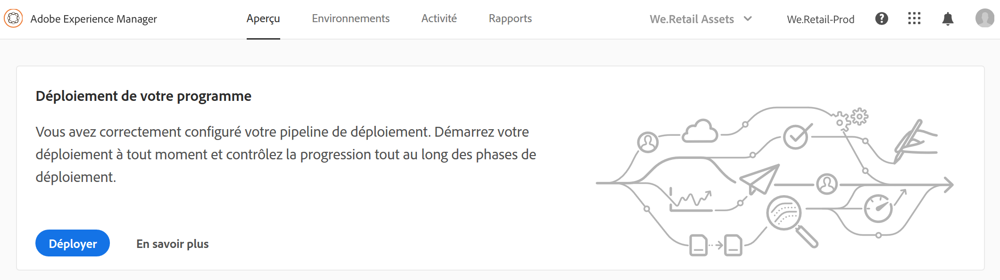
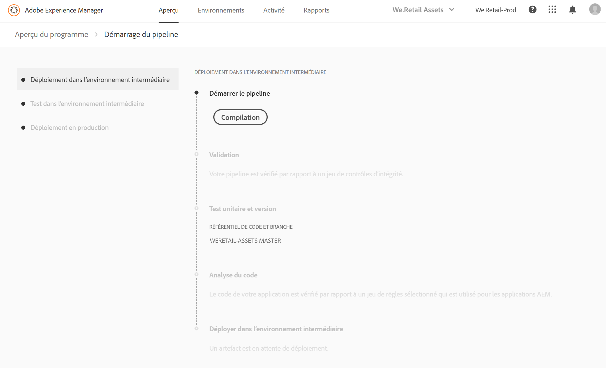
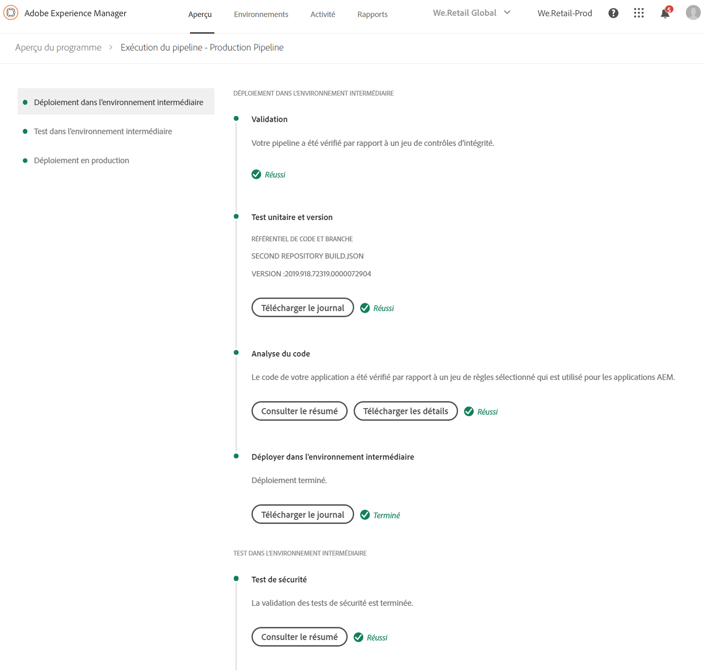
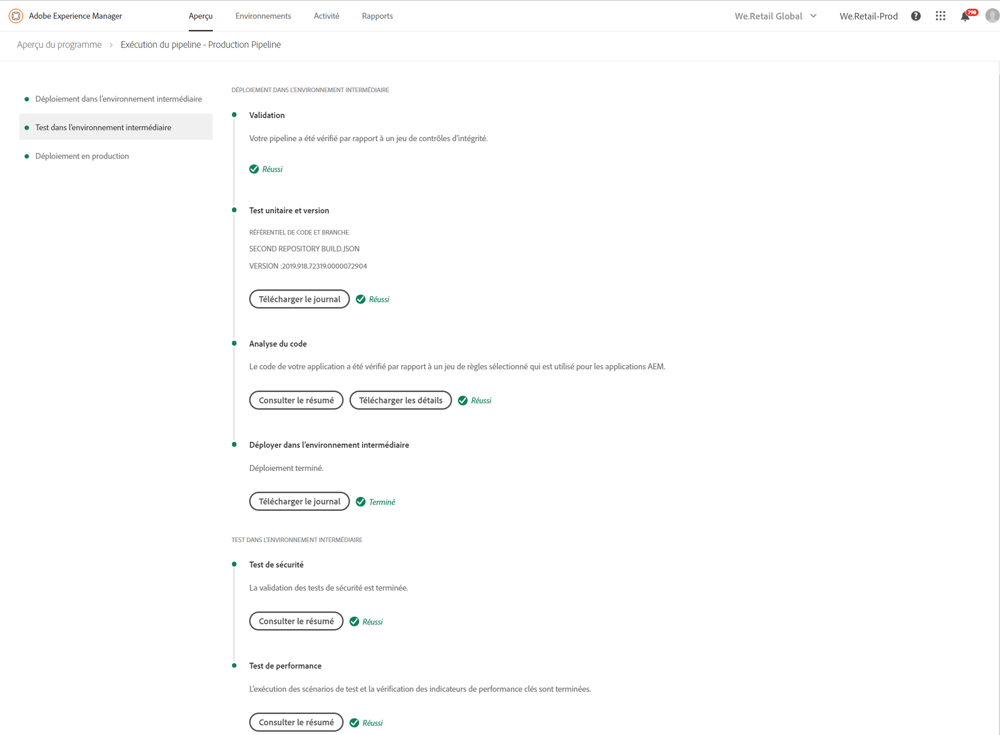
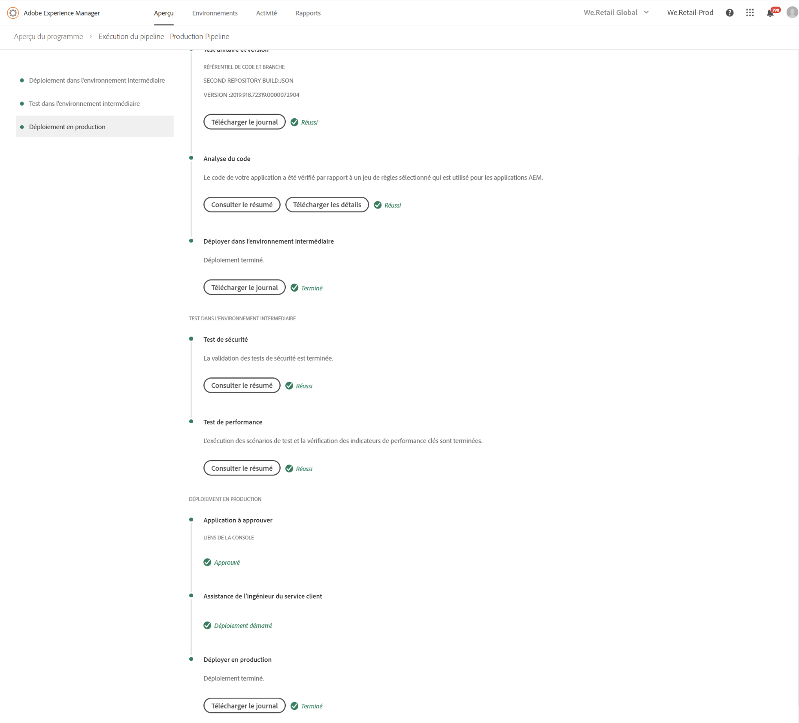
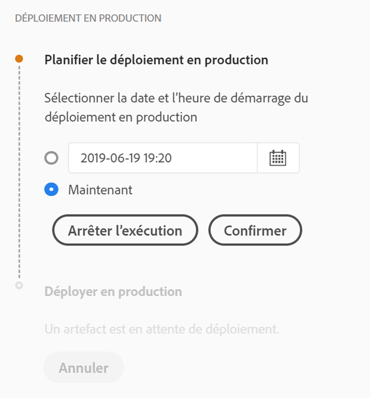
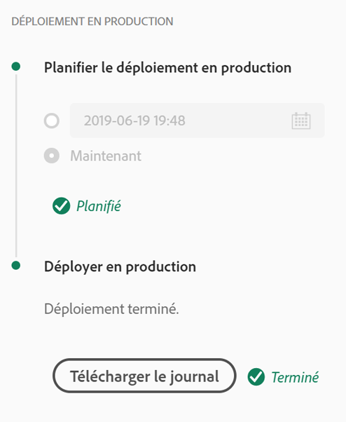
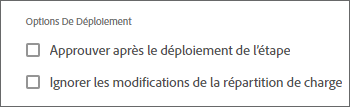

# Déploiement de votre code {#deploy-your-code}

## Déploiement du code avec Cloud Manager {#deploying-code-with-cloud-manager}

>[!NOTE]
>Pour en savoir plus sur le déploiement du code pour Cloud Manager dans AEM as a Cloud Service, consultez [ce lien](https://experienceleague.adobe.com/docs/experience-manager-cloud-service/implementing/using-cloud-manager/deploy-code.html?lang=fr#using-cloud-manager).

Une fois que vous avez configuré votre pipeline de production (référentiel, environnement et environnement de test), vous êtes prêt à déployer votre code.

1. Cliquez sur **Déployer** dans Cloud Manager pour lancer le processus de déploiement.

   

1. L’écran **Exécution du pipeline** s’affiche.

   Cliquez sur **Compilation** pour lancer le processus.

   

1. Le processus de création complet déploie le code.

   Les étapes suivantes sont impliquées dans le processus de création :

   1. Déploiement dans l’environnement intermédiaire
   1. Test dans l’environnement intermédiaire
   1. Déploiement dans l’environnement de production

   >[!NOTE]
   >
   >En outre, vous pouvez examiner les étapes de divers processus de déploiement en affichant les journaux ou en examinant les résultats pour les critères de test.

   Le **Déploiement dans l’environnement intermédiaire** comprend les étapes suivantes :

   * Validation : cette étape permet de s’assurer que le pipeline est configuré pour utiliser les ressources actuellement disponibles ; par exemple, la branche configurée existe, les environnements sont disponibles, etc.
   * Test unitaire et version : cette étape exécute un processus de création en conteneur. Voir [Présentation de l’environnement de création](/help/using/build-environment-details.md) pour plus d’informations sur l’environnement de création.
   * Analyse du code : cette étape évalue la qualité du code de votre application. Pour plus d’informations sur le processus de test, voir [Présentation des résultats des tests](understand-your-test-results.md).
   * Déployer dans l’environnement intermédiaire

   

   Le **test dans l’environnement intermédiaire** comprend les étapes suivantes :

   * Tests de sécurité : cette étape évalue l’impact du code de votre application sur la sécurité de l’environnement AEM. Pour plus d’informations sur le processus de test, voir [Présentation des résultats des tests](understand-your-test-results.md).
   * Tests de performance : cette étape évalue les performances du code de votre application. Pour plus d’informations sur le processus de test, voir [Présentation des résultats des tests](understand-your-test-results.md).

   

   Le **déploiement en environnement de production** comprend les étapes suivantes :

   * **Application à approuver** (si activée).
   * **Planification du déploiement en production** (si activée).
   * **Assistance de l’ingénieur du service client** (si activée).
   * **Déploiement en environnement de production**

   

   >[!NOTE]
   >
   >La **planification du déploiement en production** est activée lors de la configuration du pipeline.
   >
   >
   >Grâce à cette option, vous pouvez planifier le déploiement en production ou cliquer sur **Maintenant** pour exécuter immédiatement le déploiement en production.
   >
   >
   >La date et l’heure planifiées sont indiquées dans le fuseau horaire de l’utilisateur.
   >
   >
   >Cliquez sur **Confirmer** pour vérifier vos paramètres.

   

   Une fois que vous avez confirmé la planification du déploiement, votre déploiement du code se termine.

   L’écran suivant s’affiche lorsque l’option **Maintenant** est sélectionnée à l’étape précédente.

   

## Délais d’expiration {#timeouts}

Les étapes suivantes expirent s’ils sont en attente de commentaires de l’utilisateur :

| Étape | Délai dépassé |
|--- |--- |
| Test de qualité du code | 7 jours |
| Test de sécurité | 7 jours |
| Test de performance | 7 jours |
| Application à approuver | 7 jours |
| Planning du déploiement en production | 7 jours |
| Assistance de l’ingénieur du service client | 7 jours |

## Processus de déploiement {#deployment-process}

La section suivante décrit le déploiement des packages AEM et dispatcher dans les phases intermédiaires et de production.

Cloud Manager télécharge tous les fichiers target/*.zip générés par le processus de création vers un emplacement de stockage.  Ces artefacts sont récupérés à partir de cet emplacement pendant les phases de déploiement du pipeline.

Lorsque Cloud Manager se déploie sur des topologies autres que de production, l’objectif est de réaliser le déploiement aussi rapidement que possible ; les artefacts sont donc déployés simultanément sur tous les nœuds, comme suit :

1. Cloud Manager détermine si chaque artefact est un package AEM ou dispatcher.
1. Cloud Manager supprime tous les dispatchers de l’équilibreur de charge pour isoler l’environnement pendant le déploiement.

   Sauf configuration contraire, vous pouvez ignorer les modifications de l’équilibreur de charge dans les déploiements de développement et en environnement intermédiaire, c’est-à-dire détacher et attacher des étapes dans les deux pipelines hors production, pour les environnements de développement et le pipeline de production, pour les environnements intermédiaires.

   

   >[!NOTE]
   >
   >Cette fonctionnalité devrait principalement être utilisée par les clients 1-1-1.

1. Chaque artefact AEM est déployé sur chacune des instances AEM par le biais des API de Package Manager, avec des dépendances de packages qui déterminent l’ordre de déploiement.

   Pour en savoir plus sur l’utilisation de packages pour installer de nouvelles fonctionnalités, transférer du contenu entre des instances et sauvegarder le contenu du référentiel, reportez-vous à la section Utilisation de packages.

   >[!NOTE]
   >
   >Tous les artefacts AEM sont déployés à la fois sur l’instance de création et les instances de publication. Les modes d’exécution doivent être utilisés lorsque des configurations spécifiques à un nœud sont requises. Pour en savoir plus sur la façon dont les modes d’exécution vous permettent d’ajuster votre instance AEM à des fins spécifiques, consultez Modes d’exécution.

1. L’artefact dispatcher est déployé sur chaque dispatcher comme suit :

   1. Les configurations actuelles sont sauvegardées et copiées vers un emplacement temporaire.
   1. Toutes les configurations sont supprimées, à l’exception des fichiers non modifiables. Pour plus d’informations, consultez la section Gestion des configurations du Dispatcher. Cela permet de vider les répertoires pour qu’aucun fichier orphelin ne soit abandonné.
   1. L’artefact est extrait dans le répertoire `httpd`.  Les fichiers non modifiables ne sont pas remplacés. Toute modification apportée aux fichiers non modifiables dans votre référentiel git sera ignorée au moment du déploiement.  Ces fichiers sont essentiels à la structure du dispatcher AMS et ne peuvent pas être modifiés.
   1. Apache effectue un test de configuration. Si aucune erreur n’est trouvée, le service est rechargé. Si une erreur se produit, les configurations sont restaurées à partir de la sauvegarde, le service est rechargé et l’erreur est renvoyée à Cloud Manager.
   1. Chaque chemin spécifié dans la configuration de pipeline est invalidé ou purgé du cache du dispatcher.

   >[!NOTE]
   >Cloud Manager exige que l’artefact du dispatcher contienne le jeu de fichiers complet.  Tous les fichiers de configuration du dispatcher doivent être présents dans le référentiel git. Les fichiers ou dossiers manquants entraînent l’échec du déploiement.

1. Après le déploiement réussi de tous les packages AEM et de dispatcher sur tous les nœuds, les dispatchers sont ajoutés à l’équilibreur de charge et le déploiement est terminé.

   >[!NOTE]
   >Vous pouvez ignorer les modifications de l’équilibreur de charge dans les déploiements de développement et d’évaluation, c’est-à-dire, détacher et attacher des étapes dans les deux pipelines hors production pour les environnements de développement, ainsi que dans le pipeline de production, pour les environnements d’évaluation.

### Phase de déploiement en production {#deployment-production-phase}

Le processus de déploiement des topologies de production diffère légèrement afin de minimiser l’impact sur les visiteurs d’AEM Site.

Les déploiements en production suivent généralement les mêmes étapes que ci-dessus, mais par roulements :

1. Déploiement des packages AEM sur l’instance de création.
1. Détachement de dispatcher1 de l’équilibreur de charge.
1. Déploiement en parallèle des packages AEM sur publish1 et du package dispatcher sur dispatcher1. Purge du cache du Dispatcher.
1. Replacement du dispatcher1 dans l’équilibreur de charge.
1. Lorsque dispatcher1 fonctionne à nouveau, détachement de dispatcher2 de l’équilibreur de charge.
1. Déploiement en parallèle des packages AEM sur publish2 et du package dispatcher sur dispatcher2. Purge du cache du Dispatcher.
1. Replacement du dispatcher2 dans l’équilibreur de charge.
Ce processus se poursuit jusqu’à ce que le déploiement ait atteint toutes les instances de publication et tous les Dispatchers dans la topologie.

## Mode d’exécution d’urgence du pipeline {#emergency-pipeline}

Dans les situations critiques, les clients d’Adobe Managed Services peuvent devoir déployer les modifications de code dans leurs environnements intermédiaire et de production sans attendre l’exécution d’un cycle de test complet de Cloud Manager.

Pour résoudre ces problèmes, le pipeline de production de Cloud Manager peut être exécuté en mode *d’urgence*. Lorsque ce mode est utilisé, les étapes de test de sécurité et de performance ne sont pas exécutées ; toutes les autres étapes, y compris les étape de validation configurées, sont exécutées comme dans le mode normal d’exécution du pipeline.

>[!NOTE]
>La fonctionnalité Mode d’exécution d’urgence du pipeline est activée au niveau du programme par les ingénieurs de réussite client.

### Utilisation du mode d’exécution d’urgence de pipeline {#using-emergency-pipeline}

Lorsque vous démarrez l’exécution d’un pipeline de production, si cette fonctionnalité a été activée, vous pouvez le faire en mode normal ou d’urgence à partir de la boîte de dialogue, comme illustré ci-dessous.


En outre, en affichant la page des détails d’exécution du pipeline pour une exécution en mode d’urgence, le chemin de navigation en haut de l’écran affiche un indicateur indiquant que le mode d’urgence a été utilisé pour cette exécution en particulier.


Vous pouvez également créer une exécution de pipeline dans ce mode d’urgence à l’aide de l’API Cloud Manager ou de l’interface de ligne de commande. Pour démarrer une exécution en mode d’urgence, envoyez une requête PUT au point d’entrée d’exécution du pipeline avec le paramètre de requête `?pipelineExecutionMode=EMERGENCY` ou lors de l’utilisation de l’interface de ligne de commande :

```
$ aio cloudmanager:pipeline:create-execution PIPELINE_ID --emergency
```

>[!IMPORTANT]
>L’utilisation de l’indicateur `--emergency` peut nécessiter une mise à jour vers la dernière version de l’`aio-cli-plugin-cloudmanager`.