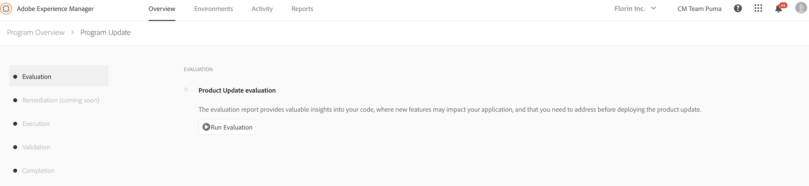

# Phase d’évaluation {#evaluation}

La première phase de l’assistant de mise à jour du produit est la phase **[!UICONTROL Évaluation]**.
Pendant cette phase, vous pouvez évaluer la complexité de la mise à niveau avec l’outil de détection des motifs accessible directement à partir de l’assistant. À la fin de cette étape, vous avez accès au rapport d’évaluation.

Le rapport généré vous permet de vérifier l’instance d’auteur pour la mise à niveau en détectant les modèles qui :

* enfreignent certaines règles et qui sont exécutés dans des zones qui seront affectées ou écrasées par la mise à niveau ;

* utilisent une API ou une fonctionnalité d’AEM 6.x non rétrocompatible sur AEM et qui risque d’échouer après la mise à niveau.

Cela peut servir à évaluer l’ampleur des tâches de développement nécessaires pour effectuer une mise à niveau vers Adobe Experience Manager (AEM) 6.5.

>[!NOTE]
>
>Pour en savoir plus sur le détecteur de motifs, consultez [Évaluation de la complexité de la mise à niveau à l’aide de l’outil de détection des motifs](https://helpx.adobe.com/fr/experience-manager/6-4/sites/deploying/using/pattern-detector.html)

## Exécution de l’évaluateur {#running-evaluator}

Pour générer un rapport d’évaluation, procédez comme suit :

1. Cliquez sur **[!UICONTROL Exécuter une évaluation]**.

   >[!NOTE]
   >Le détecteur de motifs peut s’exécuter dans n’importe quel environnement. Toutefois, pour augmenter le taux de détection et éviter tout ralentissement des instances métier critiques, Cloud Manager l’exécute dans l’environnement d’évaluation de l’instance Auteur.

   

1. L’assistant vous informe de l’état de votre action. Vous remarquerez les états **en cours** ou **terminé** le cas échéant une fois le rapport d&#39;évaluation généré.

   Une fois le rapport généré, vous pouvez cliquer sur **[!UICONTROL Télécharger le rapport]** pour enregistrer une copie.

   

   >[!NOTE]
   >
   >La version actuelle de l’assistant de mise à jour du produit de Cloud Manager prend uniquement en charge la phase **Évaluation**. Les quatre autres phases appelées **Correction**, **Exécution**, **Validation** et **Achèvement** seront bientôt disponibles.
