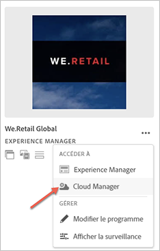

# Première connexion {#first-time-login}

Une fois que vous avez terminé les configurations générales de [!UICONTROL Cloud Manager], vous êtes prêt à utiliser l’interface utilisateur (IU) de [!UICONTROL Cloud Manager].

>[!NOTE]
>Selon les rôles affectés dans [!UICONTROL Cloud Manager] et l’état de l’application, vous verrez plusieurs écrans lors de l’utilisation de l’interface utilisateur de [!UICONTROL Cloud Manager].

## Première connexion {#logging-in-for-the-first-time}

1. Connectez-vous à **Adobe [!UICONTROL Experience Cloud]**. La liste des **programmes** s’affiche alors.

   

1. Sélectionnez le programme (par exemple, **We.Retail Global**). Une fois que la carte du programme s’affiche sur la landing page, sélectionnez la balise **...** pour afficher les options de menu disponibles.   Sélectionnez **Cloud Manager** pour accéder à la page **Aperçu** de Cloud Manager.

   

1. La page **Aperçu** de Cloud Manager s’affiche.

   

1. Cliquez sur **Configuration du programme** pour définir la description du **Programme** et les indicateurs de performance clés (IPC).

   >[!NOTE]
   >
   >Voir [Configuration de votre programme](https://helpx.adobe.com/fr/experience-manager/cloud-manager/using/setting-up-program.html) pour exécuter les étapes suivantes.

## Tutoriel vidéo {#video-tutorial-two}

### Onglet Activité de Cloud Manager {#activity-video}

Cloud Manager fournit une vue consolidée de l’activité d’un programme, répertoriant toutes les exécutions de pipeline CI/CD, tant en production que hors production, ce qui permet de connaître l’activité passée et présente, et permet aux détails de toute activité d’être examinés.

>[!VIDEO](https://video.tv.adobe.com/v/26313/)
