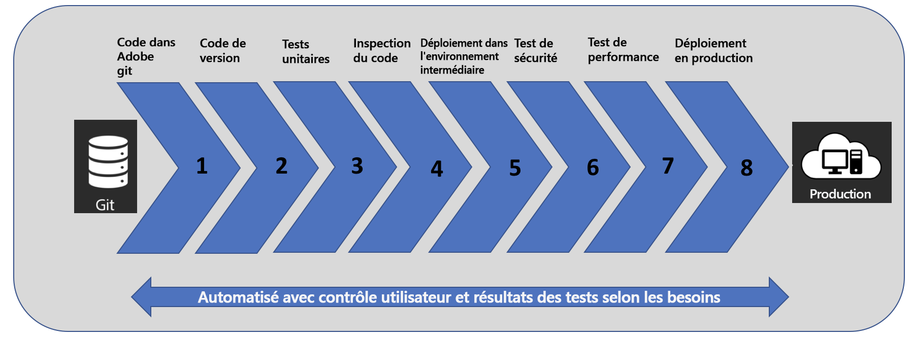

# Présentation de [!UICONTROL Cloud Manager]{#introduction-to-cloud-manager}

>[!CONTEXTUALHELP]
>id="aemcloud_cloudmanager_introduction"
>title="Présentation de Cloud Manager"
>abstract="Permet aux entreprises de gérer elles-mêmes Experience Manager dans le cloud. Il comprend une structure d’intégration et de diffusion continues (CI/CD) qui permet aux équipes informatiques et aux partenaires d’implémentation d’accélérer la diffusion des personnalisations ou des mises à jour sans compromettre les performances ou la sécurité."
>additional-url="https://experienceleague.adobe.com/docs/experience-manager-learn/cloud-service/cloud-manager/programs.html?lang=fr#cloud-manager" text="Créer des programmes"
>additional-url="https://experienceleague.adobe.com/docs/experience-manager-learn/cloud-service/cloud-manager/environments.html?lang=fr#cloud-manager" text="Créer des environnements"

## Présentation {#introduction}

[!UICONTROL Cloud Manager], qui fait partie d’Adobe Experience Manager (AEM) dans le cloud, permet aux entreprises de gérer elles-mêmes Experience Manager dans le cloud. Il comprend une structure d’intégration et de diffusion continues (CI/CD) qui permet aux équipes informatiques et aux partenaires d’implémentation d’accélérer la diffusion des personnalisations ou des mises à jour sans compromettre les performances ou la sécurité.

Ce site de documentation décrit spécifiquement les fonctionnalités de Cloud Manager disponibles pour les clients Adobe Managed Services (AMS). Vous trouverez de la documentation sur les fonctionnalités de Cloud Manager pour les clients d’AEM en tant que Cloud Service dans la section [Implémentation des applications pour AEM as a Cloud Service](https://experienceleague.adobe.com/docs/experience-manager-cloud-service/implementing/home.html?lang=en).

Grâce au portail client libre-service de [!UICONTROL Cloud Manager], les **organisations** peuvent exécuter/exploiter les éléments suivants :

* **Intégration continue/diffusion continue** du code pour réduire le délai de mise sur le marché de plusieurs mois/semaines à quelques jours/heures.
* **Inspection du code, test de performance et validation de la sécurité** basés sur les bonnes pratiques avant de passer à la production, afin de minimiser les interruptions de production.
* **Déploiement automatique, planifié ou manuel** même en dehors des heures ouvrées pour une flexibilité et un contrôle maximaux.
* La fonction de **mise à l’échelle automatique** détecte intelligemment la nécessité d’une capacité accrue et apporte automatiquement un ou plusieurs segments Dispatcher/Publish en ligne.

L’image suivante illustre le flux du processus CI/CD utilisé dans [!UICONTROL Cloud Manager] :

## Fonctionnalités clés de [!UICONTROL Cloud Manager] {#key-features-in-cloud-manager}

Les organisations peuvent tirer parti des fonctionnalités suivantes de [!UICONTROL Cloud Manager] :

### Interface en libre-service {#self-service-interface}

L’interface utilisateur de [!UICONTROL Cloud Manager] permet aux clients d’accéder facilement à l’environnement cloud et au pipeline CI/CD pour leurs applications Experience Manager et de les gérer.

Les clients définissent des indicateurs de performances clés (IPC) spécifiques à l’application : le nombre de pages maximum vues par minute et le délai de réponse attendu pour un chargement de page, qui constituent la base de la mesure d’un déploiement réussi. Les rôles et autorisations des différents membres de l’équipe peuvent être facilement définis. Bien que la nouvelle interface en libre-service soit sous votre contrôle, elle propose également des liens vers des bonnes pratiques. Vous pouvez aussi accéder aux experts d’Adobe qui peuvent vous aider lorsque vous en avez besoin.

Pour découvrir et commencer à utiliser l’interface utilisateur de [!UICONTROL Cloud Manager], consultez la rubrique [Première connexion](https://helpx.adobe.com/fr/experience-manager/cloud-manager/using/first-time-login.html).

### Pipeline CI/CD {#ci-cd-pipeline}

[!UICONTROL Cloud Manager] permet de tirer parti d’un pipeline CI/CD optimisé pour accélérer la diffusion du code personnalisé ou des mises à jour, telles que l’ajout de composants sur le site web.

Grâce à l’interface utilisateur de [!UICONTROL Cloud Manager], les clients peuvent configurer et déclencher leur pipeline CI/CD. Durant ce pipeline, une analyse approfondie du code est exécutée pour garantir que seules des applications de grande qualité transitent par l’environnement de production.

Pour plus d’informations sur la configuration du pipeline à partir de l’interface utilisateur de [!UICONTROL Cloud Manager], consultez [Configuration de votre pipeline CI/CD](https://helpx.adobe.com/fr/experience-manager/cloud-manager/using/configuring-pipeline.html).

### Modes de déploiement flexibles {#flexible-deployment-modes}

[!UICONTROL Cloud Manager] offre aux clients des modes de déploiement flexibles et configurables afin qu’ils puissent diffuser des expériences en fonction des besoins.

Avec un mode de déclenchement automatique, le code est automatiquement déployé dans un environnement en fonction d’événements spécifiques tels que la validation du code. Vous pouvez également planifier des déploiements de code pendant les périodes spécifiées, même en dehors des heures de bureau.

Indépendamment du déclencheur de déploiement, les contrôles de qualité sont toujours effectués dans le cadre de l’exécution du pipeline CI/CD, chaque fois qu’un déploiement est déclenché. Les contrôles de qualité incluent, entre autres, l’inspection de code, les tests de sécurité et les tests de performance, et ne requièrent littéralement aucun effort de la part des clients ou de leurs partenaires.

Pour en savoir plus sur le déploiement des contrôles de code et de qualité, consultez la rubrique [Déploiement de code](deploying-code.md).

### Mise à l’échelle automatique {#autoscaling}

[!UICONTROL Cloud Manager] détecte la nécessité de capacité supplémentaire lorsque l’environnement de production est soumis à une charge élevée. Il apporte automatiquement de la capacité supplémentaire en ligne via la fonction de mise à l’échelle automatique.

Lors d’un événement de mise à l’échelle automatique, [!UICONTROL Cloud Manager] déclenche automatiquement le processus de mise à l’échelle automatique, envoie une notification de l’événement de mise à l’échelle automatique et ajoute la capacité supplémentaire en quelques minutes. La capacité supplémentaire sera configurée dans l’environnement de production, dans les mêmes régions et conformément aux spécifications système des nœuds Dispatcher/Publish exécutés.

La fonction de mise à l’échelle automatique s’applique uniquement à la couche Dispatcher/Publish et sera toujours exécutée à l’aide d’une méthode de mise à l’échelle horizontale, avec au moins un segment supplémentaire d’une paire Dispatcher/Publish et jusqu’à dix segments au maximum. Toute capacité supplémentaire configurée sera mise à l’échelle manuellement dans un délai de dix jours ouvrés, selon les indications de l’ingénieur du service client.

>[!NOTE]
>Les clients qui souhaitent déterminer si la mise à l’échelle automatique est appropriée ou non pour leur application doivent contacter leur ingénieur de service client ou représentant Adobe.
