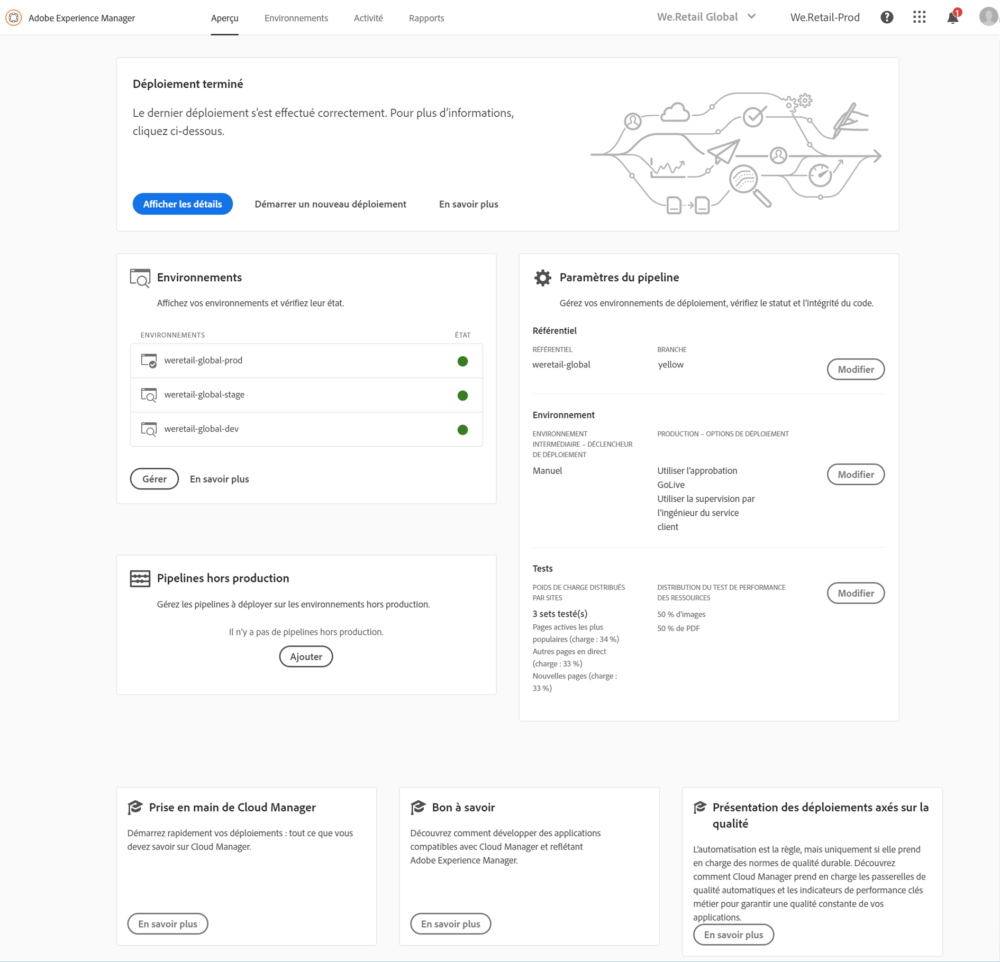
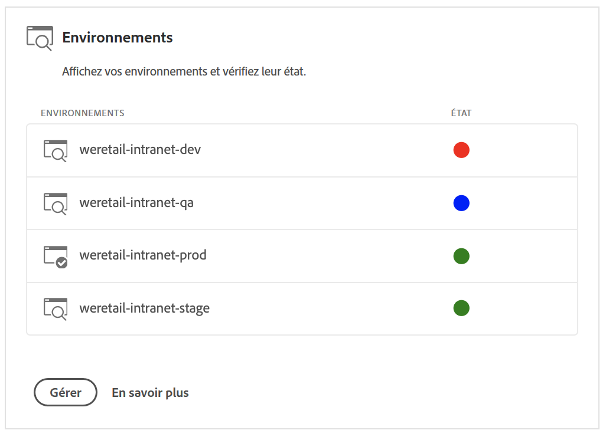
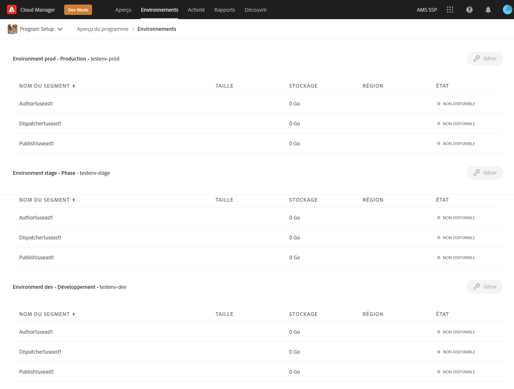

# Gestion des environnements {#manage-your-environments}

La page **Aperçu** de Cloud Manager comprend la vignette **Environnements** qui répertorie tous les environnements AEM gérés.

Chacun des environnements répertoriés affiche l’état associé.

## Accès aux environnements dans Cloud Manager {#accessing-environments-in-cloud-manager}

La vignette **Environnements** affiche les environnements intermédiaires et de production configurés dans votre programme ainsi que le statut.

Le statut est l’état d’alimentation cumulée sur les nœuds de l’environnement. Il est vert si tous les nœuds sont en cours d’exécution, rouge si même un seul nœud est à l’arrêt, bleu si même un seul nœud est à venir et jaune si même un seul nœud a un état d’alimentation indisponible (dans cet ordre de priorité).

### Environnements {#environments}

Cliquez sur **Gérer** pour afficher l’écran **Environnements**.

L’écran **Environnements** affiche une carte pour les environnements de *production* et *intermédiaires* (selon le cas) dans votre programme. Le nom de l’environnement est visible au-dessus de chaque carte. La carte comprend un tableau des nœuds de l’environnement, ainsi que la taille du processeur, du stockage, de la région et de l’état.

>[!NOTE]
>
>Le **statut** du nœud représente l’état d’alimentation de la VM et ne reflète pas l’état d’AEM sur le serveur. L’état peut être **En cours d’exécution** (cercle vert), **Arrêté** (cercle rouge), **À venir** (cercle bleu) ou **Indisponible** (cercle jaune).

