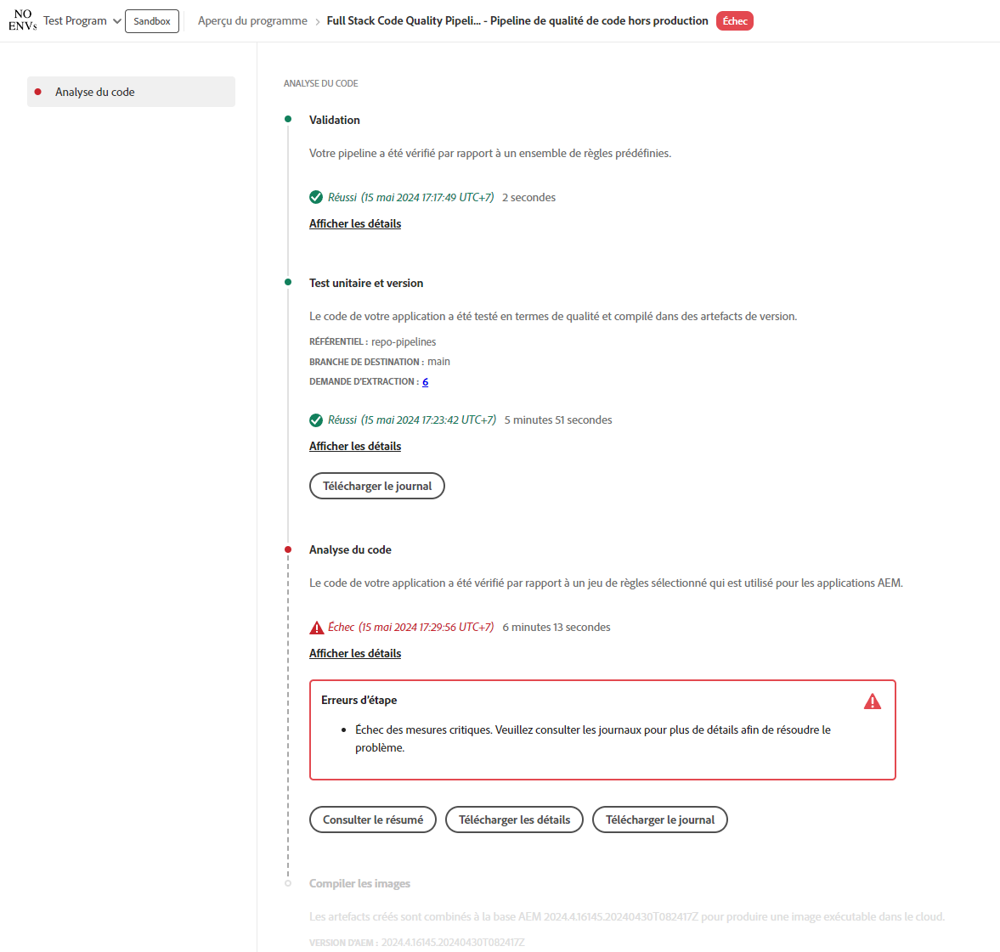

# Gestion des pipelines {#managing-pipelines}

Découvrez comment gérer vos pipelines existants, notamment en les exécutant, en les modifiant et en les supprimant.

## Carte de pipeline {#pipeline-card}

La vignette **Pipelines** de la page **Aperçu du programme** dans Cloud Manager vous donne un aperçu de tous vos pipelines et de leur statut actuel.

En cliquant sur  en regard de chaque pipeline, vous pouvez effectuer les actions suivantes :

* [Exécutez le pipeline](#running-pipelines).
* [Modifiez le pipeline](#editing-pipelines).
* [Supprimez le pipeline](#deleting-pipelines).
* [Affichez les détails](#view-details).

Au bas de la liste des pipelines, vous disposez des options générales suivantes :

* **Ajouter** : permet d’[ajouter un nouveau pipeline de production](/help/using/production-pipelines.md) ou d’[ajouter un nouveau pipeline hors production](/help/using/non-production-pipelines.md).
* **Tout afficher** : dirige l’utilisateur ou l’utilisatrice vers l’écran **Pipelines** pour afficher tous les pipelines dans un tableau plus détaillé.
* **Accéder aux informations sur le référentiel** : affiche les informations nécessaires pour accéder au référentiel Git de Cloud Manager.
* **En savoir plus** : permet d’accéder aux ressources de documentation du pipeline CI/CD.

## Page Pipelines {#pipelines}

La page **Pipelines** affiche la liste complète de tous les pipelines du programme sélectionné. Cette liste se révèle utile, car elle présente des informations plus complètes que celles disponibles dans la [Carte Pipelines](#pipeline-card).

1. Connectez-vous à Cloud Manager à l’adresse [my.cloudmanager.adobe.com](https://my.cloudmanager.adobe.com/) et sélectionnez l’organisation et le programme appropriés.

1. Dans la page **Vue d’ensemble du programme**, cliquez sur l’onglet **Pipelines** pour basculer vers la page **Pipelines**.

1. Vous y trouverez une liste de tous les pipelines du programme, ainsi que le début et l’arrêt de l’exécution du pipeline, comme dans la **Carte des pipelines**.

Le fait de cliquer sur l’icône `i` affiche des détails sur la dernière exécution ou l’exécution actuelle du pipeline.

Cliquez sur **Afficher les détails** pour accéder aux [détails de l’exécution du pipeline](#view-details).

### Marquer les favoris du pipeline{#pipeline-favorites}

Vous pouvez marquer des pipelines spécifiques comme favoris afin qu’ils apparaissent en haut de la liste sur la page **Pipelines**. Cette fonctionnalité facilite la recherche et l’exécution des pipelines fréquemment consultés.

**Pour marquer les favoris de pipeline :**

1. Connectez-vous à Cloud Manager à l’adresse [my.cloudmanager.adobe.com](https://my.cloudmanager.adobe.com/) et sélectionnez l’organisation et le programme appropriés.
1. Sur la page **Aperçu du programme**, cliquez sur  **Onglet Pipelines**.
1. Sur la page **Pipelines**, à gauche du nom et du type d’un pipeline, cliquez sur  pour l’ajouter à votre liste de favoris.
Vous pouvez également cliquer sur  pour supprimer le pipeline de votre liste de favoris.

## Page Activité {#activity}

La page **Activités** affiche la liste complète de toutes les exécutions de pipelines du programme sélectionné.

1. Connectez-vous à Cloud Manager à l’adresse [my.cloudmanager.adobe.com](https://my.cloudmanager.adobe.com/) et sélectionnez l’organisation et le programme appropriés.

1. Dans la page **Vue d’ensemble du programme**, cliquez sur l’onglet **Activité** pour basculer vers la page **Activité**.

1. Vous y trouverez une liste de toutes les exécutions de pipeline du programme, y compris les exécutions actuelles et historiques.

Le fait de cliquer sur l’icône `i` affiche des détails sur l’exécution de pipeline sélectionnée.

Cliquez sur **Afficher les détails** pour vérifier les [détails de l’exécution du pipeline](#view-details).

## Exécution d’un pipeline {#run-one-pipeline}

1. Connectez-vous à Cloud Manager à l’adresse [my.cloudmanager.adobe.com](https://my.cloudmanager.adobe.com/) et sélectionnez l’organisation et le programme appropriés.
1. Accédez à la carte **Pipelines** à partir de la page **Vue d’ensemble du programme**.
1. Cliquez sur  en regard du pipeline que vous exécutez, puis cliquez sur **Exécuter**.

   La colonne Statut indique le début de l’exécution du pipeline.

   Pour afficher les détails de l’exécution, cliquez de nouveau sur  puis sur **[Afficher les détails](#view-details)**.

   Selon le type de pipeline, vous pouvez être en mesure d’annuler l’exécution en cliquant de nouveau sur  puis sur **Annuler**.

## Exécution de plusieurs pipelines {#run-multiple-pipelines}

Avec Cloud Manager, vous pouvez exécuter plusieurs pipelines simultanément, ce qui améliore l’efficacité du déploiement pour les clients Adobe Managed Services (AMS). La fonction **Exécuter sélectionné** vous permet de sélectionner plusieurs pipelines et de les déclencher pour qu’ils s’exécutent en même temps. Cela réduit l’effort manuel d’exécution des pipelines individuellement et optimise les workflows de création et de déploiement.

**Pour exécuter plusieurs pipelines :**

1. Connectez-vous à Cloud Manager à l’adresse [my.cloudmanager.adobe.com](https://my.cloudmanager.adobe.com/) et sélectionnez l’organisation et le programme appropriés.
1. Dans le menu de gauche, cliquez sur  **Pipelines**.
1. Dans le tableau de la page **Pipeline**, cochez les cases en regard des pipelines à exécuter.
Si nécessaire, cliquez sur  **Filtres** pour trier les pipelines par nom ou environnement, ou type de code déployé, ou une combinaison des trois.
1. Dans le coin supérieur droit de la page, cliquez sur **Exécuter la sélection (x)**.
1. Dans la boîte de dialogue **Exécuter les pipelines sélectionnés (x)**, cliquez sur **Exécuter (x)**.

   Le bouton **Exécuter** indique le nombre de pipelines qui peuvent continuer. Par exemple, vous avez peut-être sélectionné quatre pipelines, mais un est déjà en cours d’exécution. Ou bien, un environnement lié à un pipeline sélectionné n’existe plus. Dans ce cas, le système s’ajuste en conséquence. Le bouton se met à jour sur « Exécuter (3) » pour indiquer que trois pipelines peuvent continuer.

1. Les pipelines commencent à s’exécuter et leur statut est mis à jour dans la liste **Pipelines**.

## Modifier les pipelines {#editing-pipelines}

Vous ne pouvez pas modifier un pipeline en cours d’exécution.

**Pour modifier des pipelines, procédez comme suit**

1. Connectez-vous à Cloud Manager à l’adresse [my.cloudmanager.adobe.com](https://my.cloudmanager.adobe.com/) et sélectionnez l’organisation et le programme appropriés.

1. Sur la page **Aperçu du programme**, accédez à la vignette **Pipelines**.

1. Cliquez sur  en regard du pipeline à modifier, puis cliquez sur **Modifier**.

1. Dans la boîte de dialogue **Modifier le pipeline de production** ou **Modifier le pipeline hors production**, vous pouvez modifier les mêmes détails que ceux saisis lors de la création du pipeline.

   Voir [Configuration des pipelines de production](/help/using/production-pipelines.md) et [Configuration des pipelines hors production](/help/using/non-production-pipelines.md) pour plus d’informations sur les champs et les options de configuration disponibles pour les pipelines.

1. Lorsque vous avez terminé, cliquez sur **Mettre à jour**.

## Supprimer des pipelines {#deleting-pipelines}

Vous ne pouvez pas supprimer un pipeline en cours d’exécution.

**Pour supprimer des pipelines :**

1. Connectez-vous à Cloud Manager à l’adresse [my.cloudmanager.adobe.com](https://my.cloudmanager.adobe.com/) et sélectionnez l’organisation et le programme appropriés.

1. Sur la page **Aperçu du programme**, accédez à la vignette **Pipelines**.

1. Cliquez sur  en regard du pipeline que vous exécutez, puis cliquez sur **Supprimer**.

## Affichage des détails du pipeline {#view-details}

Vous pouvez uniquement afficher les détails d’un pipeline en cours d’exécution ou qui a été exécuté au moins une fois.

**Pour afficher les détails du pipeline :**

1. Connectez-vous à Cloud Manager à l’adresse [my.cloudmanager.adobe.com](https://my.cloudmanager.adobe.com/) et sélectionnez l’organisation et le programme appropriés.

1. Sur la page **Aperçu du programme**, accédez à la vignette **Pipelines**.

1. Cliquez sur  en regard du pipeline que vous exécutez, puis cliquez sur **Afficher les détails**.

1. Vous accédez à la page des détails du pipeline en cours d’exécution.

Vous pouvez y voir le statut des différentes étapes du pipeline et récupérer les journaux de génération à des fins de diagnostic. Reportez-vous au document [Déploiement du code](/help/using/code-deployment.md) pour plus d’informations.

Toutes les étapes d’exécution d’un pipeline s’affichent, celles n’ayant pas encore commencé étant grisées. Les étapes terminées affichent leur durée.

Lorsqu’une étape de pipeline est terminée, un résumé est présenté.

Cliquez sur le lien **Afficher les détails** pour afficher la section **Durée**. Cette section inclut la durée moyenne du pipeline en fonction de la tendance historique de ce programme.

Si votre pipeline contenait une étape **Analyse du code**, qui a soulevé des problèmes, vous pouvez cliquer sur **Télécharger les détails** pour afficher une liste [tests de qualité du code](/help/using/code-quality-testing.md) qui n’ont pas réussi.

Une colonne **Emplacement du fichier de projet** est présente dans le fichier CSV pour indiquer l’emplacement du code problématique. Cette colonne correspond au chemin d’accès relatif du projet, tandis que la colonne **Emplacement du fichier** est générée par Maven.

