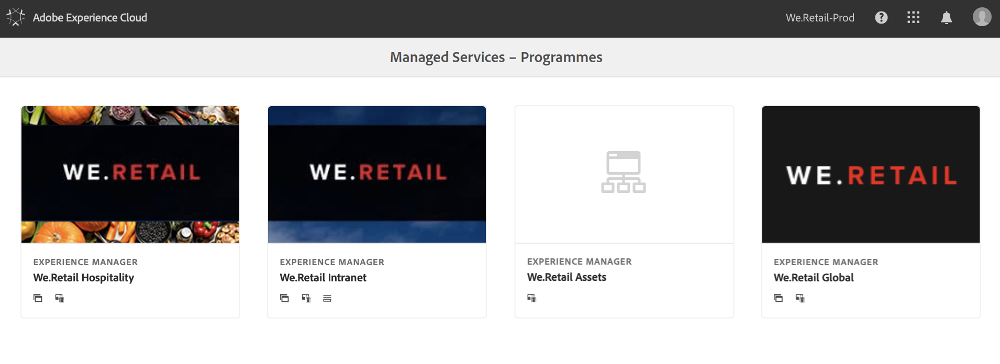
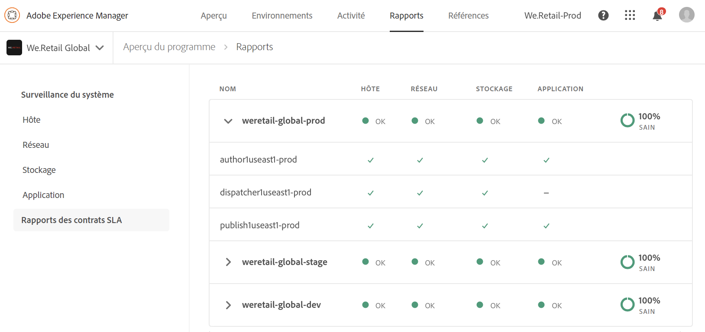

# Surveillance du système {#system-monitoring}

La surveillance du système dans [!UICONTROL Cloud Manager] est réalisée en observant les instances dans un environnement et en suivant diverses mesures pour chaque instance. Chaque mesure possède deux seuils définis : un *seuil d’avertissement* et un *seuil critique*.

Si une mesure dépasse son seuil critique, elle est considérée comme étant dans un état critique ; si une mesure est supérieure à son seuil d’avertissement (mais sous son seuil critique), elle est considérée comme étant dans un état d’avertissement. Les seuils sont définis par Adobe Managed Services et peuvent être visualisés dans [!UICONTROL Cloud Manager]. Dans la plupart des cas, les seuils sont cohérents entre les clients. Mais dans certains cas, Adobe Managed Services modifie les seuils pour répondre aux besoins spécifiques des clients. Les questions relatives aux seuils doivent être adressées à l’ingénieur du service client.

## Accès à la surveillance du système {#navigating-system-monitoring}

Vous pouvez accéder à la fonction Surveillance du système de deux manières différentes.

1. Connectez-vous à la page d’entrée **Managed Services - Programmes**.

   

1. Cliquez sur la quatrième icône de la carte du programme.

   

   *Ou*,

* Accédez à la page d’entrée **Surveillance du système** par le biais de l’élément de menu de navigation globale **Rapports** dans [!UICONTROL Cloud Manager].

## Page d’aperçu de la surveillance du système {#system-monitoring-overview-page}

La page d’aperçu de la surveillance du système répertorie les environnements surveillés dans le programme et les rapports sur leur intégrité globale dans quatre catégories distinctes :

* **Hôte**
* **Stockage**
* **Réseau**
* **Application**

L’état de chaque catégorie est une synthèse des mesures. Si une mesure d’une catégorie est dans un état critique, la catégorie entière est dans un état critique sur la page d’aperçu. La même synthèse peut être affichée au niveau d’un environnement et au niveau d’une instance.

>[!NOTE]
>
>Par défaut, lorsque vous accédez à cette page, les instances d’environnement de production sont visibles, mais d’autres environnements peuvent également être ouverts.

## Tutoriel vidéo {#video-tutorial}

### Présentation des rapports Cloud Manager {#reports-video}

Les rapports Cloud Manager fournissent une vue des environnements du programme et des instances AEM au moyen d’un ensemble de graphiques qui génèrent des rapports et effectuent le suivi de diverses mesures pour chaque instance AEM.
Pour plus d’informations, consultez la vidéo ci-dessous.

>[!VIDEO](https://video.tv.adobe.com/v/26315/)

## Détails de la surveillance du système {#system-monitoring-detail}

Pour afficher les détails de mesures spécifiques, vous pouvez soit cliquer sur l’une des catégories dans la navigation de gauche, soit cliquer sur l’un des indicateurs de catégorie d’une instance spécifique. Chaque page de détail présente une série de graphiques pour les mesures de cette catégorie. Vous pouvez afficher les mesures de toutes les instances dans un environnement ou pour une instance spécifique. Vous pouvez basculer entre l’environnement et les instances à l’aide des listes déroulantes dans le coin supérieur droit.

La navigation à gauche affiche les mesures disponibles dans la catégorie sélectionnée pour laquelle il existe des données pour l’environnement et les instances sélectionnés.

Un graphique séparé indique l’état et les données dans le temps avec les seuils. Si plusieurs instances sont affichées, les données de chaque instance se trouvent sur une série distincte.

Une série peut être masquée dans un graphique en cliquant dessus dans la légende.
Par exemple, si vous cliquez sur la série de seuil d’avertissement, vous ne verrez que le seuil critique.

### Définitions des mesures {#metric-definitions}

**Hôte**

* Chargement par noyau : nombre de processus exécutés par l’unité centrale ou dont la moyenne d’état en attente est supérieure à une moyenne d’une (chargement1), cinq (chargement5) et quinze (chargement15) minutes.
* Nombre de processus : nombre de processus actuellement ouverts.
* Nombre d’utilisateurs : nombre d’utilisateurs disposant d’une session shell active.
* Utilisation de la mémoire : pourcentage de la mémoire système actuellement allouée.
* Mémoire JVM (segment) : taille (en mégaoctets) du segment Java alloué.
* Espace d’ancienne génération : pourcentage de la mémoire de la JVM d’ancienne génération allouée.

**Réseau**

* Vérification du port CQ : délai de réponse en secondes pour accéder au port AEM ou Dispatcher. Il existe différentes mesures pour la création, la publication et le dispatcher.

**Stockage**

* Espace disque : espace disque utilisé (en mégaoctets) pour chaque point de montage sur l’hôte. Il existe différentes mesures pour chaque point de montage. Vous verrez au minimum les mesures « / » et « /mnt », mais des mesures de point de montage supplémentaires peuvent être disponibles selon la configuration d’instance spécifique.
* Taille du dossier : stockage de segments AEM : espace disque utilisé (en gigaoctets) pour le stockage de segments AEM.

**Application**

* Agent de réplication : durée, en secondes, d’un événement de réplication de test. Il existe des mesures distinctes pour chaque agent de réplication.
* Purge du Dispatcher : nombre d’éléments actuellement présents dans la file d’attente de purge du Dispatcher.

## Création de rapports de contrat SLA {#sla-reporting}

Les clients peuvent voir les performances de leur environnement AEM de production correspondant au contrat de niveau de service auquel ils ont souscrit. Cette option est disponible dans un sous-menu de l’écran Rapports.
Par exemple, le graphique ci-dessous illustre les résultats mensuels du contrat de niveau de service spécifique à l’année 2018.

Comme pour les graphiques de surveillance du système, le fait de survoler un point de données affiche les valeurs correspondant à ce mois.

La section Analyse des événements, située sous ce graphique, affiche l’ensemble des incidents survenus pour le programme au cours de l’année sélectionnée. Chaque incident comporte une période, une cause et un ensemble de commentaires.

## Mesures SLA {#sla-metrics}

* **Contrat d’auteur** : il s’agit du contrat SLA défini dans le cadre de votre contrat avec Adobe Managed Services pour le niveau auteur.

* **Contrat SLA d’auteur AMS** : il s’agit de la période de disponibilité mesurée du niveau auteur de production comptabilisant les incidents causés par Adobe ou par nos fournisseurs.

* **Contrat SLA d’auteur** : il s’agit de la période de disponibilité mesurée du niveau auteur ignorant le temps d&#39;arrêt planifié, tel que les fenêtres de maintenance.

* **Contrat utilisateur final** : il s&#39;agit du contrat SLA défini dans votre contrat avec Adobe Managed Services pour le niveau publication.

* **Contrat SLA utilisateur final AMS** : il s’agit de la période de disponibilité mesurée du niveau publication de production comptabilisant les incidents causés par Adobe ou par nos fournisseurs.

* **Contrat SLA utilisateur final** : il s’agit de la période de disponibilité mesurée du niveau publication ignorant le temps d’arrêt planifié, tel que les fenêtres de maintenance.