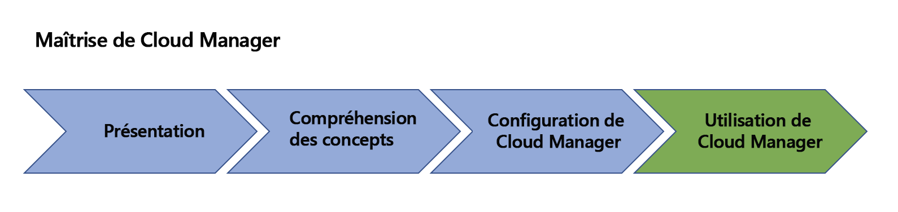

# Présentation d’AEM [!UICONTROL Cloud Manager]{#overview-index}

[!UICONTROL Cloud Manager] est un ensemble d’outils et de technologies disponibles pour tous les clients d’Adobe Managed Services.

Cette section donne une vue d’ensemble de la liste des ressources permettant de commencer à utiliser [!UICONTROL Cloud Manager].

Lisez les ressources [!UICONTROL Cloud Manager] ci-dessous, depuis la présentation des concepts et des terminologies clés jusqu’à la définition des configurations (conditions préalables requises), pour commencer à utiliser [!UICONTROL Cloud Manager].

Le schéma ci-dessous illustre la feuille de route de votre apprentissage de [!UICONTROL Cloud Manager] :

Consultez les ressources figurant dans la section Présentation pour une introduction à [!UICONTROL Cloud Manager] :

* **[Introduction à [!UICONTROL Cloud Manager]](introduction-to-cloud-manager.md)**
* **[Concepts clés](key-concepts.md)**
* **[[!UICONTROL Parcours du client]](customer-journey.md)**

