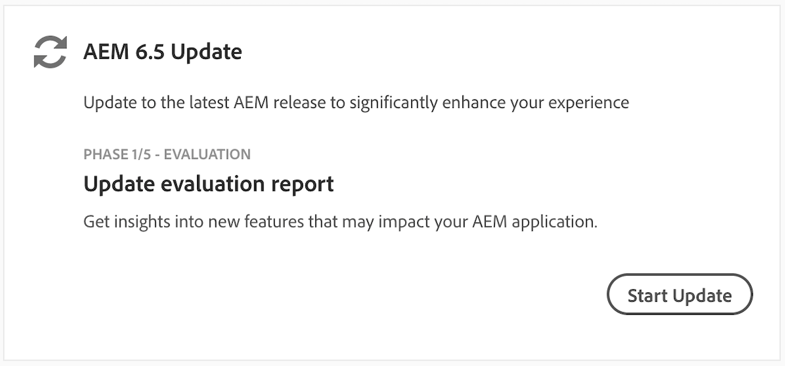

# Présentation {#overview-product-update-wizard}

L’assistant de mise à jour du produit est une expérience guidée, destinée aux clients Cloud Manager qui effectuent une mise à niveau vers la dernière version 6.5 d’Adobe Experience Manager (AEM). Il simplifie le processus de bout-en-bout et garantit l’adhérence aux bonnes pratiques AEM à l’aide de l’infrastructure d’intégration et de distribution continues de Cloud Manager et des tests automatisés intégrés.

L’assistant comprend cinq phases qui guident l’utilisateur lors d’une mise à jour du produit AEM :

* **Évaluation**
* **Correction**
* **Exécution**
* **Validation**
* **Fin**

## Utilisation de l’assistant de mise à jour du produit {#using-product-update-wizard}

>[!NOTE]
>
>Les clients intégrés à Cloud Manager et admissibles à la mise à niveau vers AEM 6.5 pourront utiliser l’assistant Mise à jour des produits. Pour plus d’informations, contactez l’ingénieur du service client (CSE).

1. Vous recevrez une notification Pulse via Cloud Manager pour vous informer qu’AEM 6.5 est disponible pour votre offre.

1. Une carte **[!UICONTROL Mise à jour AEM 6.5]** s’affiche sur l’écran d’aperçu de [!UICONTROL Cloud Manager]. Cette carte permet de déterminer dans quelle phase du processus de mise à jour vous vous trouvez actuellement et vous informe de la prochaine étape à suivre. Sélectionnez **[!UICONTROL Démarrer la mise à jour]** pour lancer l’assistant.

   

   L’assistant affiche désormais la première phase du processus de **[!UICONTROL mise à jour AEM 6.5]**, comme dans la [phase d’évaluation](evaluation.md).
