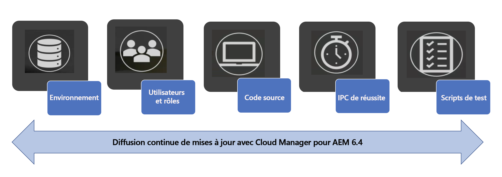
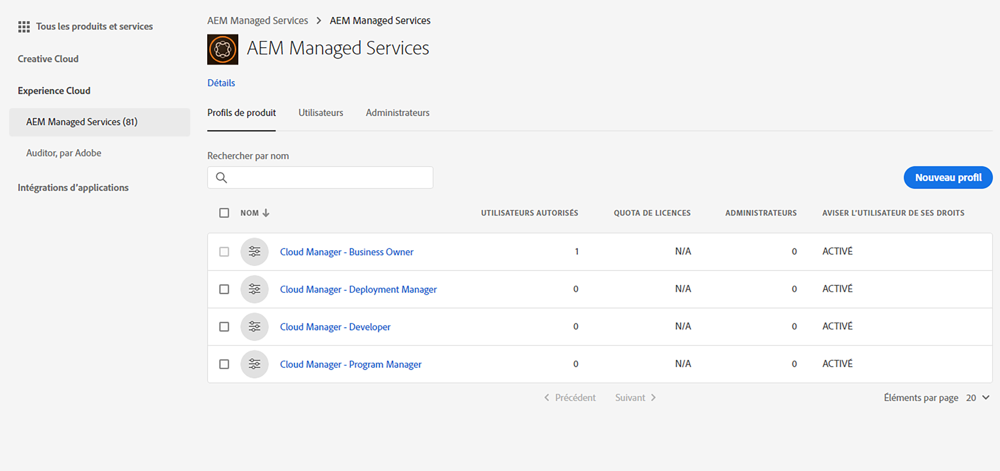
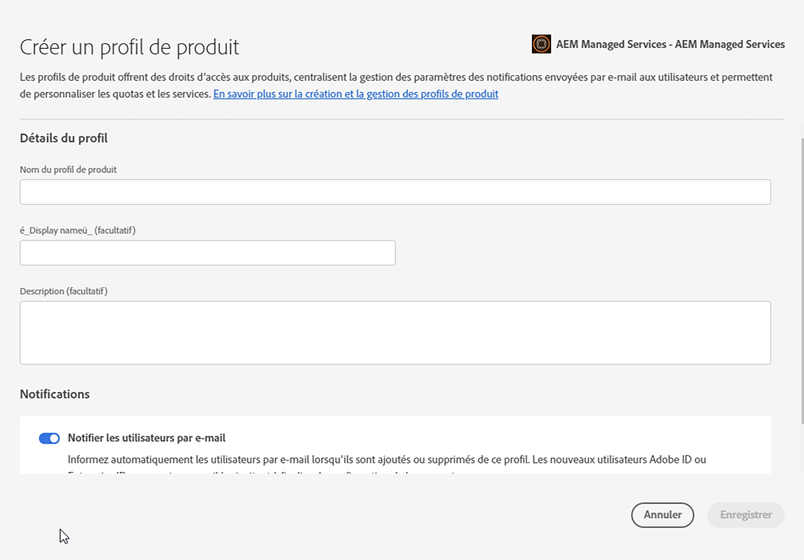

# Définition des configurations générales de [!UICONTROL Cloud Manager]{#setting-up-general-configurations-for-cloud-manager}

La section ci-après présente les conditions préalables à la configuration de [!UICONTROL Cloud Manager] et la gestion du contenu depuis son interface utilisateur.

Cette section couvre les sujets suivants :

* **Configuration des utilisateurs et des rôles**
* **Configuration du projet d’application AEM**
* **Configurations du dispatcher**
* **Meilleures pratiques de développement**

Le diagramme suivant illustre les différentes fonctions qui permettent à [!UICONTROL Cloud Manager] de toujours fournir du code de qualité optimale :



## Configuration des utilisateurs et des rôles {#setting-up-users-and-roles}

Les rôles sont gérés pour [!UICONTROL Cloud Manager] à partir d’Adobe Admin Console. Des rôles spécifiques sont fournis en ajoutant un utilisateur à un profil de produit [!UICONTROL Cloud Manager] dans Admin Console.

>[!CAUTION]
>
>Pour utiliser [!UICONTROL Cloud Manager], vous devez disposer d’un Adobe ID et du contexte du produit Adobe Managed Services.

Vous pouvez affecter des rôles spécifiques en ajoutant un utilisateur à un profil de produit [!UICONTROL Cloud Manager] dans Admin Console.

Créez les rôles suivants à l’aide d’Admin Console pour [!UICONTROL Cloud Manager] :

>[!NOTE]
>
>Adobe Admin Console fournit un emplacement central pour gérer les droits Adobe dans l’ensemble de votre organisation.
>
>Pour en savoir plus sur Adobe Admin Console, consultez la documentation relative à [Admin Console](https://helpx.adobe.com/fr/enterprise/using/admin-console.html).

| **Rôles[!UICONTROL de]Cloud Manager** | **Description** |
|---|---|
| Propriétaire de l’entreprise | Est responsable de la définition des ICP, approuve les déploiements en production et contourne les échecs de trois niveaux. |
| Responsable de programme | Utilise [!UICONTROL Cloud Manager] pour configurer les équipes et passer en revue les statuts et les IPC. Peut approuver des échecs importants de trois niveaux. |
| Responsable de déploiement | Gère les opérations de déploiement. Utilise [!UICONTROL Cloud Manager] pour exécuter les déploiements dans les environnements intermédiaires/de production. Peut approuver des échecs importants de trois niveaux. Dispose d’un accès au Git. |
| Développeur | Développe et teste du code d’application personnalisé. Utilise principalement [!UICONTROL Cloud Manager] pour consulter les statuts. Dispose d’un accès en validation au Git. |
| Ingénieur du service client | Prend en charge généralement les stratégies du service client pour les clients AMS. Interagit avec [!UICONTROL Cloud Manager] dans le but d’exécuter des déploiements nécessitant la supervision de l’ingénieur du service client. |
| Auteur de contenu | N’interagit généralement pas avec [!UICONTROL Cloud Manager]. Peut utiliser le commutateur de programmes de [!UICONTROL Cloud Manager] (depuis [!UICONTROL Experience Cloud]) pour accéder à AEM. |

### Utilisation d’Admin Console pour configurer l’équipe {#using-admin-console-to-set-up-team}

Afin de fournir aux utilisateurs de [!UICONTROL Cloud Manager] les permissions adéquates basées sur les rôles, un administrateur de l’organisation du client doit créer de nouveaux profils de produit sous le contexte du produit [!UICONTROL AEM Managed Services].

>[!NOTE]
>
>Pour accéder à Admin Console et configurer votre équipe (utilisateurs et rôles), ouvrez un navigateur et rendez-vous sur [https://adminconsole.adobe.com](https://adminconsole.adobe.com/enterprise).

L’ajout d’utilisateurs (ou de groupes) à ces profils de produit s’effectue à l’aides des fonctionnalités normales d’Admin Console, comme le montre l’illustration ci-dessous :

1. Connectez-vous à Admin Console et cliquez sur **Nouveau profil** pour ajouter un nouveau profil.

   

1. Renseignez les champs afin de configurer un nouveau rôle pour [!UICONTROL Cloud Manager].

   Saisissez le **Nom du profil** et une **Description** pour créer un profil. Vous pouvez en outre sélectionner un **groupe d’autorisations** pour le profil.

   Cliquez sur **Terminé** pour terminer l’étape de création du profil.

   

## Configuration du projet d’application AEM{#aem-application-project-setup}

Avant de configurer votre projet d’application dans [!UICONTROL Cloud Manager], vous devez tenir compte de l’un des deux scénarios. Vous commencez à utiliser AEM 6.4 ou êtes déjà client.

>[!NOTE]
>
>Afin d’avoir accès à [!UICONTROL Cloud Manager], contactez les ingénieurs du service client pour obtenir une URL et des informations d’identification.

Vous pouvez configurer un projet d’application pour [!UICONTROL Cloud Manager], en fonction des deux scénarios suivants :

* **Nouveau projet AEM** :

Un nouveau projet AEM exploite votre projet existant et utilise [!UICONTROL Cloud Manager].

Pour plus d’informations, consultez [Prise en main d’AEM 6.4](https://chl-author./content/help/fr/experience-manager/6-4/sites/deploying/using/deploy.html). Vous pouvez également consulter [Ressources AEM](https://www.adobe.com/marketing-cloud/experience-manager/resources.html?promoid=759X6WV8&amp;mv=other) pour plus d’informations.

* **Projet AEM existant** :

Un projet AEM existant doit se conformer aux règles de configuration de projet. Vous pouvez mettre à niveau votre installation AEM existante pour bénéficier des nouvelles fonctionnalités et des améliorations offertes dans AEM 6.4 afin de commencer à utiliser [!UICONTROL Cloud Manager]. Ces critères doivent fonctionner avec des changements mineurs. Contactez les ingénieurs du service client pour toute assistance.

Pour obtenir des informations supplémentaires sur la mise à niveau de votre instance AEM vers la version 6.4, consultez [Mise à niveau vers AEM 6.4](https://helpx.adobe.com/fr/experience-manager/6-4/sites/deploying/using/upgrade.html).

### Configuration du référentiel {#setting-up-repository}

Un seul référentiel git, initialement vide, est fourni pour chaque programme intégré à [!UICONTROL Cloud Manager]. Les développeurs et les responsables de déploiement reçoivent l’URL du git et les informations d’identification de l’ingénieur du service client.

Avec ces informations, un développeur pour ajouter son code, en suivant les directives de la section **Configuration du projet**, afin de répondre aux critères de configuration avant d’utiliser [!UICONTROL Cloud Manager].

## Configurations du dispatcher{#dispatcher-configurations}.

[!UICONTROL Cloud Manager] peut déployer les fichiers de configuration du serveur web et du Dispatcher en supposant qu’ils soient stockés dans le référentiel Git, en plus des packages de contenu AEM normaux.

Pour tirer parti de cette possibilité, la génération Maven produit un fichier zip contenant deux répertoires : ***conf*** et ***conf.d***.

Lors du déploiement sur une instance de Dispatcher, le contenu de ces répertoires remplacera celui de ces répertoires sur l’instance de Dispatcher. Comme les fichiers de configuration de serveur web et de dispatcher ont souvent besoin d’informations spécifiques à l’environnement, vous devrez d’abord collaborer avec les ingénieurs du service client afin d’extraire ces variables d’environnement vers /etc/sysconfig/httpd, pour pouvoir utiliser cette capacité correctement.

Pour effectuer le processus initial de configuration du dispatcher, procédez comme suit :

1. Commencez par demander les fichiers de configuration actuels aux ingénieurs du service client.
1. Supprimez les données codées en dur spécifiques à l’environnement (par exemple, l’adresse l’IP du moteur de rendu) et remplacez-les par des variables.
1. Définissez les variables requises en paires de valeurs-clés pour chaque dispatcher cible et demandez à l’ingénieur du service client de les ajouter à ***/etc/sysconfig/httpd*** pour chaque instance.
1. Testez les configurations mises à jour dans l’environnement intermédiaire, puis demandez à l’ingénieur du service client de procéder au déploiement en production afin de vérifier qu’elles fonctionnent correctement.
1. Validez les fichiers dans le git.
1. Effectuez un déploiement via [!UICONTROL Cloud Manager].

Le fichier zip peut être produit avec maven-assembly-plugin. Les projets générés avec le modèle multi-module AEM Lazybones peuvent être créés avec la structure de projet Maven appropriée lors de la création de projet.

>[!NOTE]
>
>La configuration du dispatcher est effectuée lors de l’intégration à [!UICONTROL Cloud Manager], mais elle peut aussi être réalisée plus tard.

### Configuration du dispatcher pour les tests de performance {#configuring-dispatcher-for-performance-testing}.

Pour que [!UICONTROL Cloud Manager] puisse effectuer les tests de performance correctement, le serveur du dispatcher intermédiaire doit avoir le même nom d’hôte que le celui de production de façon à être cohérent avec le serveur de production.

*Par exemple*, si un client a comme noms d’hôte en production [www.myco.com](http://www.myco.com/) et [www.myotherco.com](http://www.myotherco.com,/), et évaluation-myco.adobecqms.net comme nom d’hôte dans l’environnement intermédiaire, une requête comme celle-ci doit répondre correctement :

```
curl -H"Host: www.myco.com" http://stage-myco.adobecqms.net/en/home.html
```

Il faut donc non seulement que les noms d’hôte soient configurés correctement dans la configuration du dispatcher, mais aussi que ***/etc/map***, toute réécriture Apache, ou toute autre règle de chemin ***mapping/filter*** soit établie de façon cohérente entre environnement intermédiaire et production.

## Meilleures pratiques de développement {#development-best-practices}

Avant d’utiliser [!UICONTROL Cloud Manager], il est conseillé de comprendre certaines des meilleures pratiques relatives à la configuration d’un projet, du serveur web ou du dispatcher.

### Configuration du projet {#project-set-up}

Vos projets doivent se répondre à certains critères pour pouvoir fonctionner avec [!UICONTROL Cloud Manager].

Suivez les meilleures pratiques relatives à la configuration de projet dans [!UICONTROL Cloud Manager] :

* L’unique outil de génération fourni et pris en charge est Apache Maven. Apache Maven 3.3.9 est installé.
* Les builds s’exécutent sous environnement Linux dans un conteneur Docker comme utilisateur root.
* La version Java installée est Oracle JDK 8u161.
* Quelques packages système supplémentaires sont installés tels que bzip2, unzip, libpng, imagemagick, and graphicsmagick. Si vous avez besoin d’autres packages, vous devez les demander à l’ingénieur du service client.
* Maven s’exécute toujours avec la commande mvn -B clean package.
* Il vous sera fourni un seul référentiel git. Un fichier pom.xml doit se trouver dans la racine de ce référentiel. Ce fichier pom.xml peut faire référence à autant de sous-modules (qui, à leur tour, peuvent comporter d’autres sous-modules, etc.) que nécessaire, mais il ne doit y avoir qu’un seul point d’entrée.
* Maven est configuré au niveau système avec un fichier settings.xml qui inclut automatiquement le référentiel d’artefacts Adobe publique (repo.adobe.com).
* Vous pouvez ajouter des référentiels supplémentaires dans vos fichiers pom.xml. Cependant, l’accès aux référentiels d’artefacts protégés par mot de passe ou par réseau n’est pas pris en charge.
* Les packages de contenu déployables peuvent être découverts en recherchant les fichiers zip qui sont contenus dans un répertoire appelé target. Un nombre illimité de sous-modules peut produire des packages de contenu.
* S’il existe plusieurs packages de contenu, l’ordre des déploiements des packages n’est pas garanti. Si un ordre spécifique est nécessaire, il est possible d’utiliser les dépendances de package pour le définir.

<!-- 

Comment Type: annotation
Last Modified By: jsyal
Last Modified Date: 2018-05-02T18:18:15.028-0400

change as per KT

 -->

### Étapes suivantes {#the-next-steps}

Quand vous avez terminé la configuration générale, vous êtes prêt à utiliser [!UICONTROL Cloud Manager].

Consultez [Utilisation de [!UICONTROL Cloud Manager]](https://helpx.adobe.com/fr/experience-manager/cloud-manager/using/using-cloud-manager.html) pour commencer à utiliser [!UICONTROL Cloud Manager].
