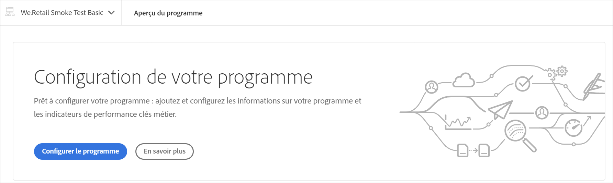
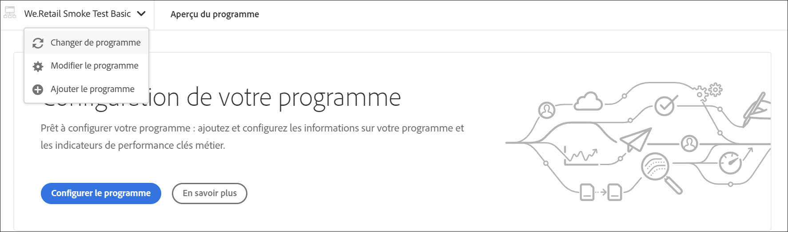
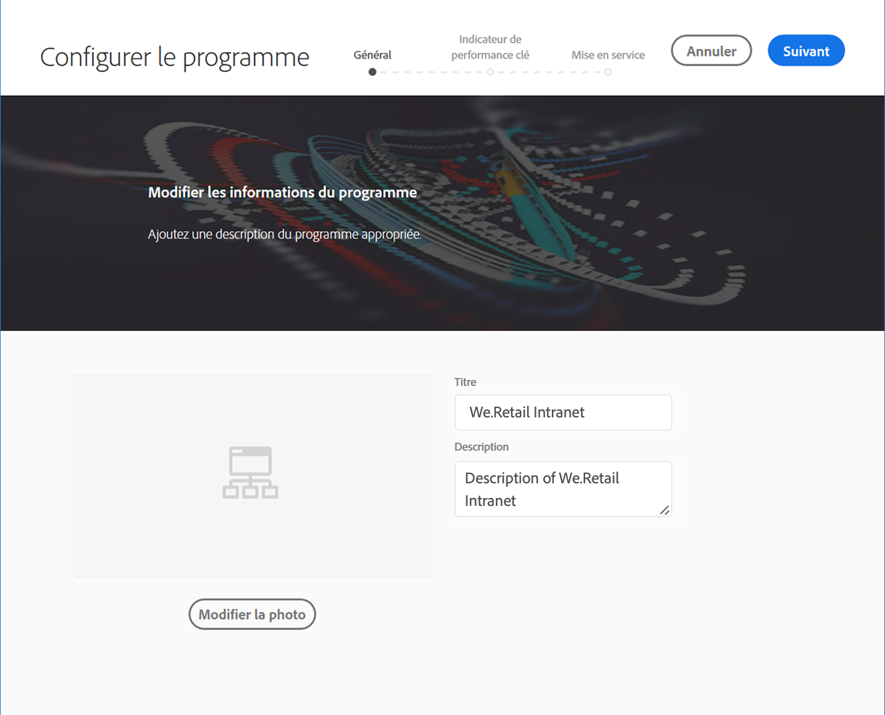
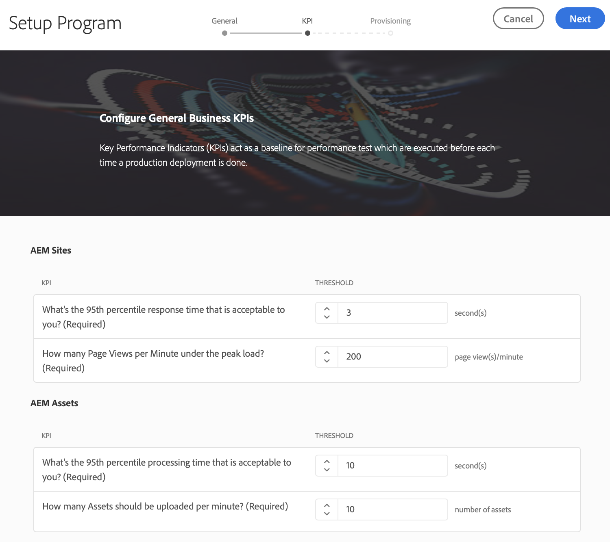
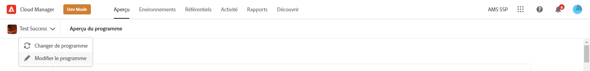
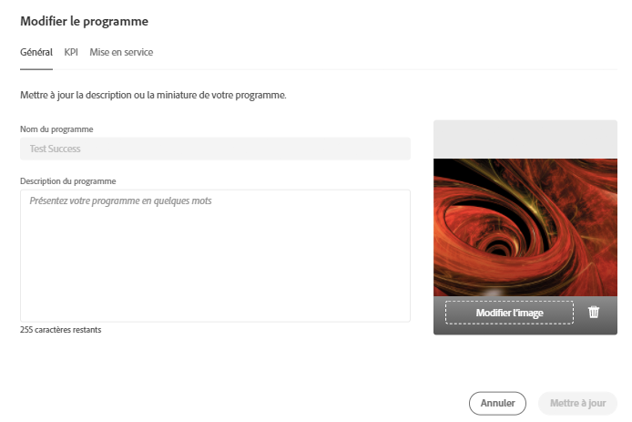
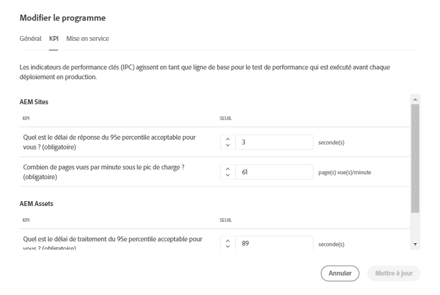
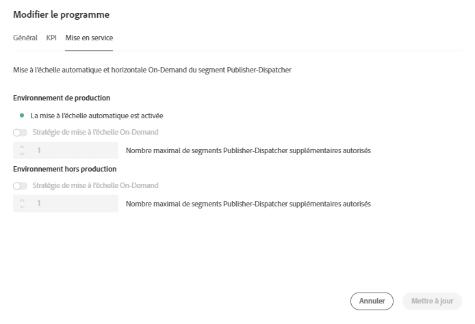

# Configuration de votre programme {#setup-your-program}

Après l’intégration, le propriétaire de l’entreprise devra effectuer une configuration initiale du programme. Cela implique d’établir la description du programme et de définir les indicateurs clés de performance (KPI) qui serviront à tester les performances. Vous pouvez éventuellement télécharger une vignette. De plus, le propriétaire de l’entreprise peut configurer les environnements lors de la configuration du programme.

Les KPI définis servent de référence pour les tests de performance qui sont effectués chaque fois que le pipeline s’exécute.

>[!NOTE]
>Les indicateurs de performance clés définis sont mesurés sur les tests exécutés sur l’environnement **intermédiaire**. En règle générale, ils sont adaptés aux capacités de l’environnement intermédiaire.
>Par exemple, un utilisateur qui attend une moyenne de 1 000 vues de page par minute dans **l’environnement** de production et qui dispose de quatre dispatchers/serveurs de publication en production doit réduire cette valeur à 250 vues de page par minute (en supposant que son environnement intermédiaire se compose d’une seule paire de serveurs de publication et de dispatcher).
>De plus, de nombreux utilisateurs disposeront d’un réseau de diffusion de contenu (CDN), tel que Akamai ou CloudFront devant leur environnement de production. Puisque [!UICONTROL Cloud Manager] effectue directement des tests par rapport à l’environnement intermédiaire, l’indicateur de performance clé doit refléter uniquement le trafic prévu pour transiter via le CDN, c’est-à-dire les pertes dans le cache. En règle générale, il s’agira d’un sous-ensemble relativement petit du trafic de production total.

## Utilisation de [!UICONTROL Cloud Manager] pour configurer votre programme {#using-cloud-manager-to-setup-your-program}

Pour configurer le programme et définir les indicateurs de performance clés, procédez comme suit :

1. Cliquez sur **Configurer le programme** pour lancer le processus de configuration dans [!UICONTROL Cloud Manager].

   

   >[!NOTE]
   > Vous pouvez toujours changer, modifier ou ajouter un nouveau programme à partir de la barre d’actions, comme illustré dans la figure ci-dessous.

   

1. L’écran **Configurer le programme** affiche l’option Modifier les informations du programme.

1. Trois options s’affichent sous forme d’onglets : **Général**, **Indicateur de performance clé** et **Mise en service**.

1. Dans l’onglet **Général**, téléchargez une vignette dans votre programme. Vous pouvez également ajouter une description appropriée à votre programme.

   

1. Sous **Indicateur de performance clé**, vous pouvez définir vos deux indicateurs de performance clés (attentes pour chaque déploiement). Des indicateurs de performance clés distincts sont définis pour **AEM Sites** et **AEM Assets**. Vous pouvez spécifier les indicateurs de performance clés pour les produits sous licence que vous possédez.

   **AEM Sites**

   1. Quel est le délai de réponse du 95e percentile acceptable pour vous ?

      * Valeur recommandée : 3 secondes.
   1. Combien de pages vues par minute sous le pic de charge ?

      * Valeur recommandée : 200 vues de page par minute.

   **AEM Assets**

   Depuis sa version initiale, Cloud Manager a été en mesure d’exécuter des tests de performance pour les programmes AEM Sites. Avec cette version, il est désormais possible d’exécuter des tests de performance pour les programmes AEM Assets. Les tests de performance des ressources sont effectués en chargeant plusieurs ressources à plusieurs reprises pendant une période de test de 30 minutes et en mesurant le temps de traitement de chaque ressource ainsi que diverses mesures au niveau du système.
Lors de la configuration du programme, des indicateurs de performance clés spécifiques aux ressources sont spécifiés :

   * Délai de traitement du 95e percentile
   * Ressources téléchargées par minute

   

1. Sous **Mise en service**, vous pouvez afficher ou modifier la configuration des environnements de production et autres dans votre programme. **La mise à l’échelle automatique est activée** s’affiche si la mise à l’échelle automatique a été activée pour le programme.

   >[!NOTE]
   >La fonction de mise à l’échelle automatique s’applique uniquement à l’environnement de production et peut ne pas être disponible pour tous les programmes clients.

   

1. Cliquez sur **Enregistrer** pour terminer l’assistant de configuration.

   >[!NOTE]
   >Vous pouvez toujours modifier le programme une fois le programme initial configuré. Pour plus d’informations, suivez les étapes ci-après.

## Modification d’un programme {#editing-program}

1. Accédez au programme sur l’écran d’accueil de **Cloud Manager**.

1. Cliquez sur **Modifier le programme** pour mettre à jour ou modifier votre programme à partir de la page **Aperçu**, comme illustré dans la figure ci-dessous.

   

1. L’écran **Modifier le programme** vous permet de mettre à jour ou de modifier votre programme.

   Vous pouvez mettre à jour la description de votre programme à partir de l’onglet **Général**.

   

   Accédez à l’onglet **KPI** pour mettre à jour les informations dans AEM Sites et Assets.

   

   De plus, vous pouvez accéder à l’onglet **Mise en service** pour modifier la configuration de mise en service des environnements de production et autres dans votre programme.

   

1. Cliquez sur **Mettre à jour** pour enregistrer vos modifications.

## Étapes suivantes {#the-next-steps}

Si vous avez déjà configuré le pipeline, l’exécution suivante prendra en compte vos paramètres mis à jour. Si vous n’avez pas encore configuré le pipeline, suivez d’abord les étapes de configuration de celui-ci.

Consultez les documents [Configuration des pipelines de production](configuring-production-pipelines.md) et [Configuration de pipelines hors production](configuring-non-production-pipelines.md) pour configurer le pipeline.
