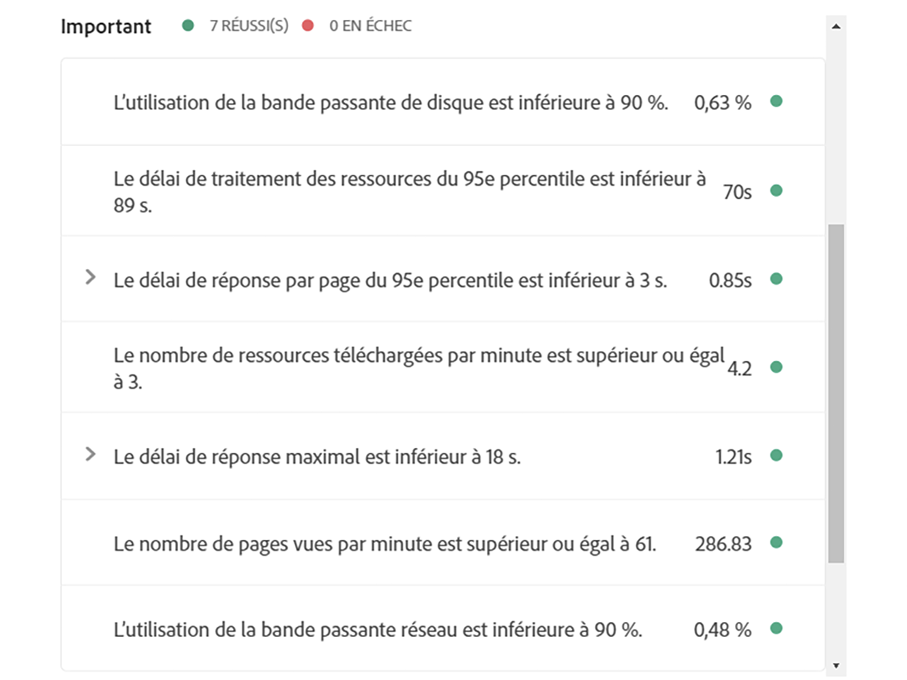
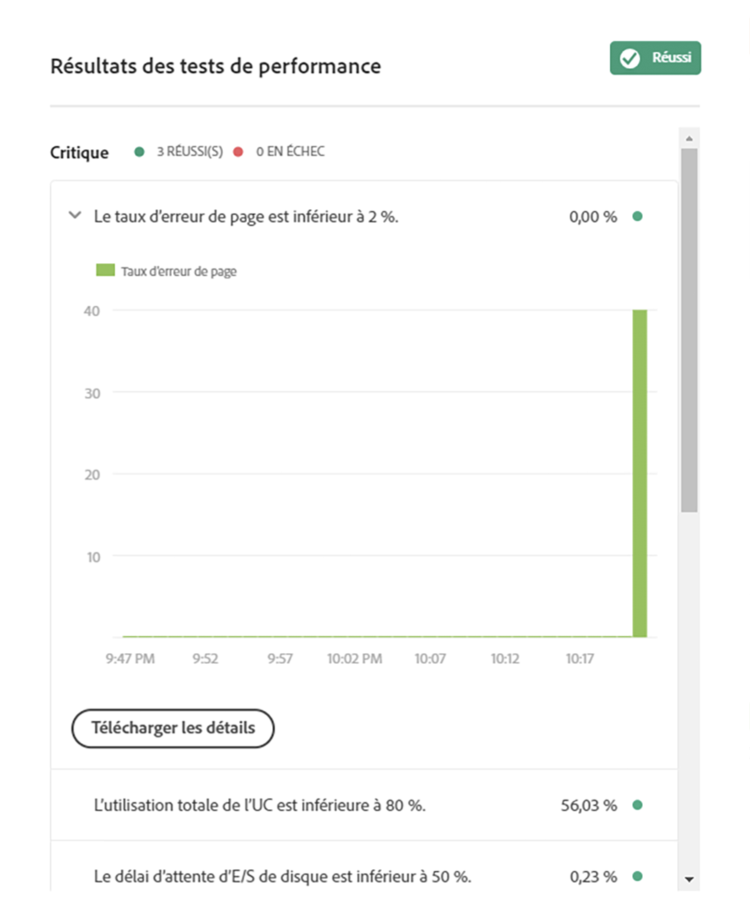

# Présentation des résultats de tests {#understand-your-test-results}

Pendant le processus de **pipeline**, un certain nombre de mesures sont capturées et comparées soit aux indicateurs de performance clés (ICP) définis par le propriétaire de l’entreprise, soit aux normes définies par Adobe Managed Services.

Celles-ci sont signalées à l’aide du système de contrôle à trois niveaux tel que défini dans cette section.

## Points de contrôle à trois niveaux lors de l’exécution d’un pipeline {#three-tier-gates-while-running-a-pipeline}

Le pipeline comprend trois points de contrôle :

* Qualité du code
* Test de performance
* Test de sécurité

Pour chaque point de contrôle, il existe une structure à trois niveaux pour les problèmes identifiés.

* **Critique** : il s’agit des problèmes identifiés par le point de contrôle qui entraînent l’échec immédiat du pipeline.
* **Important** : il s’agit des problèmes identifiés par le point de contrôle qui entraînent la suspension du pipeline. Un responsable de déploiement, un responsable de projet ou un propriétaire d’entreprise peuvent soit contourner les problèmes, auquel cas le pipeline continue, soit accepter les problèmes, auquel cas le pipeline s’arrête avec un échec.
* **Informations** : il s’agit des problèmes identifiés par le point de contrôle qui sont fournis uniquement à titre d’information et qui n’ont aucune incidence sur l’exécution du pipeline.

## Test de qualité du code {#code-quality-testing}

Dans le cadre du pipeline, le code source est analysé afin de garantir que les déploiements respectent certains critères de qualité. Actuellement, ce contrôle est implémenté par SonarQube. Il existe plus de 100 règles combinant des règles Java génériques et des règles spécifiques à AEM. Le tableau suivant résume l’évaluation des critères de test :

| Nom | Définition | Catégorie | Seuil d’échec |
|--- |--- |--- |--- |
| Cote de sécurité | A = 0 vulnérabilité <br/>B = au moins 1 vulnérabilité mineure<br/> C = au moins 1 vulnérabilité majeure <br/>D = au moins 1 vulnérabilité critique <br/>E = au moins 1 vulnérabilité de blocage | Critique | &lt; B |
| Cote de fiabilité | A = 0 bogue <br/>B = au moins 1 bogue mineur <br/>C = au moins 1 bogue majeur <br/>D = au moins 1 bogue critique E = au moins 1 bogue bloqueur | Important | &lt; C |
| Évaluation de maintenabilité | Le coût de correction en suspens pour les smells du code est : <br/><ul><li>&lt;=5% du temps qui s’est déjà écoulé dans l’application, la note est A </li><li>entre 6 et 10 % la note est B </li><li>entre 11 et 20 % la note est C </li><li>entre 21 et 50 % la note est D</li><li>tout ce qui dépasse 50 % est E</li></ul> | Important | &lt; A |
| Couverture | Combinaison de couverture de ligne de tests unitaires et de couverture de condition utilisant cette formule : <br/>`Coverage = (CT + CF + LC)/(2*B + EL)`  <br/>où : CT = conditions qui ont été évaluées comme « vrai » au moins une fois lors de l’exécution de tests unitaires <br/>CF = conditions qui ont été évaluées comme « faux » au moins une fois <br/>LC = lignes couvertes = lines_ to_ cover - uncover_ lines <br/><br/> B = nombre total de conditions <br/>EL = nombre total de lignes exécutables (lines_to_cover) | Important | &lt; 50% |
| Tests unitaires ignorés | Nombre de tests unitaires ignorés. | Infos | &gt; 1 |
| Problèmes en cours | Types de problèmes généraux - Vulnérabilités, bogues et smells de code | Infos | &gt; 1 |
| Lignes dupliquées | Nombre de lignes impliquées dans des blocs dupliqués. <br/>Pour qu’un bloc de code soit considéré comme dupliqué : <br/><ul><li>**Projets non Java :**</li><li>Il doit y avoir au moins 100 jetons successifs et dupliqués.</li><li>Ces jetons doivent être répartis au moins sur : </li><li>30 lignes de code pour COBOL </li><li>20 lignes de code pour ABAP </li><li>10 lignes de code pour d’autres langages</li><li>**Projets Java :**</li><li> Il devrait y avoir au moins 10 instructions successives et dupliquées, quel que soit le nombre de jetons et de lignes.</li></ul> <br/>Les différences dans la mise en retrait ainsi que dans les littéraux de chaîne sont ignorées lors de la détection des doublons. | Infos | &gt; 1% |


>[!NOTE]
>
>Pour plus [d&#39;informations, reportez-vous à la section Définitions](https://docs.sonarqube.org/display/SONAR/Metric+Definitions) des mesures.


Vous pouvez télécharger la liste des règles ici [code-quality-rules.xlsx](assets/code-quality-rules.xlsx)

>[!NOTE]
>
>Pour en savoir plus sur les règles de qualité du code personnalisé exécutées par [!UICONTROL Cloud Manager], reportez-vous aux [Règles Qualité du code personnalisé](custom-code-quality-rules.md).

### Traitement des faux positifs {#dealing-with-false-positives}

Le processus d’analyse de qualité n’est pas parfait et identifiera parfois de manière incorrecte des problèmes qui ne sont pas réellement problématiques. On parle alors de « faux positif ».

Dans ce cas, une annotation Java `@SuppressWarnings` standard spécifiant l’ID de règle comme attribut d’annotation peut être inscrite dans le code source. Par exemple, la règle SonarQube permettant de détecter les mots de passe codés en dur peut être agressive sur la façon dont un mot de passe codé en dur est identifié.

Pour prendre un exemple spécifique, ce code serait assez courant dans un projet AEM qui comporte un code pour se connecter à un service externe :

```java
@Property(label = "Service Password")
private static final String PROP_SERVICE_PASSWORD = "password";
```

SonarQube lèvera alors une vulnérabilité de bloqueur. Après avoir examiné le code, vous identifiez qu’il ne s’agit pas d’une vulnérabilité et pouvez l’annoter avec l’identifiant de règle approprié.

```java
@SuppressWarnings("squid:S2068")
@Property(label = "Service Password")
private static final String PROP_SERVICE_PASSWORD = "password";
```

En revanche, si le code était le suivant :

```java
@Property(label = "Service Password", value = "mysecretpassword")
private static final String PROP_SERVICE_PASSWORD = "password";
```

La bonne solution consiste alors à supprimer le mot de passe codé en dur.

>[!NOTE]
>
>Bien qu’il soit préférable de rendre l’annotation `@SuppressWarnings` aussi précise que possible, c’est-à-dire de n’annoter que l’énoncé ou le bloc qui cause le problème, il est tout de même possible de le faire à un niveau qui se rapporte à la classe.

## Test de sécurité {#security-testing}

[!UICONTROL Cloud Manager ] exécute les ***contrôles de sécurité AEM*** à l’étape qui suit le déploiement et indique leur statut via l’interface utilisateur. Les résultats sont agrégés à partir de toutes les instances AEM de l’environnement.

Si l’une des **instances** signale un échec pour un contrôle d’intégrité donné, l’**environnement** entier ne réussit pas ce contrôle. Comme pour les tests de qualité du code et de performance, ces contrôles sont classés en catégories et signalés à l’aide du système de point de contrôle à trois niveaux. La seule différence réside dans le fait qu’il n’existe aucun seuil dans le cas des tests de sécurité. Tous les contrôles d’intégrité réussissent ou non.

Le tableau suivant répertorie les contrôles actuels :

| **Nom** | **Implémentation de la vérification de l’intégrité** | **Catégorie** |
|---|---|---|
| La disponibilité de l’API d’ajout de pare-feu de désérialisation est dans un état acceptable. | Disponibilité de l’API d’ajout de pare-feu de désérialisation | Critique |
| Le pare-feu de désérialisation est fonctionnel. | Pare-feu de désérialisation fonctionnel | Critique |
| Le pare-feu de désérialisation est chargé. | Pare-feu de désérialisation chargé | Critique |
| L’implémentation d’AuthorizableNodeName n’expose pas l’ID autorisable dans le nom/chemin du nœud. | Génération de nom de nœud autorisé | Critique |
| Les mots de passe par défaut ont été modifiés. | Comptes de connexion par défaut | Critique |
| Le servlet GET par défaut Sling est protégé contre les attaques par DOS. | Servlet Sling Get | Critique |
| Le Dispatcher effectue correctement le filtrage des requêtes. | Configuration du Dispatcher CQ | Critique |
| Le gestionnaire de bibliothèque HTML Adobe Granite est correctement configuré. | Configuration de gestionnaire de bibliothèque HTML CQ | Critique |
| Le gestionnaire de script Java Sling est correctement configuré. | Gestionnaire de script Java Sling | Critique |
| Le gestionnaire de script JSP Sling est correctement configuré. | Gestionnaire de script JSP Sling | Critique |
| Le filtre référent Sling est configuré pour empêcher les attaques CSRF. | Filtre référent Sling | Critique |
| SSL est correctement configuré. | Configuration SSL | Critique |
| Aucune stratégie de profil d’utilisateur évidemment risquée trouvée | Accès par défaut au profil utilisateur | Critique |
| Le lot de prise en charge de CRXDE est désactivé. | Prise en charge de CRXDE | Important |
| Le lot DavEx Sling et le servlet sont désactivés. | Contrôle d’intégrité DavEx | Important |
| L’exemple de contenu n’est pas installé. | Packages d’exemple de contenu | Important |
| Le filtre de requête WCM et le filtre de débogage WCM sont désactivés. | Configuration des filtres WCM | Important |
| Le lot WebDAV Sling et le servlet sont correctement configurés. | Contrôle d’intégrité WebDAV | Important |
| Le serveur web est configuré pour empêcher les clics publicitaires. | Configuration du serveur web | Important |
| La réplication n’utilise pas l’utilisateur « admin ». | Utilisateurs de réplication et de transport | Infos |

## Test de performance {#performance-testing}

Le *test de performances* dans [!UICONTROL Cloud Manager] est mis en œuvre à l’aide d’un test de 30 minutes.

Lors de la configuration du pipeline, le responsable de déploiement peut déterminer le trafic à diriger vers chaque compartiment.

Vous pouvez obtenir des informations supplémentaires sur les commandes de compartiment en consultant la section [Configuration de votre pipeline CI/CD](configuring-pipeline.md).

>[!NOTE]
>
>Pour configurer votre programme et définir vos indicateurs de performance clés, consultez la section [Configuration de votre programme](setting-up-program.md).

Le tableau suivant résume la matrice des tests de performance à l’aide du système de point de contrôle à trois niveaux :

| **Mesure** | **Catégorie** | **Seuil d’échec** |
|---|---|---|
| Taux d’erreur de demande de page % | Critique | &gt;= 2 % |
| Taux d’utilisation de l’UC | Critique | &gt;= 80 % |
| Délai d’attente d’E/S de disque | Critique | &gt;= 50 % |
| Délai de réponse du 95e percentile | Important | &gt;= ICP de niveau programme |
| Délai de réponse max. | Important | &gt;= 18 secondes |
| Nombre de pages vues par minute | Important | &lt; ICP de niveau programme |
| Utilisation de la bande passante de disque | Important | &gt;= 90 % |
| Utilisation de la bande passante réseau | Important | &gt;= 90 % |
| Demandes par minute | Infos | &lt; 6 000 |

### Graphiques des résultats de tests de performance {#performance-testing-results-graphs}

De nouveaux graphiques et des options de téléchargement ont été ajoutés à la boîte de dialogue Résultats des tests de performance.

Lorsque vous ouvrez la boîte de dialogue Test de performance, les panneaux de mesures peuvent être développés pour afficher un graphique, fournir un lien de téléchargement ou les deux.

Dans la version 2018.7.0 de [!UICONTROL Cloud Manager], cette fonctionnalité est disponible pour les mesures suivantes :

* **Utilisation de l’UC**
   * Graphique montrant l’utilisation de l’UC pendant la période de test.

* **Délai d’attente d’E/S de disque**
   * Graphique montrant le délai d’attente d’E/S de disque pendant la période de test.

* **Taux d’erreur de page**
   * Graphique montrant les erreurs de page par minute pendant la période de test.
   * Fichier CSV répertoriant les pages qui ont généré une erreur pendant le test.

* **Utilisation de la bande passante de disque**
   * Graphique de l’utilisation de la bande passante par le disque pendant la période de test.

* **Utilisation de la bande passante réseau**
   * Graphique montrant l’utilisation de la bande passante par le réseau pendant la période de test.

* **Délai de réponse max.**
   * Graphique montrant le délai de réponse maximal par minute pendant la période de test.

* **Délai de réponse du 95e percentile**
   * Graphique montrant le délai de réponse du 95e percentile par minute pendant la période de test.
   * Fichier CSV répertoriant les pages dont le délai de réponse du 95ème centile a dépassé les ICP définis.

Les illustrations suivantes montrent les graphiques des tests de performance :





