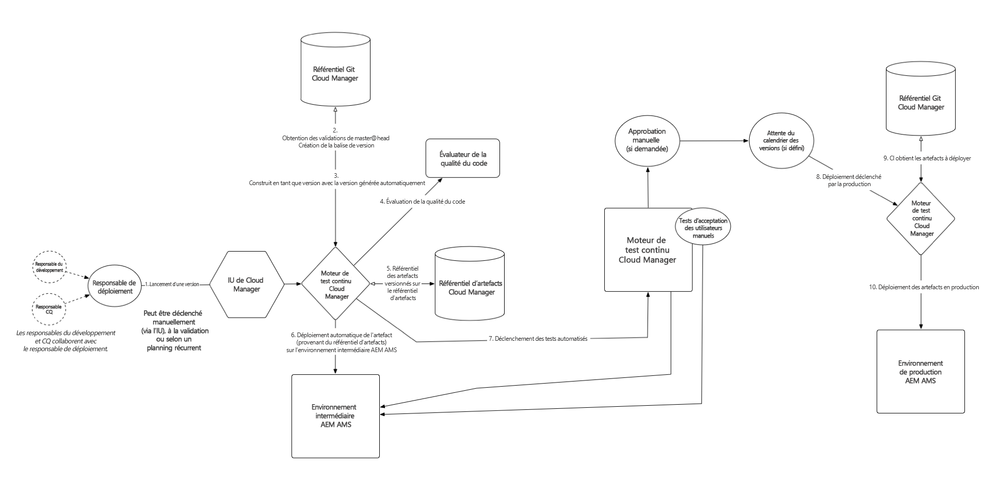

# Présentation des concepts avant l’utilisation de Cloud Manager{#understanding-concepts-before-using-cloud-manager}

Cette section présente des concepts et des terminologies à connaître avant d’utiliser Cloud Manager. Elle couvre les sujets suivants :

* **Environnement de déploiement**
* **Référentiel de code source**
* **Sécurité et confidentialité**
* **Présentation du pipeline**
* **Ressources d’aide**

## Environnement de déploiement {#deployment-environment}

Vous commencez peut-être à utiliser Adobe Experience Manager (AEM) 6.4 ou vous devez effectuer une mise à niveau vers la version 6.4 d’AEM.

Si vous commencez à utiliser AEM 6.4, vous avez déjà accès à Cloud Manager.

Si vous êtes déjà client, vous devez effectuer une mise à niveau vers AEM 6.4 pour accéder à Cloud Manager. Vous pouvez commencer à utiliser Cloud Manager après avoir reçu l’URL et les informations d’identification des ingénieurs du service client.

<!-- 

Comment Type: annotation
Last Modified By: ptager
Last Modified Date: 2018-05-02T17:19:24.147-0400

Section is redundant with the section in the Overview topic

 -->

## Référentiel de code source {#source-code-repository}

**Plusieurs serveurs Git** : dans certains cas, les clients disposeront déjà d’un référentiel git et souhaiteront continuer à l’utiliser.

Pour ces cas, vous pouvez utiliser la prise en charge par git de plusieurs référentiels distants. Le développement quotidien continuera de se dérouler dans votre référentiel git. Lorsqu’un déploiement est souhaité, vous pouvez simplement transmettre le dernier code au référentiel git de Cloud Manager.

<!-- 

Comment Type: annotation
Last Modified By: ptager
Last Modified Date: 2018-05-02T17:20:46.002-0400

Looks like we lost some content, compared to the previous version

 -->

## Sécurité et confidentialité {#security-and-privacy}

<!-- 

Comment Type: annotation
Last Modified By: jsyal
Last Modified Date: 2018-04-21T02:38:21.417-0400

Query for Brad B.

 -->

## Présentation du pipeline {#pipeline-overview}

Cloud Manager prend en charge un seul pipeline par programme (définition ci-dessus) qui gère les déploiements dans les environnements intermédiaires et de production. ****

La branche git utilisée pour les déploiements d’évaluation et de production est master.

>[!NOTE]
>
>Il est recommandé d’utiliser master comme branche git pour les environnements intermédiaire et de production, mais vous pouvez utiliser n’importe quelle branche lors de la configuration du pipeline.

Le processus de pipeline unique est illustré ci-dessous :

### Présentation du flux {#understanding-the-flow}

Vous pouvez configurer votre pipeline depuis la vignette [!UICONTROL Paramètres du pipeline] dans l’interface utilisateur de Cloud Manager.

Pour plus d’informations, consultez la section [Utilisation de Cloud Manager](hhttps://helpx.adobe.com/experience-manager/cloud-manager/using/using-cloud-manager.html).

Le responsable de déploiement est chargé de la configuration du pipeline, c’est-à-dire :

* attribution de branche d’application
* Attribution des environnements de déploiement
* définition des options de test

Pour ce faire, vous devez d’abord sélectionner une branche dans le référentiel git. Vous définissez ensuite le déclencheur qui démarrera le pipeline.

Vous pouvez ensuite définir les paramètres contrôlant le déploiement en production.

Enfin, vous pouvez configurer les paramètres de test de performance.

>[!NOTE]
>
>Pour en savoir plus sur la configuration du comportement et des préférences de votre pipeline, consultez la section **Configuration du pipeline** dans [Utilisation de Cloud Manager](using-cloud-manager.md).

### Ressources d’aide {#help-resources}

Contactez l’ingénieur du service client d’Adobe Managed Services pour obtenir de l’aide.

### Étapes suivantes {#the-next-steps}

Vous maîtrisez maintenant davantage les concepts de Cloud Manager.

Pour configurer votre projet, votre environnement et votre équipe (utilisateur et rôles), consultez [Définition des configurations générales pour Cloud Manager](setting-configurations-for-cloud-manager.md).
