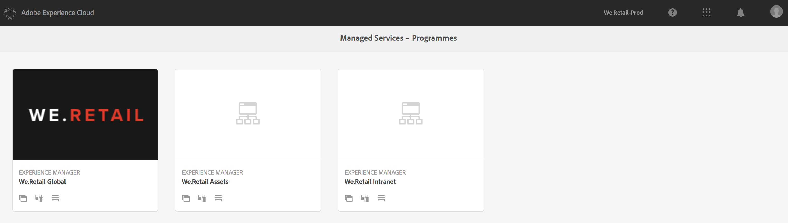
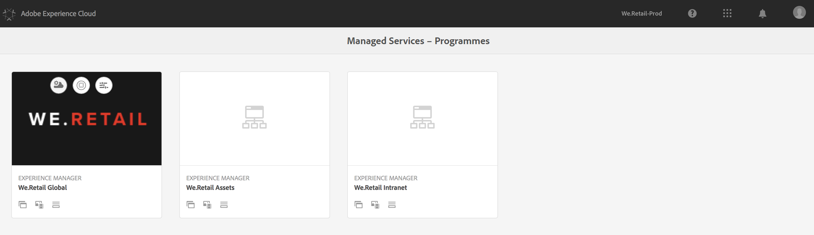
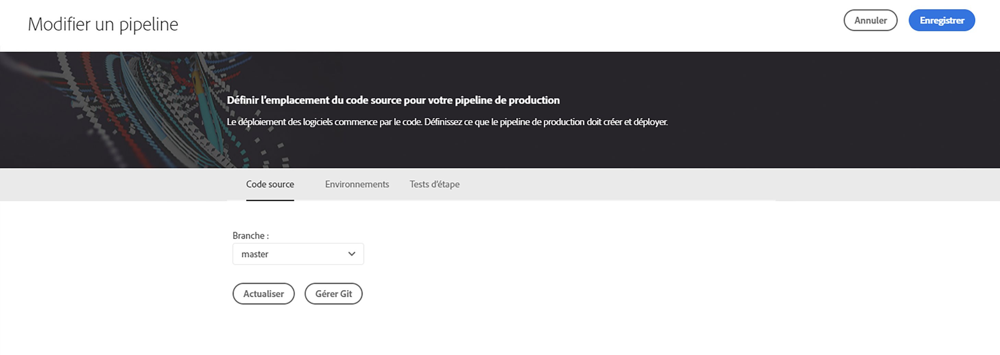
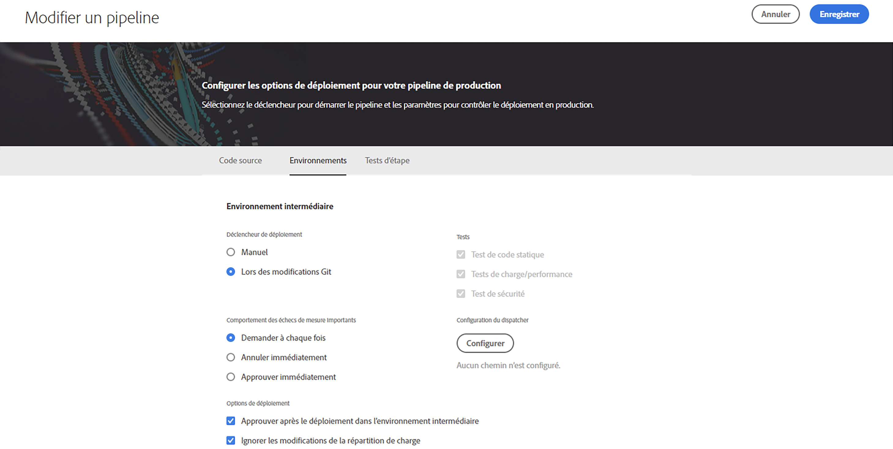
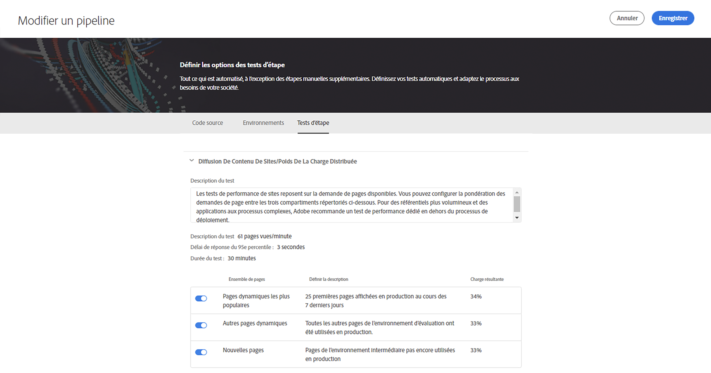
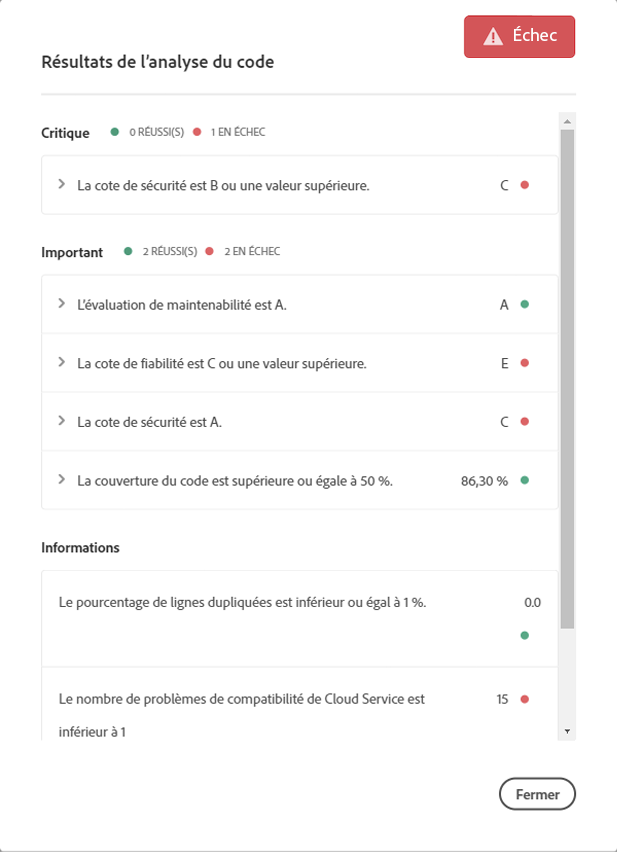
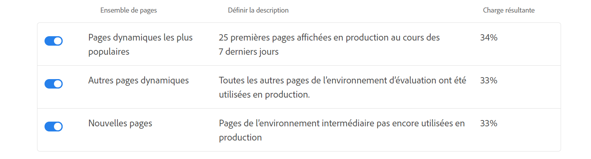

# Utilisation de Cloud Manager{#using-cloud-manager}

Cette section présente l’interface utilisateur (IU) de [!UICONTROL Cloud Manager] et explique la méthode de travail, depuis la définition du programme jusqu’au déploiement du code et des contrôles qualité.

## Conditions préalables {#prerequisites}

Avant d’entrer dans les détails de l’utilisation de [!UICONTROL Cloud Manager], il est conseillé de lire les sections suivantes :

* [Présentation des concepts avant l’utilisation de [!UICONTROL Cloud Manager]](understanding-concepts.md)
* [Définition des configurations générales de [!UICONTROL Cloud Manager]](setting-configurations-for-cloud-manager.md)

## Prise en main de [!UICONTROL Cloud Manager] {#getting-started-with-cloud-manager}

Une fois les configurations générales de [!UICONTROL Cloud Manager] définies, vous êtes prêt à utiliser [!UICONTROL Cloud Manager].

1. Connectez-vous à Adobe [!UICONTROL Experience Cloud] pour afficher la liste des solutions.

   

1. Sélectionnez le programme et cliquez sur l’icône en haut à gauche pour ouvrir [!UICONTROL Cloud Manager].

   

## Configuration du programme {#setting-up-program}

Après l’intégration, le propriétaire de l’entreprise devra effectuer une configuration initiale du programme. Il devra notamment établir la description du programme et définir les indicateurs de performance clés qui serviront à tester les performances. Vous pouvez éventuellement télécharger une vignette.

Les indicateurs de performance clés définis servent de référence pour les tests de performances qui sont réalisés chaque fois que le pipeline s’exécute.

>[!NOTE]
>
>Les indicateurs de performance clés définis sont mesurés sur les tests exécutés sur l’environnement **intermédiaire**. En règle générale, ils sont adaptés aux capacités de l’environnement intermédiaire.
>
>Par exemple, un utilisateur qui attend une moyenne de 1 000 pages vues par minute dans son environnement de production et qui dispose de quatre serveurs `dispatcher/publish` en production doit réduire cette valeur à 250 pages vues par minute (en supposant que son environnement intermédiaire soit constitué d’une seule paire de serveurs `dispatcher/publish`).
>
>De plus, de nombreux utilisateurs auront un CDN (Akamai, CloudFront) devant leur environnement de production. Puisque [!UICONTROL Cloud Manager] effectue directement des tests par rapport à l’environnement intermédiaire, l’indicateur de performance clé doit refléter uniquement le trafic prévu pour transiter via le CDN, c’est-à-dire les pertes dans le cache. En règle générale, il s’agira d’un sous-ensemble relativement petit du trafic de production total.

### Utilisation de [!UICONTROL Cloud Manager] pour définir des indicateurs de performance clés {#using-cloud-manager-to-define-kpis}

Pour configurer le programme et définir les indicateurs de performance clés, procédez comme suit :

1. Cliquez sur **Configurer le programme** pour lancer le processus de configuration dans [!UICONTROL Cloud Manager].
1. L’écran **Modifier les informations du programme** s’affiche.

   Téléchargez une vignette dans votre programme. Vous pouvez également ajouter une description appropriée à votre programme et cliquer sur **Suivant**.

1. L’écran **Configurer les utilisateurs** s’affiche.

   Vous pouvez configurer les rôles et les utilisateurs de votre équipe. Cliquez sur **Suivant**.

1. L’écran **Configurer les IPC métier généraux** s’affiche.

   Vous pouvez définir vos deux IPC (prévisions pour chaque déploiement) :

   1. Quel est le délai de réponse du 95e percentile acceptable pour vous ?

      1. Valeur recommandée : 3 secondes.
   1. Combien de pages vues par minute sous le pic de charge ?

      1. Valeur recommandée : 200 pv/m


1. Cliquez sur **Envoyer** pour terminer l’assistant de configuration.

   L’écran d’accueil de [!UICONTROL Cloud Manager] se transforme alors en **Déployer**.

## Environnements disponibles {#available-environments}

La section **Environnements disponibles** dans [!UICONTROL Cloud Manager] répertorie tous les environnements AEM gérés.

Chacun des environnements répertoriés sera associé à un état.

## Configuration du pipeline {#configuring-pipeline}

### Préparation du pipeline {#setting-up-pipeline}

>[!CAUTION]
>
>Le pipeline ne peut pas être configuré tant que le référentiel Git ne possède pas au moins une branche.

Avant de commencer le déploiement du code, vous devez configurer les paramètres de votre pipeline à partir de [!UICONTROL Cloud Manager].

Pour en savoir plus sur la configuration du pipeline, reportez-vous à la section **Présentation du pipeline** dans ** [Présentation des concepts avant l’utilisation de [!UICONTROL Cloud Manager]](understanding-concepts.md)**.

>[!NOTE]
>
>Vous pouvez modifier les paramètres du pipeline après la configuration initiale.

### Configuration des paramètres du pipeline à partir de [!UICONTROL Cloud Manager] {#configuring-pipeline-settings-from-the-cloud-manager}

Pour configurer le comportement et les préférences de votre pipeline depuis [!UICONTROL Cloud Manager], procédez comme suit :

1. Accédez à l’onglet **Branche** pour configurer la branche d’application.

   Sélectionnez la branche git que vous souhaitez configurer.

   >[!NOTE]
   >
   >Les branches trouvées dans le référentiel Git sont associées au programme.

   

1. Accédez à l’onglet **Environnements** pour sélectionner les options **Intermédiaire** et **Production**.

   Vous pouvez définir un déclencheur qui démarre le pipeline :

   * **Manuel** : une personne doit cliquer dans l’interface utilisateur pour démarrer le pipeline.
   Définissez maintenant les paramètres contrôlant le déploiement en production. Les trois options disponibles sont les suivantes :

   * **Utiliser l’approbation GoLive** : un déploiement doit être approuvé manuellement par un propriétaire d’entreprise, un responsable de projet ou un responsable de déploiement via l’interface utilisateur de [!UICONTROL Cloud Manager].
   * **Utiliser la supervision par l’ingénieur du service client** : un ingénieur du service client participe au démarrage du déploiement.
   

1. Accédez à l’onglet **Test** pour définir les critères de test du programme.

   Vous pouvez maintenant configurer les paramètres de test de performance.

   

## Déploiement du code {#deploying-code}

Une fois que vous avez configuré le pipeline (référentiel, environnement et environnement de test), vous êtes prêt à déployer le code.

### Déploiement du code à partir de [!UICONTROL Cloud Manager] {#deploying-code-from-cloud-manager}

Pour déployer le code dans l’environnement de production, procédez comme suit :

1. Cliquez sur **Déployer** dans [!UICONTROL Cloud Manager] pour lancer le processus de déploiement.
1. L’écran **Déploiement dans l’environnement intermédiaire** s’affiche.

   Cliquez sur **Générer** pour lancer le processus.

1. Le processus de génération complet prend en compte plusieurs paramètres pour vérifier et déployer le code.

   Les paramètres suivants sont cochés :

   **Déploiement dans l’environnement intermédiaire**

   * Référentiel
   * Test unitaire
   * Analyse du code
   * Déployé dans l’environnement intermédiaire
   **Test de pré-production**

   * Test de sécurité
   * Test de performance
   >[!NOTE]
   >
   >En outre, vous pouvez afficher les journaux ou consulter les résultats pour les critères de test ci-dessus.

## Résultats des contrôles de qualité {#results-from-quality-checks}

Le pipeline comprend trois points de contrôle : Qualité du code, Test de performance et Test de sécurité.

Pour chaque point de contrôle, il existe une structure à trois niveaux pour les problèmes identifiés.

* **Critique** : il s’agit des problèmes identifiés par le point de contrôle qui entraînent l’échec immédiat du pipeline.
* **Important** : il s’agit des problèmes identifiés par le point de contrôle qui entraînent la suspension du pipeline. Un responsable de déploiement, un responsable de projet ou un propriétaire d’entreprise peuvent soit contourner les problèmes, auquel cas le pipeline continue, soit accepter les problèmes, auquel cas le pipeline s’arrête avec un échec.
* **Informations** : il s’agit des problèmes identifiés par le point de contrôle qui sont fournis uniquement à titre d’information et qui n’ont aucune incidence sur l’exécution du pipeline.

### Analyse du code {#code-scanning}



### Test de performance {#performance-testing}

Le *test de performance* dans [!UICONTROL Cloud Manager] est mis en œuvre à l’aide d’un test de 30 minutes.

Lors de la configuration du pipeline, le responsable de déploiement peut déterminer le trafic à diriger vers chaque compartiment. Il peut choisir un à trois compartiments. La répartition du trafic dépend du nombre de compartiments sélectionnés. Si les trois compartiments sont sélectionnés, 33 % du nombre total des pages vues sont placées dans chaque compartiment. Si deux compartiments sont sélectionnés, 50 % sont dirigés vers chaque ensemble ; si l’un d’entre eux est sélectionné, 100 % du trafic est acheminé vers cet ensemble.

Supposons, par exemple, qu’il y ait une répartition 50 %/50 % entre les pages actives populaires et les nouvelles pages (dans cet exemple, les autres pages actives ne sont pas utilisées) et que les nouvelles pages comprennent 3 000 pages. L’indicateur de performance clé des pages vues par minute est défini sur 200. Pendant la période test de 30 minutes :

* Chacune des 25 pages de l’ensemble Pages actives populaires sera ouverte 240 fois - `((200 &#42; 0.5) / 25) &#42; 30 = 120`
* Chacune des 3 000 pages de l’ensemble Nouvelles pages est ouverte une fois - `((200 &#42; 0.5) / 3000) &#42; 30 = 1`



### Mesures de test de performance {#performance-test-metrics}

Pendant la période de test, un certain nombre de mesures sont capturées et comparées aux indicateurs de performance clés définis par le propriétaire d’entreprise ou les normes définies par AMS.

Celles-ci sont signalées à l’aide du système de point de contrôle à trois niveaux suivant :

### Points de contrôle à trois niveaux lors de l’exécution d’un pipeline {#three-tier-gates-while-running-a-pipeline}

Le pipeline comporte trois points de contrôle : Qualité du code, Test de performance et Test de sécurité.

Pour chaque point de contrôle, il existe une structure à trois niveaux pour les problèmes identifiés :

* **Critique** : il s’agit des problèmes identifiés par le point de contrôle qui entraînent l’échec immédiat du pipeline.
* **Important** : il s’agit des problèmes identifiés par le point de contrôle qui entraînent la suspension du pipeline. Un responsable de déploiement, un responsable de projet ou un propriétaire d’entreprise peuvent soit contourner les problèmes, auquel cas le pipeline continue, soit accepter les problèmes, auquel cas le pipeline s’arrête avec un échec.
* **Informations** : il s’agit des problèmes identifiés par le point de contrôle qui sont fournis uniquement à titre d’information et qui n’ont aucune incidence sur l’exécution du pipeline.

Le tableau suivant résume la matrice des tests de performance à l’aide du système de point de contrôle à trois niveaux :

| **Mesure** | **Catégorie** | **Seuil d’échec** |
|---|---|---|
| Taux d’erreur de demande de page % | Critique | &gt;= 2 % |
| Taux d’utilisation de l’UC | Critique | &gt;= 80 % |
| Délai d’attente d’E/S de disque | Critique | &gt;= 50 % |
| Délai de réponse du 95e percentile | Important | &gt;= ICP de niveau programme |
| Délai de réponse max. | Important | &gt;= 18 secondes |
| Nombre de pages vues par minute | Important | &lt; ICP de niveau programme |
| Utilisation de la bande passante de disque | Important | &gt;= 90 % |
| Utilisation de la bande passante réseau | Important | &gt;= 90 % |
| Demandes par minute | Infos | &lt; 6 000 |

### Test de sécurité {#security-testing}

[!UICONTROL Cloud Manager] exécute les *contrôles de sécurité AEM* à l’étape qui suit le déploiement et indique leur statut via l’interface utilisateur. Les résultats sont agrégés à partir de toutes les instances AEM de l’environnement.

Si l’une des instances signale un échec pour un contrôle d’intégrité donné, l’environnement entier ne réussit pas ce contrôle. Comme pour les tests de qualité du code et de performance, ces contrôles sont classés en catégories et signalés à l’aide du système de point de contrôle à trois niveaux. La seule différence réside dans le fait qu’il n’existe aucun seuil dans le cas des tests de sécurité. Tous les contrôles d’intégrité réussissent ou non.

Les contrôles actuels sont les suivants :

| **Contrôle de l’intégrité** | **Catégorie** |
|---|---|
| Disponibilité de l’API d’ajout de pare-feu de désérialisation | Critique |
| Pare-feu de désérialisation fonctionnel | Critique |
| Pare-feu de désérialisation chargé | Critique |
| Génération de nom de nœud autorisé | Critique |
| Comptes de connexion par défaut | Critique |
| Servlet Sling Get | Critique |
| Configuration du Dispatcher CQ | Critique |
| Configuration de gestionnaire de bibliothèque HTML CQ | Critique |
| Gestionnaire de script Java Sling | Critique |
| Gestionnaire de script JSP Sling | Critique |
| Filtre référent Sling | Critique |
| Configuration SSL | Critique |
| Accès par défaut au profil utilisateur | Critique |
| Prise en charge de CRXDE | Important |
| Contrôle d’intégrité DavEx | Important |
| Packages d’exemple de contenu | Important |
| Configuration des filtres WCM | Important |
| Contrôle d’intégrité WebDAV | Important |
| Configuration du serveur web | Important |
| Utilisateurs de réplication et de transport | Infos |

### Mise en œuvre du contrôle qualité par SonarQube {#quality-check-implementation-by-sonarqube}

Dans le cadre du pipeline, comme illustré ci-dessus, le code est analysé. Actuellement, ce contrôle est implémenté par SonarQube. Nous avons 93 règles qui sont une combinaison de règles Java génériques et de règles spécifiques à AEM (y compris certaines des règles existantes de Cognifide). Vous trouverez la liste de ces règles ici : [Règles SonarQube](assets/sonarqube-rules.xlsx)

À partir de ces règles, plusieurs mesures sont calculées, certaines d’entre elles étant utilisées comme point de contrôle de qualité avant d’autoriser un déploiement vers l’environnement intermédiaire.

Voici les seuils actuels :

| Nom | Définition | Catégorie | Seuil d’échec |
|--- |--- |--- |--- |
| Cote de sécurité | A = 0 vulnérabilité <br/>B = au moins 1 vulnérabilité mineure<br/> C = au moins 1 vulnérabilité majeure <br/>D = au moins 1 vulnérabilité critique <br/>E = au moins 1 vulnérabilité de blocage | Critique | &lt; B |
| Cote de fiabilité | A = 0 bogue <br/>B = au moins 1 bogue mineur <br/>C = au moins 1 bogue majeur <br/>D = au moins 1 bogue critique E = au moins 1 bogue bloqueur | Important | &lt; C |
| Évaluation de maintenabilité | Le coût de correction en suspens pour les smells du code est : <br/><ul><li>&lt;=5% du temps qui s’est déjà écoulé dans l’application, la note est A </li><li>entre 6 et 10 % la note est B </li><li>entre 11 et 20 % la note est C </li><li>entre 21 et 50 % la note est D</li><li>tout ce qui dépasse 50 % est E</li></ul> | Important | &lt; A |
| Couverture | Combinaison de couverture de ligne et de couverture de condition à l’aide de cette formule : <br/>`Coverage = (CT + CF + LC)/(2*B + EL)`  <br/>où : CT = conditions qui ont été évaluées comme « vrai » au moins une fois <br/>CF = conditions qui ont été évaluées comme « faux » au moins une fois <br/>LC = lignes couvertes = lines_ to_ cover - uncover_ lines <br/><br/> B = nombre total de conditions <br/>EL = nombre total de lignes exécutables (lines_to_cover) | Important | &lt; 50% |
| Tests unitaires ignorés | Nombre de tests unitaires ignorés. | Infos | &gt; 1 |
| Problèmes en cours | Types de problèmes généraux - Vulnérabilités, bogues et smells de code | Infos | &gt; 1 |
| Lignes dupliquées | Nombre de lignes impliquées dans des blocs dupliqués. <br/>Pour qu’un bloc de code soit considéré comme dupliqué : <ul><li> **Projets non Java :**</li><li>Il doit y avoir au moins 100 jetons successifs et dupliqués.</li><li>Ces jetons doivent être répartis au moins sur : </li><li>30 lignes de code pour COBOL </li><li>20 lignes de code pour ABAP </li><li>10 lignes de code pour d’autres langages</li></ul><ul><li>**Projets Java :**</li><li> Il devrait y avoir au moins 10 instructions successives et dupliquées, quel que soit le nombre de jetons et de lignes.</li></ul>Les différences dans la mise en retrait ainsi que dans les littéraux de chaîne sont ignorées lors de la détection des doublons. | Infos | &gt; 1% |

### Faux positifs {#false-positives}

Le processus d’analyse de qualité n’est pas parfait et identifiera parfois de manière incorrecte des problèmes qui ne sont pas réellement problématiques. On parle alors de *faux positif* (bien que *faux négatif* soit probablement plus correct sémantiquement). Dans ce cas, une annotation Java `@SuppressWarnings` standard spécifiant l’ID de règle comme attribut d’annotation peut être inscrite dans le code source. Par exemple, la règle SonarQube permettant de détecter des mots de passe codés en dur est très libérale quant à ce qu’elle considère comme un mot de passe codé en dur.

Pour prendre un exemple spécifique, ce code serait assez courant dans un projet AEM qui comporte un code pour se connecter à un service externe :

```java
@Property(label = "Service Password")
private static final String SERVICE_PASSWORD = "password";
```

SonarQube lèvera alors une vulnérabilité de bloqueur. Dans ce cas, le client peut identifier qu’il ne s’agit pas d’une vulnérabilité et l’annoter avec l’ID de règle approprié :

```java
@SuppressWarnings("squid:S2068")
@Property(label = "Service Password")
private static final String SERVICE_PASSWORD = "password";
```

En revanche, si le code était le suivant :

```java
@Property(label = "Service Password", value = "mysecretpassword")
private static final String SERVICE_PASSWORD = "password";
```

Ensuite, le client doit prendre l’avertissement de SonarQube au sérieux et supprimer le mot de passe codé en dur. Toutefois, il doit toujours ajouter l’`@SuppressWarnings` annotation puisque la règle SonarQube est réellement déclenchée par le terme `password`.

>[!NOTE]
>
>Il est recommandé de rendre l’`@SuppressWarnings` annotation aussi spécifique que possible, c’est-à-dire d’annoter uniquement l’instruction ou le bloc spécifique qui génère le problème. Il est possible d’annoter au niveau de la classe.

